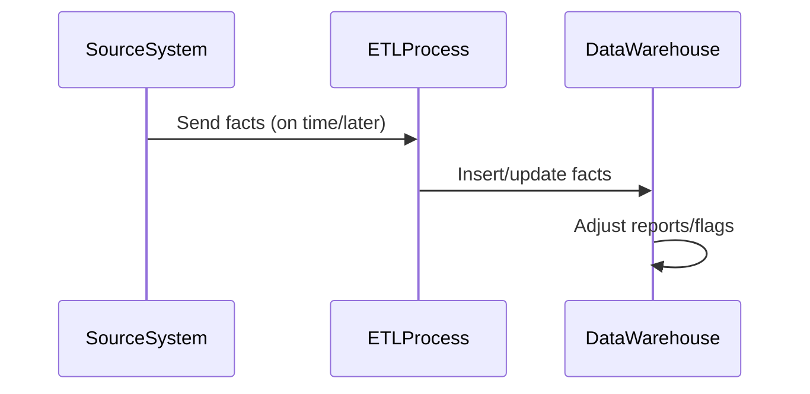

## Introduction

The **Late Arriving Facts** pattern is a crucial component in data warehousing that deals with the occurrence of fact records arriving later than expected. In a typical ETL (Extract, Transform, Load) process, the data is loaded into the data warehouse based on a predefined schedule. However, certain situations cause delays in data arrival, necessitating mechanisms to ensure that these records are accurately integrated into the existing datasets. This pattern plays a pivotal role in maintaining the integrity and timeliness of data analytics and reporting.

## Problem

In data warehouse systems, fact records contain measurable, quantitative data that are essential for generating reports and analytics. When these facts arrive late:

- **Data Integrity Issues**: Reports and KPIs might be based on incomplete datasets, leading to inaccurate business insights.
- **Process Complexity**: Integrating late-arriving data involves additional ETL complexities and potential reprocessing of analysis.
- **System Performance**: Real-time reporting systems may suffer from latency or require significant tuning to handle late-arriving data smoothly.

## Solution

To effectively manage late-arriving facts, several architectural approaches and best practices can be implemented:

- **Data Arrival Windows**: Define flexible windows for data acceptance beyond the standard processing cut-off times. This approach allows for the inclusion of late data without altering established ETL cycles.
  
- **Revision Mechanisms**: Implement revision flags or correction mechanisms in the data warehouse schema, allowing adjustments once late-arriving facts are processed.

- **Reconciliation Processes**: Periodically reconcile warehouse data with source systems to ensure late data is captured and integrated appropriately.

- **Buffer Zones**: Use buffer zones or stages in the ETL process where late data can be delayed, reviewed, and appropriately transformed before final integration.

### Example Code

Let's consider an ETL pipeline pattern implemented in an SQL-based system, handling late-arriving sales transactions:

```sql
-- Sample table structure for sales
CREATE TABLE Sales (
    TransactionID INT PRIMARY KEY,
    SaleDate DATE,
    Amount DECIMAL(10, 2),
    Status VARCHAR(20)
);

-- Example transformation script to handle late-arriving data
UPDATE Sales
SET Status = 'Late Arrival'
WHERE SaleDate < CURRENT_DATE - INTERVAL '1 day';
```

## Diagram

Here is a simple diagram to illustrate the late-arriving facts process using a sequence diagram format:



## Related Patterns

- **Change Data Capture (CDC)**: A pattern used to identify and capture changes in the source data to handle updates and late arrivals efficiently.

- **Slowly Changing Dimensions (SCD)**: Useful in conjunction with late-arriving facts to manage changing attributes in dimensions over time.

- **Eventual Consistency**: Implemented in distributed systems where time delays are expected, and reconciliation provides eventual data correctness.

## Additional Resources

- Ralph Kimball's Data Warehouse Toolkit for insights on dimensional modeling and managing data warehousing scenarios.
- Online resources and tutorials on advanced ETL tool configurations and best practices.

## Summary

The Late Arriving Facts pattern is essential for maintaining data quality and reporting accuracy in data warehousing systems. By adopting strategic ETL practices and schema arrangements, organizations can streamline the process of integrating delayed fact records while ensuring the integrity of their data analytics. This pattern embodies the robustness necessary to adapt to operational delays without compromising strategic decision-making capabilities.
