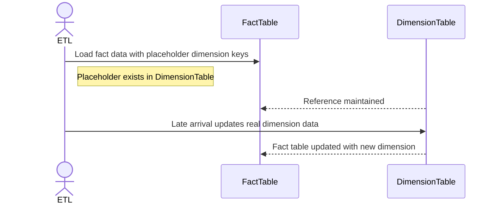

## Overview

The Late Arriving Dimensions pattern addresses situations where dimension data related to facts becomes available after the fact data has been loaded into a data warehouse. This timing mismatch poses challenges for accurate dimension integration, as the facts typically require context and related dimension attributes to support meaningful analysis.

## Detailed Explanation

### Why Late Arriving Dimensions Matter

In data warehousing, facts and dimensions form the backbone of star and snowflake schema models. Facts often indicate transactional data such as sales orders, while dimensions provide context, such as customer, geography, or product attributes. In fast-paced business environments, the dimension data may not always be available when facts are recorded; for instance, new products may be included in sales before being fully registered in the system. This results in late arriving dimensions.

### Architectural Approaches

To handle late arriving dimensions, the following approaches can be pragmatic:

- **Surrogate Keys**: Instead of using natural keys which depend on the presence of dimensional data, use surrogate keys (integers) to ensure that facts can still reference dimensions.

- **Placeholder Records**: Insert a placeholder for the dimension with default attribute values until the actual dimension data becomes available. This helps maintain referential integrity.

- **ETL Adjustments**: Modify ETL (Extract, Transform, Load) processes to accommodate the late arrival of dimension data. This may include using techniques like late data processing, batch processing, and delta loads.

### Best Practices

1. **Design for Flexibility**: Ensure ETL processes can handle updates to dimension data without causing inconsistencies in fact tables.
  
2. **Versioning of Dimensions**: Implement Slowly Changing Dimensions (SCD) techniques to maintain historical accuracy once the late dimension data arrives.

3. **Audit Trails**: Ensure that log systems detect and record the late arriving dimensions for monitoring and future troubleshooting.

### Example Code

Below is an example using SQL to update a placeholder dimension record when the actual data becomes available:

```sql
-- Insert a placeholder for a late arriving dimension
INSERT INTO ProductDimension (ProductID, ProductName, Category)
VALUES (9999, 'Unknown', 'Unknown');

-- Later, when actual data arrives, update the placeholder
UPDATE ProductDimension
SET ProductName = 'New Product Name', Category = 'New Category'
WHERE ProductID = 9999;
```

### Diagrams



## Related Patterns

- **Slowly Changing Dimensions**: Manages changes in dimension data over time, ensuring historical consistency.

- **Surrogate Key Pattern**: Utilizes artificial keys for relationships rather than natural business keys.

- **Data Quality Management**: Ensures data integrity and consistency within the data warehouse as new dimensions are incorporated.

## Additional Resources

- "The Data Warehouse ETL Toolkit" by Ralph Kimball and Joe Caserta
- Online resources for ETL and data integration best practices
- Industry papers on evolving data warehouse strategies

## Summary

Handling late arriving dimensions is crucial in maintaining the accuracy and reliability of data warehouses. By utilizing mechanisms like placeholder records, surrogate keys, and flexible ETL processes, organizations can effectively manage these challenges, ensuring that data remains valuable and actionable. Following best practices and harnessing related patterns further enhances data warehouse robustness.
