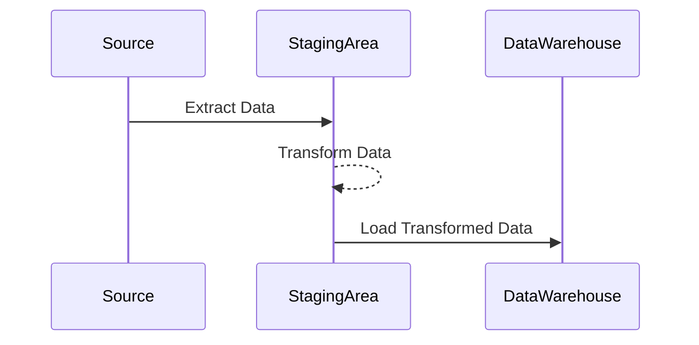

## Data Staging Design Pattern

### Description

The Data Staging pattern entails the use of a staging area to temporarily store and transform data before it is loaded into the data warehouse. This intermediary step in the ETL (Extract, Transform, Load) process allows data transformation, validation, and enrichment operations to be executed prior to the integration of the data into the primary warehouse schema. By doing so, it ensures the consistency, quality, and reliability of the data, adhering to the predefined standards and requirements.

### Architectural Approaches

1. **Batch Processing**: Data is collected over a period and then processed in large batches at scheduled intervals.
  
2. **Stream Processing**: Data is captured and processed as it flows through the system in real-time, typically using tools such as Apache Kafka or Flink.
  
3. **Hybrid Approach**: Combines aspects of both batch and stream processing to optimize for various types of data workflows.

### Best Practices

- **Proper Setup of the Staging Area**: Ensure that the staging area is isolated and has adequate capacity and performance specifications. It should be scalable and possibly even version-controlled.

- **Data Quality Checks**: Integrate robust data quality assessments within the staging process, such as format consistency checks, deduplication, and validation against business rules.

- **Efficient Transformations**: Optimize transformations using appropriate indexing and partition strategies to enhance performance.

- **Incremental Loading**: Implement mechanisms to handle incremental loading so that only changes to data are processed, which can improve efficiency and reduce processing time.

### Example Code

```sql
-- Create a staging table for incoming raw data
CREATE TABLE staging_customer_data (
    customer_id INT,
    name VARCHAR(100),
    email VARCHAR(100),
    created_at TIMESTAMP,
    raw_address TEXT
);

-- Insert new data into the staging table
INSERT INTO staging_customer_data (customer_id, name, email, created_at, raw_address)
VALUES (1, 'John Doe', 'john.doe@example.com', NOW(), '123 Main St, Anytown, USA');

-- Transformation step example: Standardizing address format
UPDATE staging_customer_data
SET raw_address = UPPER(raw_address);

-- Load transformed data into the main data warehouse table
INSERT INTO warehouse_customer_data (customer_id, name, email, created_at, address)
SELECT customer_id, name, email, created_at, raw_address AS address
FROM staging_customer_data
WHERE created_at > (SELECT MAX(created_at) FROM warehouse_customer_data);
```

### Diagrams

#### Staging Process Flow



### Related Patterns

- **Data Lake**: Utilizes a central repository to store structured and unstructured data at any scale.
- **Change Data Capture (CDC)**: Captures changes made at the data source and applies them throughout the day, ensuring data is kept fresh.
- **Data Validation**: Ensures that the data adheres to predefined standards.

### Additional Resources

- [Books: "Building a Data Warehouse" by W.H. Inmon]
- [Online Courses: Coursera's Data Warehousing for Business Intelligence Specialization]
- [Tools: Apache Kafka, Apache Flink, Talend]

### Summary

The Data Staging design pattern is crucial in ensuring that data loaded into a data warehouse is accurate, validated, and conformant to standards, leading to more reliable analytics and insights. By employing this pattern, organizations can prepare their data in an orderly, secure, and efficient manner, tackling common challenges associated with ETL processes and enabling effective data-driven decision-making.
