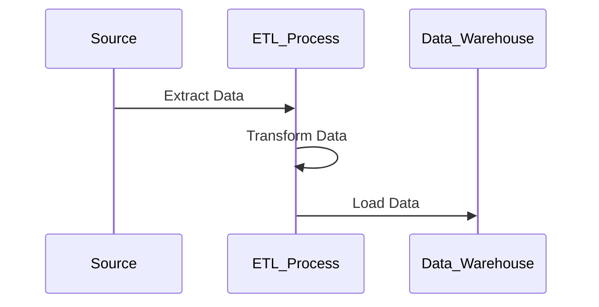

## Extract, Transform, Load (ETL)

### Overview

ETL is a fundamental design pattern in data warehousing processes that involves three key phases:

1. **Extract**: Data is extracted from various heterogeneous sources, which can include databases, CRM systems, flat files, and more. The goal is to bring data into a temporary staging area where it can be examined and refined before further processing.

2. **Transform**: The extracted data is transformed through a series of rules or processes. This step might involve cleaning, deduplicating, transposing, or aggregating the data to fit operational needs and ensure consistency, accuracy, and completeness.

3. **Load**: The transformed data is then loaded into a data warehouse or another target data system. This phase ensures that the data is stored in a way that is optimized for query performance and is accessible for analysis and reporting.

### Architectural Approaches

- **Batch Processing**: ETL processes typically occur in batches at scheduled intervals (e.g., nightly), capturing a range of updates over a given timeframe.
  
- **Parallel Processing**: Many ETL systems employ parallel processing to speed up the data transformation and loading operation. This can involve distributing tasks across multiple processors or nodes.

- **Incremental Load**: Ensures only new or changed data is extracted, transformed, and loaded, minimizing the resources and time required for data processing.

### Best Practices

- **Plan for Scalability**: Design ETL pipelines to scale with growing data volumes by incorporating cloud-based solutions that offer elasticity.
  
- **Ensure Data Quality**: Implement data validation rules during the transformation phase to maintain high data quality.
  
- **Monitor Performance**: Continuously monitor ETL processes to detect bottlenecks and optimize performance.
  
- **Maintain Data Lineage**: Track data sources and transformations to ensure clear data lineage and facilitate troubleshooting.

### Example Code

Below is a simplified example using Apache Nifi, an open-source data integration tool that visualizes data flows for ETL processes.

```yaml
nifi_flow:
  - extract:
      processor: GetFile
      properties:
        directory: "/data/input"
  - transform:
      processor: UpdateAttribute
      properties:
        attribute_name: "record.header.status"
        attribute_value: "processed"
  - load:
      processor: PutDatabaseRecord
      properties:
        connection_pool: "jdbc/myDatabase"
        table_name: "warehouseTable"
```

### Diagram

Here's a generic ETL sequence flow using Mermaid:



### Related Patterns

- **Stream Processing**: Unlike batch ETL, stream processing deals with continuous data flow, offering near-real-time analytics.
  
- **Data Lake**: Used for storing large amounts of unstructured data, which can later be processed using ETL pipelines.

- **Change Data Capture (CDC)**: A method to identify and capture changes made to a database, which can be integrated into ETL processes for real-time data transformation.

### Additional Resources

- [ETL Best Practices](https://www.ibm.com/cloud/blog/etl-best-practices)
- [Building Data Pipelines](https://dataengineeringgcp.com/building-pipelines/)
- [Overview of Apache Nifi](https://nifi.apache.org/docs.html)

### Summary

The ETL design pattern supports robust data management in data warehousing environments by efficiently moving, processing, and storing data. As businesses increasingly rely on data-driven insights, the role of efficient ETL processes becomes ever more critical. While traditionally focused on batch processing, modern ETL solutions are evolving to incorporate elements of real-time processing, utilizing cutting-edge tools and techniques.

By adopting best practices in ETL design, organizations can ensure their data infrastructure remains scalable, performant, and capable of meeting future demands.
