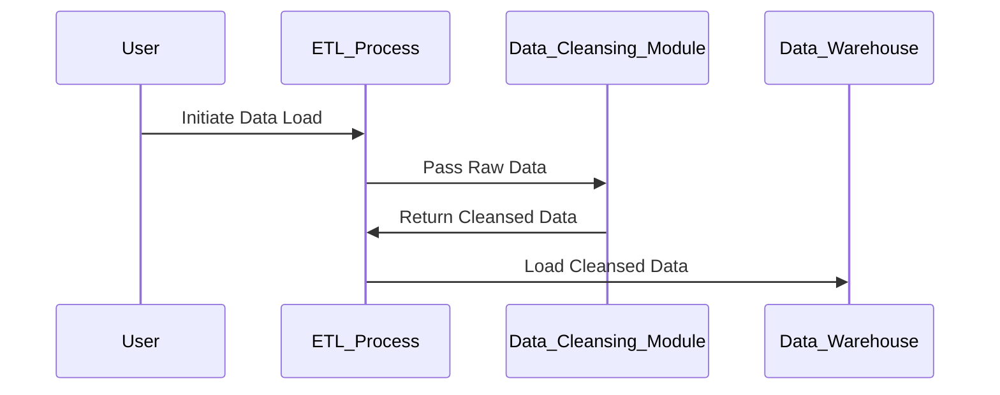

## Data Cleansing

Data cleansing is a critical design pattern within data warehousing and data quality management that focuses on the identification and rectification of erroneous, corrupt, mistyped, or incomplete data entries. This pattern ensures that the dataset used for analysis, decision-making, and machine learning is accurate, complete, and reliable.

### Purpose and Scope

The main purpose of data cleansing is to improve overall data quality by resolving data inconsistencies, removing duplicate entries, correcting invalid data, and filling in missing values. It is crucial for maintaining the integrity of business intelligence (BI) systems and is a fundamental step in the ETL (Extract, Transform, Load) process.

### Key Features and Steps

1. **Data Profiling**: Analyzing the data to understand its structure, content, and quality issues.
2. **Error Detection**: Identifying incorrect, inconsistent, or incomplete data using anomaly detection techniques.
3. **Data Correction**: Processes such as standardization, normalization, deduplication, and handling of missing values.
4. **Data Validation**: Ensuring corrected data conforms to business rules and data governance policies.
5. **Data Transformation**: Converting data into a uniform format required for down-the-line processing.

### Example Use Case

Consider a retail company's customer database that contains records with duplicate entries and inaccurately formatted phone numbers. Before any high-level analysis or decision-making, the data cleansing process will:

- Remove duplicate records using deduplication algorithms.
- Correct phone number formats to adhere to international standards.
- Standardize address information based on a referenced dataset.
- Fill in missing values where applicable or flag records for further review.

```python
import pandas as pd

data = pd.read_csv('customer_data.csv')

data.drop_duplicates(inplace=True)

data.fillna({'email': 'not provided', 'phone_number': 'unknown'}, inplace=True)

data['phone_number'] = data['phone_number'].apply(lambda x: standardize_phone_number(x))

def standardize_phone_number(number):
    # Implement phone number standardization logic
    pass

data.to_csv('cleaned_customer_data.csv', index=False)
```

### Diagram

This Mermaid UML Sequence diagram illustrates a simple data cleansing workflow:



### Best Practices

- **Automate** the data cleansing process where possible to reduce manual errors.
- Implement continuous data quality monitoring and real-time alerting mechanisms.
- Leverage machine learning models to predict and fill missing values accurately.
- Collaborate with business stakeholders to define clear data validation rules and standards.

### Related Patterns

- **ETL Pattern**: Data cleansing is a core function within the ETL process.
- **Data Profiling Pattern**: Often used in conjunction with data cleansing to identify data quality issues.
- **Data Quality Firewall Pattern**: Prevents low quality data from entering systems.

### Additional Resources

- "Data Quality: Principles and Practices" by ARI Technology Group.
- Google Cloud's Dataflow documentation for data cleansing pipelines.
- AWS Glue DataBrew for data preparation and cleansing.

### Summary

Data cleansing is an essential pattern in data governance and preparation, ensuring that data warehousing systems operate on clean, reliable data. By implementing robust data cleansing processes, organizations can significantly improve the accuracy of their analytics and decision-making processes, ultimately leading to better business outcomes.
