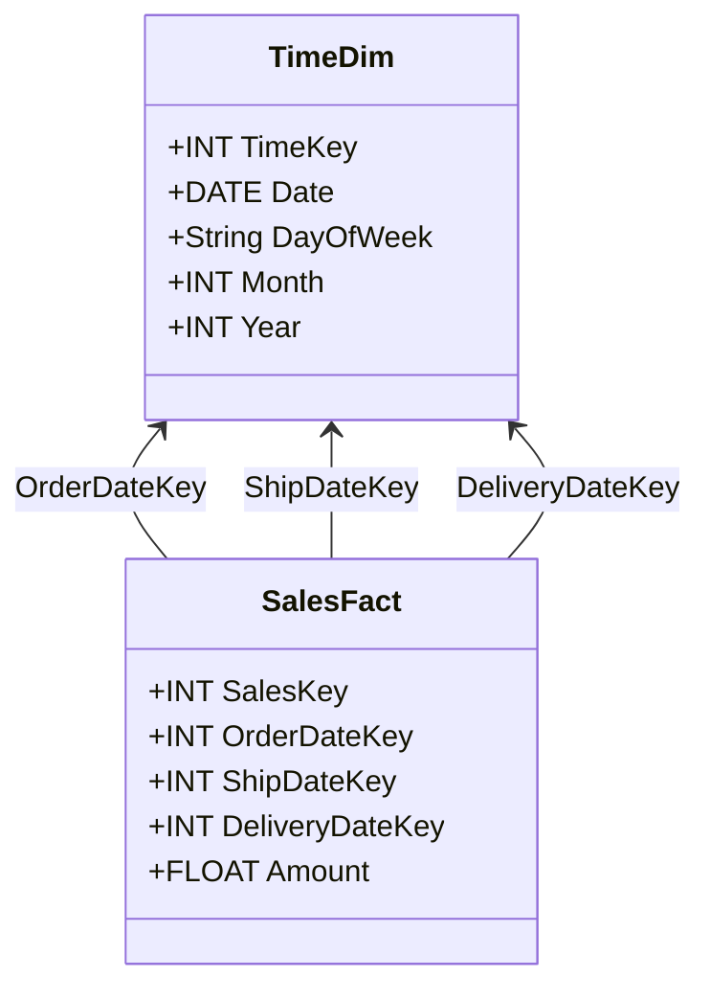

---

linkTitle: "Role-Playing Dimensions"
title: "Role-Playing Dimensions"
category: "5. Data Warehouse Modeling Patterns"
series: "Data Modeling Design Patterns"
description: "A data warehouse modeling pattern where a single dimension table is utilized in multiple roles. This pattern allows for efficient and flexible reporting by reusing dimension data across different context fields within fact tables."
categories:
- DataWarehouse
- Modeling
- DesignPatterns
tags:
- DataModeling
- Dimensions
- RolePlayingDimensions
- DataWarehouseDesign
- ETL
date: 2024-07-07
type: docs

canonical: "https://softwarepatternslexicon.com/102/5/25"
license: "© 2024 Tokenizer Inc. CC BY-NC-SA 4.0"
---


## Introduction

In data warehousing, a "dimension" is a structure that categorizes facts and measures to aid in data analysis. A role-playing dimension is a unique pattern where a single dimension table is reused in various ways throughout the data warehouse. This pattern is particularly useful when a dimension is applicable in different contexts.

## Description

Role-playing dimensions involve using one dimension table in multiple roles by linking it to a fact table on different attributes. This is achieved by creating alias tables, or views, representing distinct aspects of the same dimension. For instance, a time dimension could be reused as different types of dates like order date, ship date, or delivery date within a sales fact table. By having a singular dimension table, consistency in data is maintained, and redundancy is minimized.

## Design Considerations

- Ensure all required roles of the dimension are covered within the fact tables.
- Implement aliasing in SQL views or logical layers to distinguish between different roles.
- Maintain a comprehensive dictionary of roles each dimension plays to avoid confusion in reporting.
- Consider performance implications due to potential joins in many reports and analysis queries.

## Example

Let's consider a sales data warehousing model where the `TimeDim` dimension is used in different roles:

### Dimension Table

```sql
CREATE TABLE TimeDim (
    TimeKey INT PRIMARY KEY,
    Date DATE,
    DayOfWeek VARCHAR(10),
    Month INT,
    Year INT
);
```

### Fact Table with Role-Playing Dimensions

```sql
CREATE TABLE SalesFact (
    SalesKey INT PRIMARY KEY,
    OrderDateKey INT,
    ShipDateKey INT,
    DeliveryDateKey INT,
    Amount FLOAT,
    FOREIGN KEY (OrderDateKey) REFERENCES TimeDim(TimeKey),
    FOREIGN KEY (ShipDateKey) REFERENCES TimeDim(TimeKey),
    FOREIGN KEY (DeliveryDateKey) REFERENCES TimeDim(TimeKey)
);
```

In the `SalesFact` table above, the `OrderDateKey`, `ShipDateKey`, and `DeliveryDateKey` all reference the same `TimeDim` table, demonstrating role-playing dimensions.

## Diagrams

### UML Diagram

Here's a UML Class diagram illustrating the relationships:



## Related Patterns

- **Conformed Dimensions**: Using dimensions consistently across various data marts for consistent reporting.
- **Slowly Changing Dimensions**: Handling changes to dimension attributes over time.
- **Junk Dimensions**: Combining low cardinality attributes into a single dimension table.

## Additional Resources

- *The Data Warehouse Toolkit* by Ralph Kimball and Margy Ross for in-depth examples.
- Online articles and blogs dedicated to best practices in dimension design.
- Whitepapers from cloud providers on optimal data warehouse modeling for performance.

## Summary

The role-playing dimensions pattern is an efficient way to handle dimensions that appear in multiple roles within data warehousing. By utilizing a single dimension table for various scenarios, developers can improve consistency and reduce redundancy. This approach is ideal for scenarios where a dimension logically plays several roles in the business reporting context. With careful modeling and implementation, role-playing dimensions facilitate intuitive and flexible data analysis.


