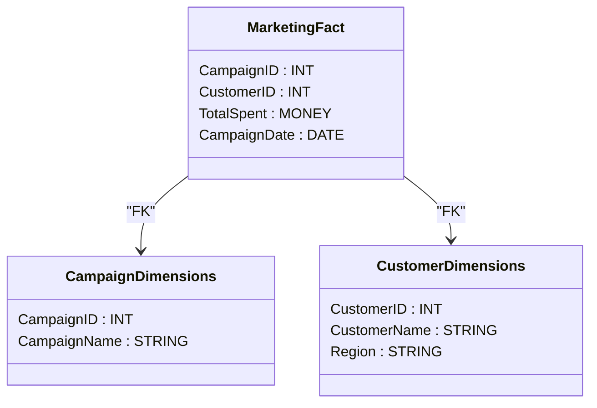

---

linkTitle: "Data Marts"
title: "Data Marts"
category: "Data Warehouse Modeling Patterns"
series: "Data Modeling Design Patterns"
description: "Data Marts are specialized subsets of a data warehouse that focus on specific business functions or departmental needs, streamlining data access and analytical processing."
categories:
- data-warehouse
- data-modeling
- data-architecture
tags:
- data-marts
- data-warehouse
- business-intelligence
- data-modeling
- analytics
date: 2024-07-07
type: docs

canonical: "https://softwarepatternslexicon.com/102/5/27"
license: "© 2024 Tokenizer Inc. CC BY-NC-SA 4.0"
---


## Overview

Data Marts, as a pattern in Data Warehouse Modeling, represent targeted data structures that support the analytics needs of specific business units or departments. By providing a focused subset of the broader enterprise data warehouse, data marts enhance performance, simplify data access, and cater to specific analytical requirements.

## Detailed Explanation

Data Marts are designed to serve the unique queries and reporting needs of particular groups within an organization, such as marketing, finance, or sales. They are built on the overarching data warehouse but are customized with a focus on particular datasets or analytics.

### Characteristics of Data Marts

1. **Subject-Oriented**: They focus on specific business subjects or functional areas, allowing for detailed insights and analysis.
2. **Integrated**: Data in marts is consistent with enterprise-wide definitions ensuring uniformity across different analyses and reporting.
3. **Time-Variant**: Retaining historical data, data marts enable trend analysis over time to support strategic decision-making processes.
4. **Non-volatile**: Though they allow the loading of data in bulk and periodic updates, data in marts remain stable to support accurate analytics.

### Types of Data Marts

- **Dependent Data Marts**: Created directly from an enterprise-wide data warehouse. They ensure consistency in data and are centralized.
- **Independent Data Marts**: Stand-alone systems that do not rely directly on an enterprise data warehouse, potentially leading to duplication or inconsistency.
- **Hybrid Data Marts**: Combination approaches that source data both from data warehouses and other, external sources.

## Architectural Considerations

In designing and implementing data marts, consider the following architectural approaches:
- **Star Schema**: Uses a central fact table and surrounding dimension tables, optimized for querying large datasets.
- **Snowflake Schema**: A normalized form of star schemas where dimension tables are decomposed for more complex querying.
  
Creating data marts involves:
- Identifying business needs and requirements.
- Designing a schema based on user requirements.
- Extracting, Transforming, and Loading (ETL) processes to populate the marts with data.

### Example Code

Consider this simplistic SQL pseudo-code to populate a marketing data mart:

```sql
CREATE TABLE MarketingFact (
    CampaignID INT,
    CustomerID INT,
    TotalSpent MONEY,
    CampaignDate DATE
);

INSERT INTO MarketingFact
SELECT c.CampaignID, 
       cu.CustomerID, 
       SUM(t.TransactionAmount), 
       t.TransactionDate
FROM Customers cu
JOIN Transactions t ON cu.CustomerID = t.CustomerID
JOIN Campaigns c ON t.CampaignID = c.CampaignID
WHERE c.CampaignType = 'Marketing'
GROUP BY c.CampaignID, 
         cu.CustomerID, 
         t.TransactionDate;
```

### Diagram

Here’s a basic UML Class Diagram using Mermaid depicting a Star Schema for a marketing data mart:



## Related Patterns

- **ETL Pipeline**: Essential for data integration processes that populate data marts.
- **Data Warehouse**: A central data storage repository from which dependent data marts derive their data.
- **OLAP Cubes**: Multidimensional data structures used for complex querying and analytics, often built atop data marts.

## Additional Resources

- [Kimball's Dimensional Data Modeling Techniques](https://www.kimballgroup.com/)
- [Inmon's DW 2.0 Architecture](https://www.inmoncif.com/)

## Summary

Data Marts play a pivotal role in enhancing business unit-specific analytics by providing tailored subsets of an enterprise data warehouse. Their design facilitates rapid access to critical business intelligence, ensuring decisions are data-driven and aligned with organizational strategies.

---
