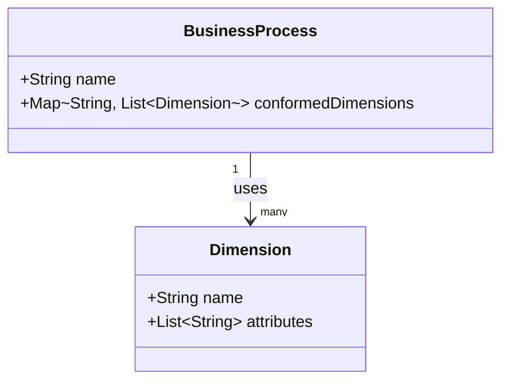

## Enterprise Data Warehouse Bus Matrix

### Introduction
The Enterprise Data Warehouse (EDW) Bus Matrix is a pivotal instrument in data warehouse architecture. It serves as a framework for designing and documenting the relationship between various business processes and the conformed dimensions essential for data consistency across an organization's analytical landscape. By using this pattern, organizations can ensure that their data warehouse integrates well within their broader business strategy, leading to more effective analytics and reporting.

### Purpose
The EDW Bus Matrix aids in systematically identifying key business processes and the corresponding dimensions necessary for forming a cohesive data warehouse. It ensures that all relevant stakeholders understand which data is accessible across various units, promoting uniformity in analysis and decision-making.

### Architectural Components
- **Business Processes**: These are the core activities of an organization that produce measurable outputs, such as order processing or customer service.
- **Conformed Dimensions**: Shared dimensions that are consistently represented across different fact tables. Examples include time, geography, and customer information.
- **Fact Tables**: Central components of a data warehouse representing transactional data or business metrics.

### Architectural Approach
1. **Identify Business Processes**: Select the key activities that the data warehouse will support.
2. **Assign Conformed Dimensions**: Determine critical dimensions shared across multiple business processes.
3. **Map Business Processes to Dimensions**: Create a matrix that documents which conformed dimensions are applicable to each business process.

### Example Code
In a practical scenario where SQL is utilized to align fact tables with conformed dimensions:

```sql
-- Example SQL snippet to demonstrate joining a fact table with conformed dimensions
SELECT 
    o.order_id,
    o.order_date,
    c.customer_name,
    p.product_name,
    o.order_amount
FROM 
    order_fact o
JOIN
    customer_dimension c ON o.customer_key = c.customer_key
JOIN
    product_dimension p ON o.product_key = p.product_key
WHERE 
    o.order_date BETWEEN '2024-01-01' AND '2024-12-31';
```

### Diagrams



### Related Patterns
- **Conformed Dimension**: Enforces consistency of dimensions across different fact tables.
- **Star Schema**: Often used in conjunction with the Bus Matrix to outline fact-dimension relationships.
- **Data Mart**: Smaller, specialized warehouses that may replicate components of the EDW.

### Additional Resources
- *The Data Warehouse Toolkit* by Ralph Kimball, which underscores the significance of systematic dimension and fact table design.
- Online courses focusing on data warehousing and modeling, such as those offered by Coursera and edX.
- In-depth articles on best practices for designing conformed dimensions and business process mapping.

### Summary
The Enterprise Data Warehouse Bus Matrix is an integral pattern that provides clarity and direction when building a cohesive data warehouse. By documenting the intersections between business processes and shared dimensions, organizations can create a robust architecture that ensures data integrity and aids in strategic planning. This matrix not only streamlines the data integration process but also enhances the overall analytical capability across an enterprise.
