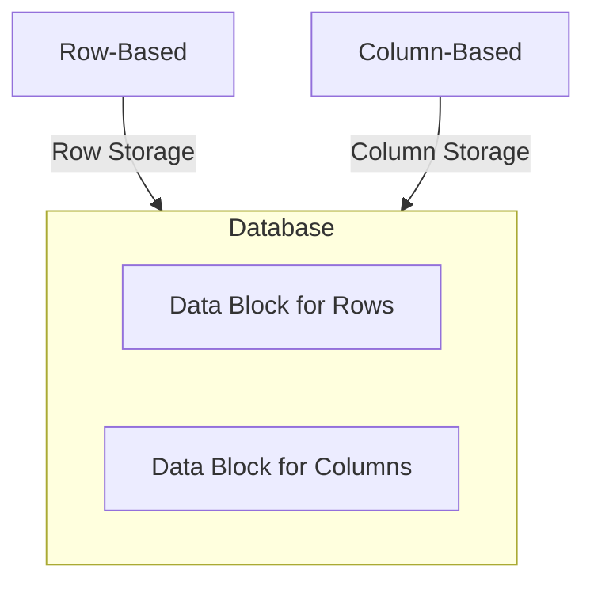

## Columnar Storage

**Columnar storage** is a design pattern that organizes data by columns rather than rows, differing from traditional row-oriented databases. This approach significantly enhances performance for analytical workloads, where operations are performed on a subset of columns, providing substantial benefits for data warehouse environments and big data processing.

### Detailed Explanation

Columnar storage is primarily leveraged in scenarios that demand high-speed data retrieval with minimal I/O operations. Traditional row-oriented databases store an entire row together, which becomes inefficient when queries involve operations on only a few columns across many rows. In contrast, in **columnar databases**, each column family stores data contiguously on disk. This enables faster data retrieval and optimization techniques like compression, which reduces storage footprint and accelerates scans due to the uniformity of data types in columns.

### Architectural Approaches

Columnar storage is often employed in OLAP (Online Analytical Processing) systems. It constitutes the backbone of several modern big data technologies, where it supports large-scale and complex queries typically found in business intelligence and analytics tools. Key architectural components include:

- **Column Families**: Logical groupings of columns which can be queried independently.
- **Compression Techniques**: Enhanced algorithms specifically tailored for columnar formats (e.g., Run-length encoding, Dictionary compression).
- **Vectorized Execution**: Processing data in batches to maximize CPU cache utilization.

### Best Practices

1. **Choose the Right Workload**: Columnar storage is ideal for read-heavy, query-intensive workloads. Consider row-oriented storage for write-dominated workloads.
2. **Data Partitioning**: Segregate data into partitions for scaling performance horizontally by distributing load among partitions.
3. **Compression**: Apply appropriate compression algorithms to balance between speed and storage size without uncompromising performance.
4. **Tuning for Performance**: Leverage indexing and materialized views that suit columnar structures to further optimize queries.

### Example Code

To illustrate how columnar storage might work in practice, consider the following pseudo-SQL expression using a columnar database syntax:

```sql
CREATE TABLE Sales (
  TransactionID INT,
  ProductID INT,
  CustomerID INT,
  Quantity INT,
  SaleDate DATETIME
)
COLUMN FORMAT
;

-- Example Query
SELECT ProductID, SUM(Quantity)
FROM Sales
WHERE SaleDate BETWEEN '2024-01-01' AND '2024-12-31'
GROUP BY ProductID;
```

### Diagrams

Below is a simple Mermaid UML diagram illustrating the difference between row-based and column-based storage architecture:



### Related Patterns

- **Data Partitioning**: Improve query performance by splitting data into partitions based on certain keys.
- **ETL Optimization**: Utilize efficient Extract, Transform, Load processes that capitalize on columnar storage advantages.
- **Indexing Patterns**: Develop indexes that are specific to columnar data types to further streamline access patterns.

### Additional Resources

- [Research on Columnar Storage](https://example.com/research-column-storage)
- [Understanding Columnar Databases](https://example.com/understanding-ultramax)

### Summary

Columnar storage design patterns offer compelling advantages for analytical queries over vast datasets. By structuring databases at the column level, organizations can drive improved query performance and reduced data redundancy, harnessing the true potential of their data-driven initiatives in big data and data warehousing contexts. Implementing these practices ensures scalable, efficient, and faster responses to complex analytical workloads.
