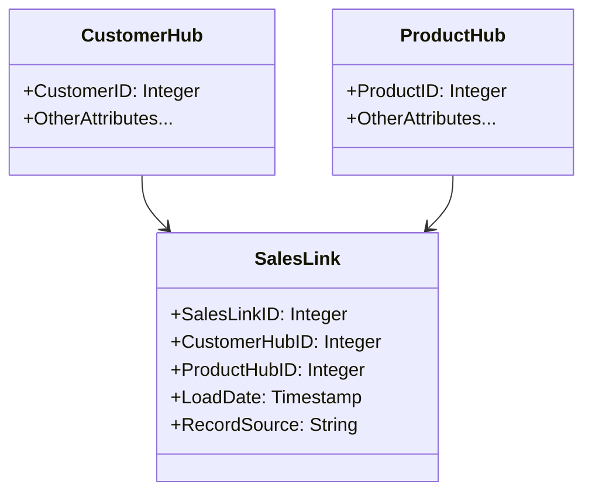

Link tables are a crucial component of the Data Vault modeling paradigm, primarily designed to represent many-to-many relationships between hub entities. Unlike traditional data warehousing models, where relationships might be embedded within tables themselves, link tables decouple these associations to improve scalability, flexibility, and auditability.

## Detailed Explanation of Link Tables

Link tables are used in scenarios where relationships between core data entities must be explicitly modeled. This pattern is central to Data Vault as it accommodates changes in business relationships over time without significant remodeling. Link tables provide the flexibility needed to add or remove associations without disrupting existing data structures.

### Key Characteristics:

1. **Decoupled Relationships**: Allows modifications to the entities' relationships independently of their core data attributes.
2. **Version Control**: Facilitates the tracking of historical changes in relationships.
3. **Enhanced Scalability**: Supports many-to-many relationships efficiently.

### Structure of a Link Table

A typical structure of a link table includes:

- **Natural Key**: Combination of related hub primary keys.
- **Surrogate Key**: Unique identifier for the link record.
- **Load Date**: Timestamp indicating when the link was created in the data warehouse.
- **Record Source**: Origin of the data for audit purposes.
- **Optional Descriptive Attributes**: Additional details specific to the relationship.

Example code of a Link Table in SQL:

```sql
CREATE TABLE SalesLink (
  SalesLinkID INTEGER PRIMARY KEY AUTO_INCREMENT,
  CustomerHubID INTEGER,
  ProductHubID INTEGER,
  LoadDate TIMESTAMP,
  RecordSource VARCHAR(255),
  FOREIGN KEY (CustomerHubID) REFERENCES CustomerHub(CustomerHubID),
  FOREIGN KEY (ProductHubID) REFERENCES ProductHub(ProductHubID)
);
```

## Diagram

Here's a Mermaid UML class diagram depicting how link tables interact with hub tables:



## Related Patterns

1. **Hub Tables**: Define the core entities of the business, housing primary business keys and informational attributes.
2. **Satellite Tables**: Store descriptive data attributes linked to hubs and links, capturing changes over time.
3. **Data Vault Modeling**: A holistic approach that incorporates hub, satellite, and link tables to create a scalable data warehouse.

## Best Practices

- **Use Natural Keys**: While surrogate keys help database operations, using natural keys ensures meaningful relationships.
- **Minimize Redundancy**: Ensure that link tables only contain relationship-defining columns and minimal attributes.
- **Auditability**: Always include load date and record source columns for traceability and compliance purposes.

## Example Scenarios

- **Sales Transactions**: Modeling the relationship between customers and product purchases.
- **Supply Chain**: Capturing connections between suppliers and product components.
- **Marketing Campaigns**: Linking promotional activities with audience segments.

## Additional Resources

- Dan Linstedt and Michael Olschimke's "Building a Scalable Data Warehouse with Data Vault 2.0."
- Kimball Group's "The Data Warehouse Toolkit: The Definitive Guide to Dimensional Modeling."

## Summary

Link tables are a foundational component of Data Vault modeling, specifically designed to efficiently handle complex many-to-many relationships. By providing a distinct mechanism to model relationships independent of entity attributes, link tables enhance scalability, flexibility, and maintainability of data warehouses. This pattern is particularly useful in environments where data structures and relationships evolve frequently, ensuring that the data warehouse can adapt swiftly without major redesigns.
