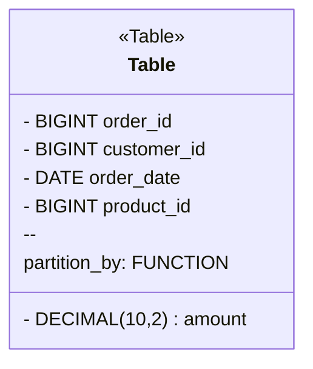

---

linkTitle: "Partitioning Strategies"
title: "Partitioning Strategies"
category: "Data Warehouse Modeling Patterns"
series: "Data Modeling Design Patterns"
description: "Partitioning Strategies involve dividing large tables into smaller, manageable pieces based on a partition key to enhance performance and manageability in a data warehouse."
categories:
- Data Modeling
- Data Warehouse
- Performance Optimization
tags:
- Partitioning
- Data Warehouse
- Performance
- Scalability
- Query Optimization
date: 2024-07-07
type: docs

canonical: "https://softwarepatternslexicon.com/102/5/30"
license: "© 2024 Tokenizer Inc. CC BY-NC-SA 4.0"
---

## Partitioning Strategies

### Description
Partitioning Strategies are essential architectural approaches in data warehouse environments designed to manage and query large datasets efficiently. By dividing a large table into smaller, more manageable partitions based on a chosen partition key, this pattern helps improve query performance, simplify maintenance, and enhance scalability.

### Benefits
- **Improved Query Performance**: Queries that filter on the partition key can leverage partition pruning, scanning only relevant partitions.
- **Easier Maintenance**: Smaller partitions facilitate data management tasks such as backup, restore, and cleanup.
- **Scalability**: Supports scaling out by allowing the distribution of partitions across multiple nodes.
- **Enhanced Manageability**: Simplifies data lifecycle management through techniques like partition rolling and archiving.

### Example Implementation
Consider a `SalesFact` table in a data warehouse. This table can be partitioned by a date, such as `order_date`, allowing queries that include date filters to read less data, speeding up performance significantly.

```sql
CREATE TABLE SalesFact (
  order_id BIGINT,
  customer_id BIGINT,
  order_date DATE,
  product_id BIGINT,
  amount DECIMAL(10,2)
) PARTITION BY RANGE(order_date);
```

This SQL DDL statement partitions `SalesFact` by year or month of `order_date`.

### Partitioning Types
- **Range Partitioning**: Divides data into non-overlapping ranges, e.g., dates.
- **List Partitioning**: Partitions based on predefined lists of values.
- **Hash Partitioning**: Distributes rows into buckets using a hash function.
- **Composite Partitioning**: Combines multiple partitioning strategies.

### Best Practices
- Choose a partition key that balances partitions in terms of size and access pattern.
- Monitor and manage partition "skew" to avoid imbalanced data distribution.
- Use partition elimination and pruning to optimize query plans.
- Align partitioning strategy with data loading and read patterns for the most efficiency.

### Diagram


### Related Patterns
- **Sharding Pattern**: Related to partitioning; involves distributing data across multiple databases or instances.
- **Caching Pattern**: Often used in conjunction with partitioning to reduce query load.

### Additional Resources
- [Cloud Data Warehouse Patterns](#)
- [Advanced SQL and Relational Databases](#)
- [Designing Scalable Data Models with Partitioning](#)

### Summary
Partitioning Strategies are pivotal in optimizing the performance and scalability of data warehouses. By strategically dividing large tables, organizations can achieve significant efficiencies and manage their data landscape more effectively. Implementing the right partitioning strategy aligns with the overall system architecture and user query patterns, providing enhanced performance and operational simplicity.

---
