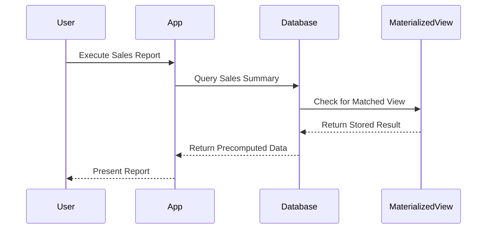

## Overview

Materialized Views (MV) are database objects that contain the results of a query. They are like regular views, but unlike a view, a materialized view caches the results of a query physically, which makes the subsequent execution much faster than querying the base tables directly. The main advantage of materialized views is query optimization by storing expensive join, aggregation, and complex computations as precomputed, physical data.

## Problem

In a data warehouse environment, it is common for the same complex queries to be executed repeatedly. Although modern databases are designed to handle such queries with relatively good performance, the computational overhead can still be significant for very large data sets, especially during real-time reporting or when an organization grows and the amount of data increases. This can lead to slower response times and impact the user experience.

## Solution

The Materialized Views pattern addresses this problem by storing the results of the complex queries in a precomputed form. When a query is run that matches a materialized view, the database retrieves the data from the materialized view rather than re-running the complex query, significantly reducing the computation time.

### Benefits

- **Performance Improvement**: By utilizing precomputed data, materialized views dramatically speed up read-intensive operations.
- **Reduced Load on Server**: By limiting the need for expensive query recomputation, server resources are conserved.
- **Simplified Query Writes**: Can simplify and standardize reports, as users can query simple precomputed results rather than complex joins and calculations.

### Drawbacks

- **Storage Overhead**: As materialized views are physical copies of data, they can consume significant storage.
- **Maintenance Overhead**: Materialized views need to be refreshed periodically to ensure they reflect the latest data modifications, which can introduce complexity and potential performance overhead.

## Implementation

Materialized View creation and maintenance vary across different database systems, but below is a general SQL example to illustrate creating a simple materialized view:

```sql
CREATE MATERIALIZED VIEW sales_summary AS
SELECT region, 
       MONTH(order_date) AS month, 
       SUM(amount) AS total_sales
FROM sales
GROUP BY region, MONTH(order_date);
```

In this scenario, the materialized view `sales_summary` stores aggregated sales data by region and month, optimizing performance for any queries that summarize sales by these dimensions.

### Refresh Strategies

- **Complete Refresh**: Recomputes the entire view from the base tables. Useful when changes are significant.
- **Incremental Refresh**: Applies only the changes that occurred since the last refresh. Suitable for less frequent changes.

## Diagram

Below is a UML Sequence Diagram illustrating the use of a materialized view for query optimization:



## Related Patterns

- **Caching**: Implement caches at different levels, which are inspired by similar concepts of storing precomputed or frequently accessed data.
- **Database Sharding**: Distribute the data across many database servers to reduce query load on individual databases.

## Additional Resources

- [AWS Redshift Materialized Views Documentation](https://docs.aws.amazon.com/redshift/latest/dg/materialized-view-concepts.html)
- [Google Cloud BigQuery: Using Materialized Views](https://cloud.google.com/bigquery/docs/materialized-views-intro)
- [Oracle Materialized Views Overview](https://www.oracle.com/database/technologies/materialized-views.html)

## Summary

Materialized Views are a powerful pattern in data warehouse optimization, allowing for dramatically improved query performance by storing precomputed results of complex queries. Although they introduce storage and maintenance considerations, their ability to offload expensive computation can lead to significant efficiency improvements. Understanding and implementing them correctly will leverage faster data retrieval and better resource management, crucial in today's data-driven environments.
