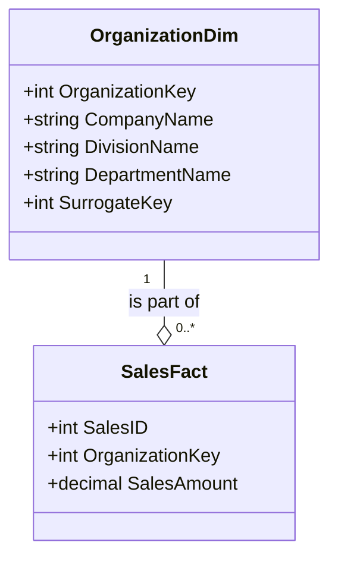

Hierarchical dimensions are an essential pattern in data warehouse modeling, significantly enhancing the analytical capabilities by enabling users to perform drill-down analysis. These dimensions capture hierarchical relationships within the data, allowing users to explore data at different levels of granularity.

## Detailed Explanation

Hierarchical dimensions are structured into levels, where each level represents a layer of the hierarchy, facilitating easy navigation through the dataset. This structure is particularly useful in Online Analytical Processing (OLAP) systems where exploring trends, patterns, and aggregations at various levels is critical for insightful data analysis.

### Example

Consider the "OrganizationDim" dimension. This dimension might have a hierarchical structure such as:
- **Company**: The top level which provides the broadest aggregation of data.
- **Division**: Nested under Company and allows a more focused view within a particular part of the company.
- **Department**: Under Division, facilitating detailed insights into specific business units.

### Architectural Approaches

- **Star Schema**: Involves a central fact table and related dimension tables that house hierarchical data. This schema is straightforward but may duplicate data.
- **Snowflake Schema**: An extension of the star schema which normalizes the dimension tables. This reduces data redundancy but can be more complex and may slow down query performance.

### Paradigms and Best Practices

- **Balance Between Depth and Complexity**: Design hierarchies that meet business needs without unnecessary complexity.
- **Exact Hierarchical Relationships**: Ensure accurate representation of real-world hierarchical relationships to maintain data integrity.
- **Use Surrogate Keys**: Implement surrogate keys to maintain unique references to each hierarchical level, ensuring efficient data retrieval and maintenance.

## Example Code: SQL

```sql
CREATE TABLE OrganizationDim (
  OrganizationKey INT PRIMARY KEY,
  CompanyName VARCHAR(100),
  DivisionName VARCHAR(100),
  DepartmentName VARCHAR(100),
  SurrogateKey INT,
  FOREIGN KEY (SurrogateKey) REFERENCES OtherDimTable(Key)
);

CREATE TABLE SalesFact (
  SalesID INT PRIMARY KEY,
  OrganizationKey INT,
  SalesAmount DECIMAL,
  FOREIGN KEY (OrganizationKey) REFERENCES OrganizationDim(OrganizationKey)
);
```

## Diagrams

### Hierarchical Dimension Structure



## Related Patterns

- **Conformed Dimensions**: Shared dimensions across fact tables to ensure consistency in data analysis.
- **Slowly Changing Dimensions**: Techniques to manage changes in dimension data over time.
- **Junk Dimensions**: Combine low-cardinality and random attributes into a single table to minimize clutter in data models.

## Additional Resources

- *Kimball Group's Data Warehouse Toolkit*: Excellent resource for understanding data warehouse design including hierarchical dimensions.
- *OLAP Analysis Documentation*: Detailed guides on implementing and querying hierarchical dimensions in OLAP systems.
- *Data Vault Modelling*: Alternative modeling approach dealing with dynamic data environments.

## Summary

Hierarchical dimensions play a pivotal role in the structure and functionality of data warehouses by supporting the layered representation of organizational data. By enabling users to explore data at varying levels through drill-down capabilities, they enhance analytical depth and flexibility. Understanding their design and correct implementation can substantially improve the efficacy and accuracy of data analysis in robust business intelligence systems.
