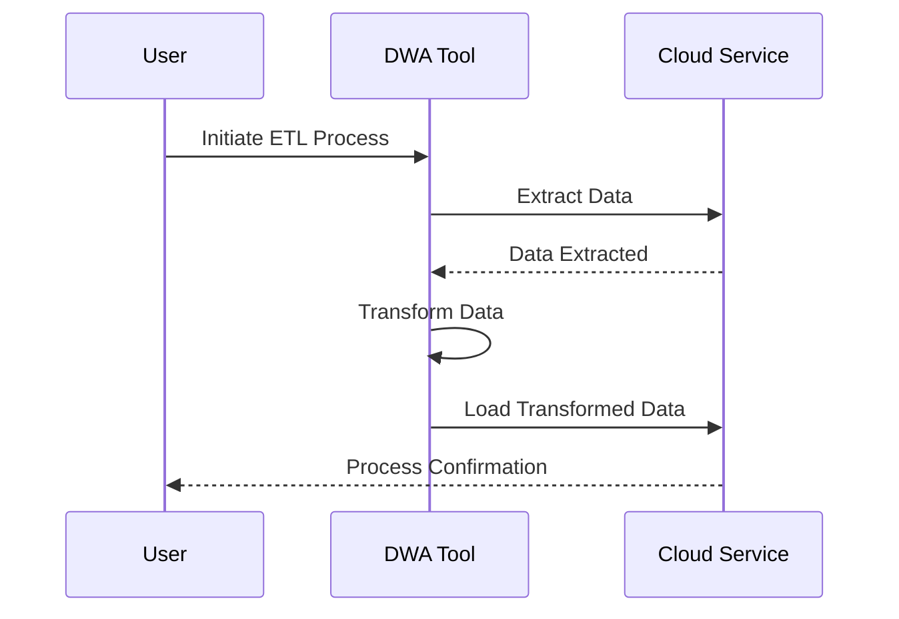

## Overview

Data Warehouse Automation (DWA) refers to the use of specialized tools and techniques to automate the design, development, deployment, and maintenance of data warehouse systems. It streamlines the process of handling large volumes of data, reducing manual effort, and increasing efficiency and accuracy. With the rise of big data and cloud-based solutions, automating data warehouse tasks has become a critical aspect of modern data management strategies.

## Key Concepts

### Automation Tools

Data Warehouse Automation involves using dedicated tools that support various aspects of data warehousing. These tools often come with capabilities like:

- **Automated ETL (Extract, Transform, Load) Processes**: Defining data extraction, transformation, and loading processes with minimal manual coding.
  
- **Schema Management**: Automatically updating and maintaining database schemas as source data changes.

- **Version Control**: Managing changes in data and schema versions efficiently.

- **Testing and Validation**: Automated testing procedures to ensure data quality and accuracy.

### Benefits

- **Reduced Development Time**: Automation accelerates the deployment of data warehouses, leading to quicker insights and decision-making.
  
- **Consistent Quality**: Automated processes reduce human error, ensuring higher data quality standards.

- **Scalability**: Easily adapt to changing data volumes and requirements with automated processes in place.

- **Cost Efficiency**: Reducing manual intervention leads to saving on resources and operational costs.

## Architectural Approach

Data Warehouse Automation can fit various architectural models, including:

- **Cloud-Based Architectures**: Utilize cloud providers' native services (e.g., Google's BigQuery, Amazon Redshift) to leverage their automated features and scalability.
  
- **Hybrid Models**: Combining on-premises systems with cloud-based services to optimize resource utilization and integration.

- **Service-Oriented Architectures**: Employ microservices to handle different aspects of data warehousing automation.

## Example Code Snippet

Here’s a simple example with a hypothetical Python script using an automation library for ETL process:

```python
from dw.auto import ETLAutomation

etl_tool = ETLAutomation()
data_source = etl_tool.connect_source('source_db')
transformed_data = etl_tool.transform_data(data_source, transformations=[
    {'operation': 'filter', 'field': 'age', 'condition': '> 18'},
    {'operation': 'rename', 'old_name': 'dob', 'new_name': 'date_of_birth'},
])
etl_tool.load_data(transformed_data, 'target_warehouse')
```

## Diagram



## Related Patterns and Practices

- **ETL Automation Pattern**: Focusing specifically on modernizing and automating extract, transform, and load processes.
  
- **Continuous Integration and Continuous Deployment (CI/CD)**: Applying CI/CD principles for data pipeline deployment and management.

- **Schema Evolution Patterns**: Methods to manage and automate schema changes and versions.

## Additional Resources

- "The Data Warehouse Toolkit" by Ralph Kimball
- Google Cloud's Data Warehouse Design Patterns
- Amazon Redshift Best Practices for Scaling and Automation

## Summary

Data Warehouse Automation is a transformative approach to managing data warehouses efficiently and effectively. It focuses on reducing manual interventions and increasing productivity by leveraging advanced tools and methodologies. By implementing automated processes for ETL, schema management, and deployment, organizations can achieve faster and more reliable data insights.
