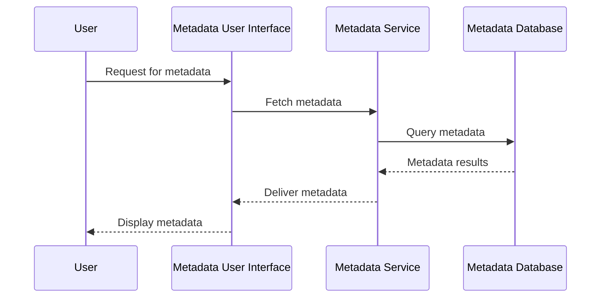

### Overview

In modern data architectures, managing metadata effectively is critical for ensuring the quality, consistency, and accessibility of data across the organization. A **Data Warehouse Metadata Repository** serves as the centralized location for storing all metadata related to a data warehouse. This includes data models, mappings, transformations, and lineage information which are crucial for maintaining data integrity and facilitating tasks like impact analysis, audit trail tracking, and regulatory compliance.

### Key Concepts

- **Metadata**: Data about data, providing context and meaning. It includes definitions, data types, transformations, business rules, and lineage information.
- **Central Repository**: A unified platform to store and access metadata, ensuring consistency and reducing redundancy.
- **Data Lineage**: Capabilities for tracking the flow of data through the system, from source to destination, detailing all transformations and processes it undergoes.

### Design Pattern Details

#### Architectural Components

1. **Metadata Storage**: Use databases or specialized metadata management tools to store metadata. This storage should be scalable and easily accessible.
   
2. **Metadata Access Layer**: Implement APIs or services that allow other systems and users to query and manipulate metadata as required.

3. **User Interface**: A dashboard or tool where users can view and manage metadata, often with a search functionality for easier access.

4. **Integration Mechanisms**: Employ ETL processes and metadata harvesters that integrate with existing systems to automatically collect and update metadata.

#### Benefits

- **Improved Data Quality**: Since metadata provides context, users can better understand data semantics, helping to avoid misinterpretation.
  
- **Ease of Maintenance**: By understanding the data's lineage and dependencies, organizations can perform impact analysis and make informed changes.

- **Regulatory Compliance**: Clear data lineage and governance ensure that the organization meets regulatory requirements effectively.

#### Implementation Considerations

- **Security**: Ensure access to metadata is appropriately restricted to authorized users only.

- **Scalability**: Account for increasing data and metadata volume, making sure the repository can scale accordingly.

- **Interoperability**: The metadata repository should effectively communicate and integrate with various technologies and data formats.

### Code Example

Here is a pseudo-code example that outlines how a simple metadata entry might be structured in a metadata repository.

```json
{
    "tables": {
        "sales": {
            "columns": {
                "transaction_id": {
                    "data_type": "INT",
                    "definition": "Unique identifier for each transaction"
                },
                "amount": {
                    "data_type": "DECIMAL",
                    "definition": "Total amount of the transaction"
                }
            },
            "lineage": {
                "source": "transactions",
                "transformations": [
                    "filter_invalid_entries"
                ]
            }
        }
    }
}
```

### Diagram

The diagram below illustrates the architecture of a Data Warehouse Metadata Repository using a simplified Mermaid UML Sequence Diagram:



### Related Patterns

- **Data Catalog**: A collection of organized metadata, often integrated with the metadata repository to provide enriched data context.
  
- **ETL Process**: Extract, Transform, Load processes can automatically update metadata repositories with lineage and transformation details.

- **Data Lineage Analysis**: Focuses specifically on tracking data movements to help in understanding the data journey and transformations.

### Additional Resources

- **Data Governance Institute**: [Data Governance & Stewardship](https://www.datagovernance.com/)
  
- **Metadata Systems & Technology Guide**: A book by David Marco, for further reading on managing metadata across enterprises.

### Summary

The Data Warehouse Metadata Repository pattern is essential for streamlining data management processes within an organization. By centralizing metadata, organizations can enhance data quality, maintain better control over changes, and comply with regulatory mandates. This pattern should be augmented with best practices in metadata management to ensure scalability, security, and interoperability across various systems.
