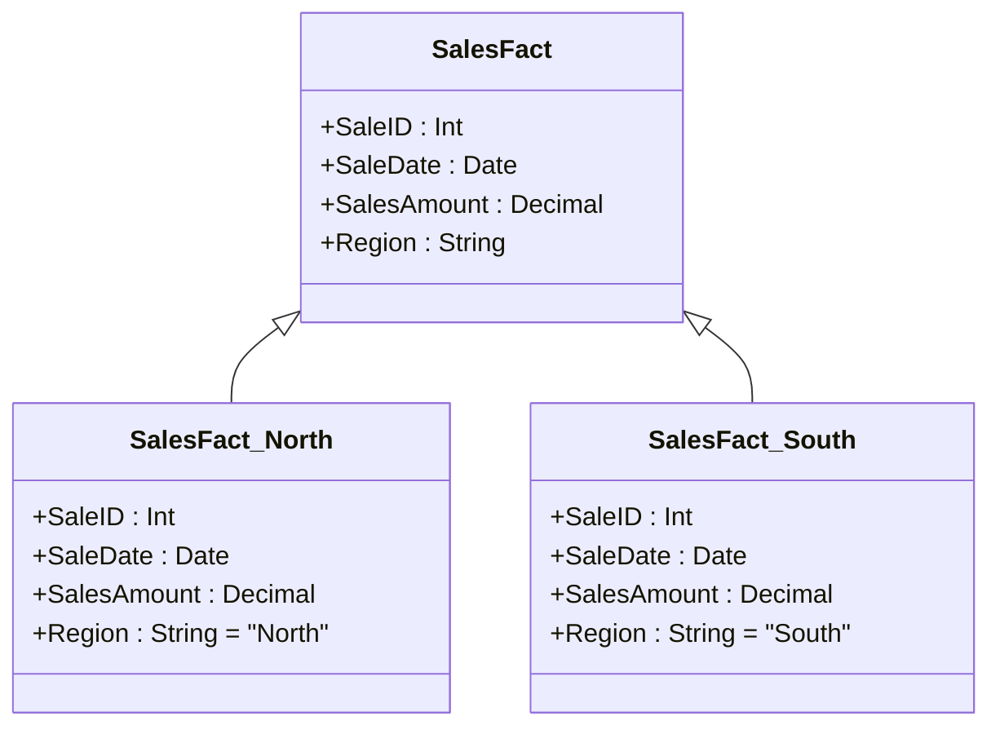

## Fact Partitioning

**Fact Partitioning** is a crucial pattern in data warehousing and large-scale database management systems, aimed at distributing large fact tables into smaller, more manageable pieces. This approach is fundamental to enhancing performance by optimizing query efficiency, improving manageability, and ensuring scalability and reliability.

### Detailed Explanation

The core idea of Fact Partitioning involves dividing a large fact table based on logical or physical attributes such as time intervals, region, business units, or other criteria pertinent to the business logic. This partitioning enables more efficient queries and improved database performance because the system can isolate and query only the relevant partitions.

#### Key Benefits
1. **Performance Improvement**: By isolating relevant partitions, the system reduces I/O operations and speeds up data retrieval. Indexes become more effective as they apply to smaller data sets.
2. **Scalability**: As data grows, additional partitions can be added to the database without impacting existing partitions.
3. **Maintenance and Manageability**: Administrators can manage smaller datasets more efficiently. Index rebuilding, statistics collection, and partition rolling-forward become straightforward tasks.
4. **Security and Isolation**: Different users or departments can be assigned to different partitions, improving security and data governance.

### Architectural Approach

- **Horizontal Partitioning**: Distributing rows of a table into different tables, often on different servers or disk segments.
- **Vertical Partitioning**: Dividing a table columns-wise, which is less common for facts since it hinders analytical queries which require more columns.
- **Hybrid Approach**: Combining both horizontal and vertical partitioning to suit specific business cases.

### Example Code

Here is a simplified SQL example demonstrating a basic partition of a `SalesFact` table by region:

```sql
CREATE TABLE SalesFact_North (
  SaleID INT,
  SaleDate DATE,
  SalesAmount DECIMAL(10, 2),
  Region VARCHAR(50)
) AS SELECT * FROM SalesFact WHERE Region = 'North';

CREATE TABLE SalesFact_South (
  SaleID INT,
  SaleDate DATE,
  SalesAmount DECIMAL(10, 2),
  Region VARCHAR(50)
) AS SELECT * FROM SalesFact WHERE Region = 'South';
```

### Diagram

Below is a simple UML diagram illustrating the concept of fact partitioning:



### Related Patterns

1. **Sharding**: A similar concept where the database is split across multiple machines to distribute load and manage large datasets.
2. **Data Lakes**: Often implemented with partitioning strategies to manage large-scale unstructured data.
3. **Indexing**: Used alongside partitioning to further improve query performance on partitioned data sets.

### Additional Resources

- [Data Warehouse Performance Tuning](https://example.com/data-warehouse-performance)
- [Partitioning Strategies for Big Data Systems](https://example.com/big-data-partitioning)
- [Understanding Database Sharding and Clustering](https://example.com/database-sharding)

### Summary

Fact Partitioning is a powerful pattern that enhances the scalability and performance of data warehouse architecture. By logically dividing data, organizations can manage their datasets more efficiently, enabling faster queries and more responsive data environments. Implementing this pattern requires careful planning and consideration of the business context, ensuring that partitioning strategies align with organizational needs and data access patterns.
