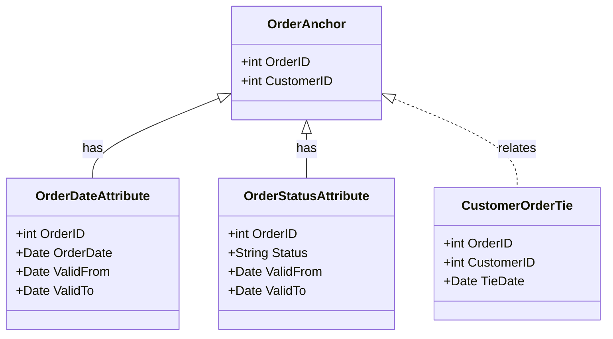

## Anchor Modeling

Anchor Modeling is a highly flexible data modeling technique designed for data warehouses that require the ability to evolve and adapt over time without adversely impacting the existing data or structure. This adaptability is achieved through a combination of anchors, attributes, and ties that define relationships and allow for dynamic schema evolution.

### Key Concepts

1. **Anchors**: 
   - Anchors represent the core entities in your data model. They are similar to tables that hold the primary version of an entity, establishing a central point for reference.
   - Example: An `OrderAnchor` table that captures the core attributes of an order such as `OrderID` and `CustomerID`.

2. **Attributes**: 
   - Attributes describe detailed properties of an anchor. These are akin to descriptive attributes that can be expanded without altering the core structure.
   - Example: Separate `OrderAttribute` tables, such as `OrderDateAttribute`, `OrderStatusAttribute`, which can evolve independently of each other.

3. **Ties**: 
   - Ties define relationships between different anchors or between anchors and their attributes. These allow the model to reflect various associations or hierarchies.
   - Example: A `CustomerOrderTie` table to relate customers with multiple orders.

### Architectural Approach

- **Decoupled Schema**: The design is inherently agile, allowing schema changes (new attributes or ties) without full system redesigns. This is particularly useful in environments where data requirements change frequently.
  
- **Versioning Support**: By isolating attributes, the model inherently supports temporal data versions. This makes it suitable for maintaining historical data and revisions efficiently.

- **Scalability and Flexibility**: Anchors can be associated with various different attributes and ties, providing a scalable approach to accommodate increasing complexity and data volume.

### Example Code

Here's a simple SQL table setup for an Anchor Modeling approach:

```sql
CREATE TABLE OrderAnchor (
    OrderID INT PRIMARY KEY,
    CustomerID INT NOT NULL
);

CREATE TABLE OrderDateAttribute (
    OrderID INT REFERENCES OrderAnchor(OrderID),
    OrderDate DATE,
    ValidFrom DATE NOT NULL,
    ValidTo DATE
);

CREATE TABLE OrderStatusAttribute (
    OrderID INT REFERENCES OrderAnchor(OrderID),
    Status VARCHAR(20),
    ValidFrom DATE NOT NULL,
    ValidTo DATE
);

CREATE TABLE CustomerOrderTie (
    OrderID INT REFERENCES OrderAnchor(OrderID),
    CustomerID INT,
    TieDate DATE
);
```

### Diagrams



### Related Patterns

- **Data Vault**: This pattern is similar in its emphasis on flexibility and auditability but utilizes hubs, links, and satellites.

- **Dimensional Modeling**: More traditional, often used in situations where the analysis of trends and relationships is more critical than flexibility.

### Best Practices

- **Decouple Changes**: Always aim to introduce new descriptors or relationships as separate entities to maintain the integrity of existing structures.
- **Utilize Indexes**: Ensure that anchors and related tables are indexed appropriately to maintain performance.
- **Benefit from Automation**: Use automation tools that support dynamic changes and manage schema evolution effortlessly.

### Additional Resources

- **Anchor Modeling Website**: [Anchor Modeling](https://www.anchormodeling.com/)
- **Research Papers**: Look up publications on dynamic models and agile modeling principles for deeper insights.
- **Tools**: Data modeling tools that support schema versions and attribute management.

### Summary

Anchor Modeling shines in the dynamic, fast-evolving contexts of modern data warehouses. It offers an agile, adaptable approach to data structure evolution, delivering the ability to change without disruption. This design pattern is instrumental in ensuring a robust, comprehensive, and scalable data architecture that aligns with the growth and complexity of real-world applications.
