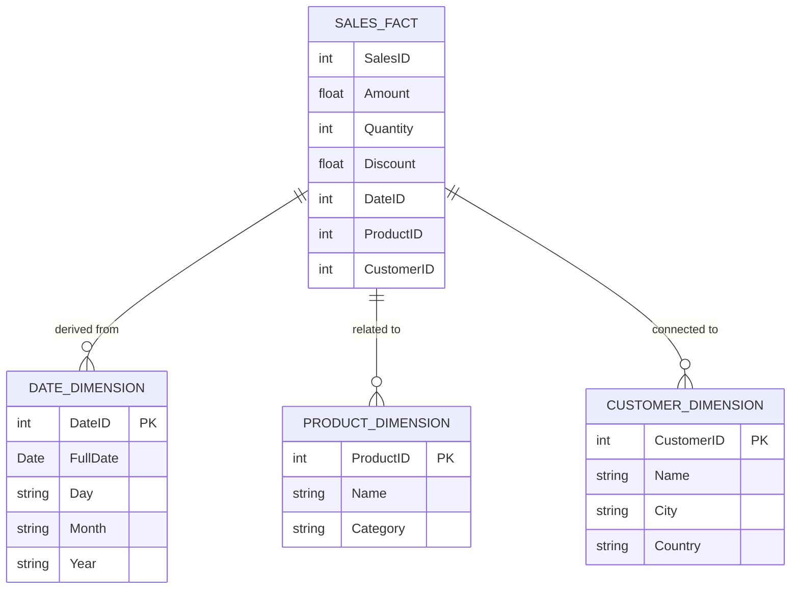

## Kimball Approach

### Overview

The Kimball Approach is a widely adopted data warehousing design paradigm that emphasizes a bottom-up methodology, focusing on creating dimensional models to build data marts tailored to specific business processes. This design pattern is renowned for its capacity to deliver rapid business value by producing solutions that closely align IT deliverables with business needs.

### Detailed Explanation

In the Kimball methodology, the core idea is to start by developing data marts optimized for analytics concerning particular business topics, such as sales or inventory. The development process is intrinsically flexible and iterative, allowing organizations to gradually expand their data warehousing system.

#### Dimensional Modeling

Dimensional modeling is the quintessential technique used in the Kimball Approach, where data is modeled into 'facts' and 'dimensions'. This enables easier querying by business users and improved performance for analytical queries.

- **Facts**: Central tables that typically contain quantitative performance measures of an organization's business processes.
- **Dimensions**: Accompanying tables that describe aspects related to the fact tables, often used for defining the "who, what, where, when, why, and how" related to the business processes.

### Example Implementation

Consider a retail sales organization aiming to analyze its sales data:

- **Fact Table**: `Sales_Fact` which might include measures such as sales amount, quantity sold, and discount.
- **Dimension Tables**:
  - `Date_Dimension` for temporal data.
  - `Product_Dimension` which contains product-related data such as product identifiers, names, categories, etc.
  - `Customer_Dimension` which details customer information like customer IDs, names, locations, demographics.

#### Star Schema Example

Below is a simple diagram illustrating a star schema using the Kimball Approach:

### Architectural Approach

The Kimball Approach encourages a decentralized architecture where data marts serve as building blocks for an enterprise data warehouse (EDW). Each data mart is designed to address specific business questions, subsequently integrated to form the complete EDW.

### Best Practices

1. **Business Alignment**: Begin with understanding specific business requirements and key performance indicators.
2. **Gradual Expansion**: Start with high-priority business areas to ensure early success and to encourage stakeholder buy-in.
3. **Flexible Design**: Use conformed dimensions to allow integration and scalability as new data marts are introduced.
4. **User Involvement**: Engage users in the design process to ensure that the models meet analytical and reporting needs.

### Related Patterns

- **Inmon Approach**: A contrasting top-down methodology focused on building a normalized enterprise data warehouse from which data marts are derived.
- **Data Vault Modeling**: Provides a balance between flexibility and consistency with its hub-and-spoke architecture.

### Additional Resources

- *The Data Warehouse Toolkit* by Ralph Kimball and Margy Ross
- Kimball Group Website: [kimballgroup.com](http://www.kimballgroup.com)
- Dimensional Modeling in Depth: Course and articles by industry practitioners.

### Summary

The Kimball Approach's bottom-up methodology and focus on dimensional modeling make it a popular choice for organizations looking to implement business-centric data warehousing solutions. By prioritizing team diversity and incremental growth, it meets both short-term analytical needs and long-term strategic goals, while being scalable and user-friendly.
