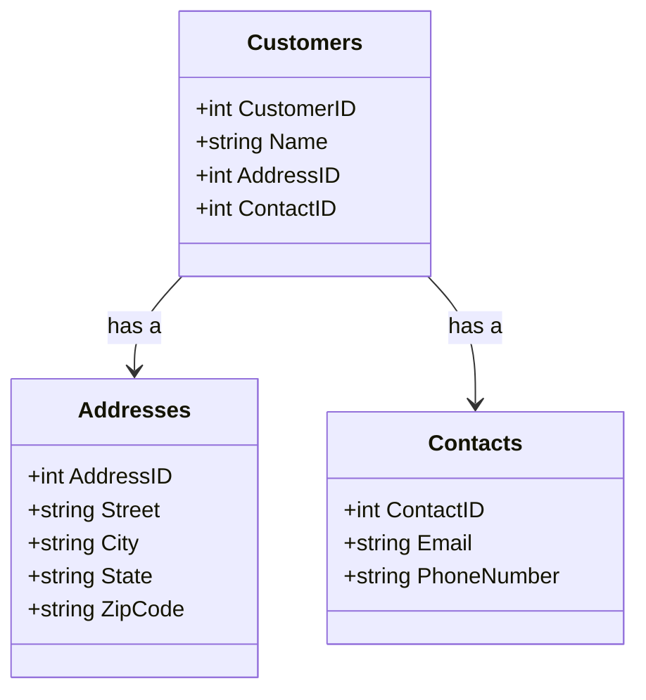

## Inmon Approach

### Overview

The Inmon Approach, named after Bill Inmon, one of the pioneers in the field of data warehousing, is a top-down methodology that focuses on the creation of a centralized, enterprise-wide data warehouse. This strategy emphasizes building a comprehensive data warehouse before constructing data marts, which are subsets of the data warehouse tailored for specific business functions.

### Characteristics

- **Enterprise Focused**: The Inmon Approach aims to integrate data across an entire organization, aligning information to serve varied business needs in a consistent manner.
- **Normalized Data Models**: The design pattern employs third normal form (3NF) for data warehouse modeling, which helps in reducing data redundancy and improving data integrity.
- **Strategic Data Integration**: This methodology ensures that organizational data is centralized, cleaned, and consistently integrated, providing a single source of truth for decision-making.

### Architectural Approaches

- **Top-Down Design**:
  - Prioritizes the development of an enterprise-wide data warehouse using a normalized 3NF structure.
  - Views the data warehouse as an integrated, historical repository of data designed to facilitate complex data analysis.

- **Data Marts as a Subset**:
  - Once the core data warehouse is established, subject-area-specific data marts can be developed.
  - Marts are sourced from the centralized data warehouse and structured according to specific business processes.

### Best Practices

- **Comprehensive Data Governance**: Establish clear data governance protocols to maintain data quality, uniformity, and security across the enterprise.
- **Iterative Development**: While the Inmon Approach is inherently top-down, implementation through iterative phases can help manage complexity and provide incremental value.
- **Robust ETL Processes**: Develop strong ETL (extract, transform, load) processes to ensure efficient data integration and transformation from operational systems to the data warehouse.

### Example Code

Below is a conceptual example to illustrate how you might define a data model in a normalized form using pseudo-SQL:

```sql
CREATE TABLE Customers (
    CustomerID INT PRIMARY KEY,
    Name VARCHAR(100),
    AddressID INT,
    ContactID INT,
    FOREIGN KEY (AddressID) REFERENCES Addresses(AddressID),
    FOREIGN KEY (ContactID) REFERENCES Contacts(ContactID)
);

CREATE TABLE Addresses (
    AddressID INT PRIMARY KEY,
    Street VARCHAR(100),
    City VARCHAR(50),
    State VARCHAR(50),
    ZipCode VARCHAR(10)
);

CREATE TABLE Contacts (
    ContactID INT PRIMARY KEY,
    Email VARCHAR(100),
    PhoneNumber VARCHAR(15)
);
```

### Diagrams

#### UML Diagram



### Related Patterns

- **Kimball Approach**: Contrasts Inmon by advocating a bottom-up methodology, focusing on developing data marts first.
- **Data Lake**: An architecture pattern that often complements the Inmon approach for handling unstructured and semi-structured data centrally.
- **Hub-and-Spoke Architecture**: A design that aligns well with Inmon's centralized control and hub architecture for data management.

### Additional Resources

- **Books**: "Building the Data Warehouse" by W.H. Inmon offers foundational insights into this methodology.
- **Articles and Papers**: Explore whitepapers and journal articles by Bill Inmon and other data warehousing experts for a deeper understanding.
- **Online Courses**: Platforms like Coursera or edX may offer courses focused on data warehousing that include sections on the Inmon Approach.

### Summary

The Inmon Approach to data warehousing emphasizes a strategic, comprehensive perspective on data integration and management through a centralized, normalized enterprise data warehouse. This methodology offers benefits such as improved data integrity and consistency, but requires careful planning, management, and governance efforts to successfully implement across diverse organizational landscapes.
