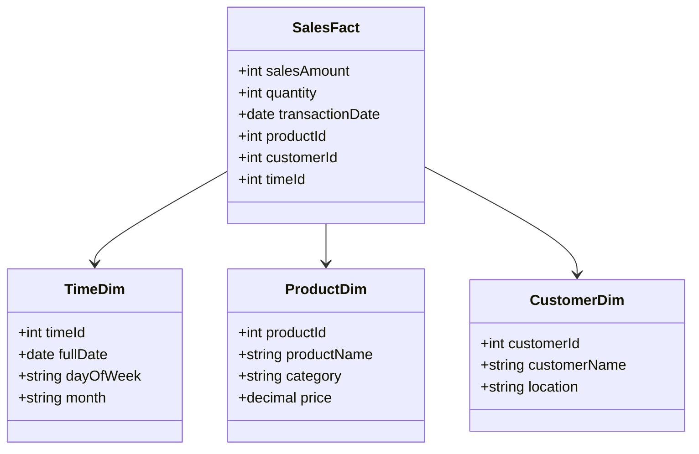

## Introduction

The Star Schema is a popular data modeling pattern used in data warehousing to optimize query performance by organizing data into fact and dimension tables. This pattern is known for its simplicity and effectiveness in complex analytical queries and reporting. It is called a "star" schema because its design resembles a star shape, with a central fact table surrounded by several dimension tables.

## Architectural Overview

### Fact Table

At the heart of the Star Schema is the fact table, which contains quantitative data for analysis. This table typically includes:

- **Measurement Metrics**: Numerical data like sales revenue, profit, or order amount.
- **Foreign Keys**: References to dimension tables, enabling various ways to slice the data.

### Dimension Tables

Surrounding the fact table are the dimension tables, each providing context for the facts by describing the characteristics or attributes of the data. Typical dimensions include:

- **TimeDim**: Details like date, day of the week, month, quarter, etc.
- **ProductDim**: Attributes such as product name, category, price, and manufacturer.
- **CustomerDim**: Information about customers including name, location, and demographic data.

### Diagram

To better understand the relationship between the fact and dimension tables, let's examine the following UML Class Diagram in Mermaid syntax:



## Best Practices

- **Denormalization**: Keep dimension tables denormalized to reduce data retrieval complexity and improve query performance.
- **Indexing**: Use appropriate indexing strategies on foreign keys to enhance the efficiency of joins between fact and dimension tables.
- **Granularity**: Choose an appropriate level of granularity in the fact table that aligns with business requirements and performance considerations.
- **Data Transformation**: Perform necessary ETL operations to ensure data consistency and cleanliness before loading into the star schema.

## Example Implementation

```sql
CREATE TABLE SalesFact (
    salesAmount DECIMAL,
    quantity INT,
    transactionDate DATE,
    productId INT,
    customerId INT,
    timeId INT,
    FOREIGN KEY (productId) REFERENCES ProductDim(productId),
    FOREIGN KEY (customerId) REFERENCES CustomerDim(customerId),
    FOREIGN KEY (timeId) REFERENCES TimeDim(timeId)
);

CREATE TABLE ProductDim (
    productId INT PRIMARY KEY,
    productName VARCHAR(255),
    category VARCHAR(255),
    price DECIMAL
);

CREATE TABLE CustomerDim (
    customerId INT PRIMARY KEY,
    customerName VARCHAR(255),
    location VARCHAR(255)
);

CREATE TABLE TimeDim (
    timeId INT PRIMARY KEY,
    fullDate DATE,
    dayOfWeek VARCHAR(50),
    month VARCHAR(50)
);
```

## Related Patterns

- **Snowflake Schema**: A more elaborate version of the Star Schema where dimension tables are normalized.
- **Galaxy Schema**: A pattern involving multiple fact tables sharing dimension tables, useful for data marts.
- **Fact Constellation Schema**: Another name for the Galaxy Schema, but often with a focus on complex and interlinked queries.

## Additional Resources

- **Kimball, Ralph**: "The Data Warehouse Toolkit: The Definitive Guide to Dimensional Modeling"
- **Inmon, W. H.**: "Building the Data Warehouse"

## Summary

The Star Schema is a foundational pattern in data warehouse modeling, designed to optimize query performance and simplify data analysis through its clear, denormalized structure. By organizing data around central fact tables linked to dimension tables, businesses can efficiently perform insightful analytical queries, providing a robust framework for decision-making.

This pattern's strength lies in its simplicity, ensuring that database architects can create intuitive and accessible designs that speak to the diverse needs of stakeholders while maintaining a high-performance architecture.
