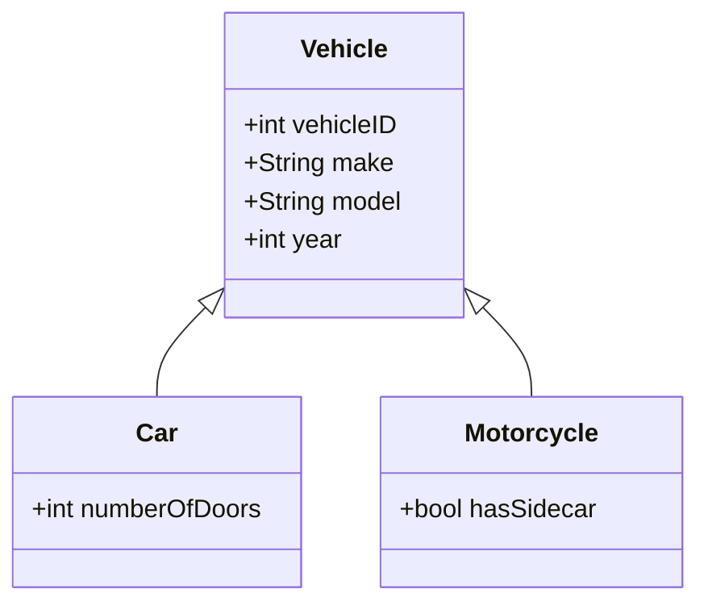

## Introduction

The **Entity Subtyping** design pattern employs inheritance to effectively model entities in a database that share a common set of attributes but differ slightly due to their unique characteristics. This approach is beneficial in both organizational clarity and the altering flexibility of a dataset.

### Key Concepts

- **Inheritance in Data Modeling**: This concept involves creating a common entity for shared attributes and extending subtypes for unique attributes.
- **Shared Entity Attributes**: Attributes common across all subtypes usually reside in a base or parent entity.
- **Unique Subtype Attributes**: Subtypes define additional properties peculiar to themselves.

## Architectural Approach

Within the Entity Subtyping pattern, tables in a relational database model are distributed in such a way that there is a 'supertype' for common fields and 'subtype' tables for discrete characteristics.

### Implementation

1. **Define the Parent Entity**: This would be the 'super' table encapsulating diverse entities’ shared traits, e.g., `Vehicle`.
   
2. **Implement Subtype Tables**: Create tables such as `Car` and `Motorcycle` that reference the parent table and define their specific attributes.

### Example

This example demonstrates modeling data for vehicles:

```sql
CREATE TABLE Vehicle (
    VehicleID INT PRIMARY KEY,
    Make VARCHAR(50),
    Model VARCHAR(50),
    Year INT
);

CREATE TABLE Car (
    VehicleID INT PRIMARY KEY,
    FOREIGN KEY (VehicleID) REFERENCES Vehicle(VehicleID),
    NumberOfDoors INT
);

CREATE TABLE Motorcycle (
    VehicleID INT PRIMARY KEY,
    FOREIGN KEY (VehicleID) REFERENCES Vehicle(VehicleID),
    HasSidecar BOOLEAN
);
```

## Best Practices

- **Normalization**: Reduce data redundancy by employing supertype/subtype relationships to normalize the dataset.
- **Indexing FK**: Index foreign keys to improve query performance when retrieving joined results.
- **Consider Polymorphism**: Implement polymorphism to handle subtypes through the base type, reducing complexity.

## Diagram

Below is a Mermaid UML class diagram that illustrates the relationship among entities in this pattern:



## Related Patterns

- **Single Table Inheritance**: Store all entities in one table with nullable columns.
- **Class Table Inheritance**: Break down each subtype into separate tables culminating in an intricate schema.

## Additional Resources

1. *"An Introduction to Database Systems"* by C.J. Date
2. *"Patterns of Enterprise Application Architecture"* by Martin Fowler

## Summary

Entity Subtyping in data modeling streamlines managing collections of entities by taking advantage of inheritance-like structures akin to programming, laying a foundational structure that simplifies adding new subtypes without restructuring existing schema design. This improves data handling, organization, and extensibility, enhancing database design for complex systems.
