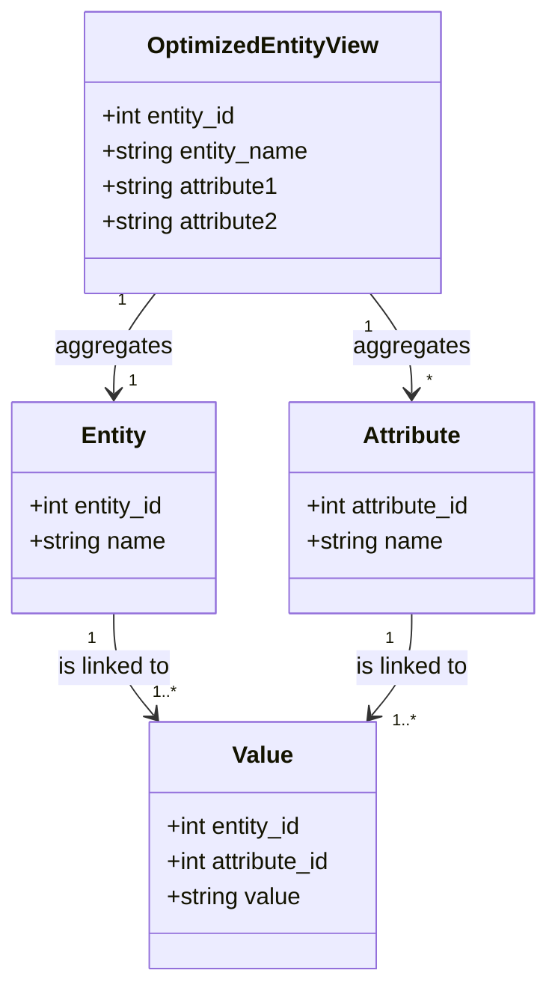

## Introduction

The Entity-Attribute-Value (EAV) model is a powerful database pattern used to model data for applications that require a high degree of flexibility. However, EAV models can suffer from performance issues, especially when it comes to read operations. The "Optimized EAV for Reads" design pattern mitigates these issues by denormalizing EAV data for entities that are accessed frequently, thereby improving read performance.


## Design Pattern Description

### Problem

EAV models typically store data in a highly normalized form, which involves splitting entities into separate tables with attributes stored as key-value pairs. This approach can lead to complex and costly queries, especially when fetching all attributes for highly accessed entities, causing significant delays.

### Solution

To overcome slow read performance, the "Optimized EAV for Reads" pattern introduces the concept of denormalization for frequently queried entities. This is done by creating pre-aggregated views or materialized tables that consolidate the EAV data, providing a structure that is optimized for read-heavy operations.

### Implementation Steps

1. **Identify Frequently Accessed Entities**: 
   - Monitor the database to identify entities or attributes that are accessed frequently.
   
2. **Create Denormalized Structures**:
   - Use SQL views or materialized tables to pre-aggregate and store data for these entities.
   - Ensure these structures are updated appropriately to reflect changes in the underlying EAV tables.

3. **Modify Queries**:
   - Adapt existing application queries to leverage these predefined views or tables, which should significantly reduce query complexity and improve performance.

4. **Maintain Sync**:
   - Implement a mechanism to keep these optimized structures synchronized with the underlying EAV schema, ensuring data consistency and reliability.


## Example Code

```sql
-- Assume an EAV schema with these tables
CREATE TABLE Entity (
    entity_id INT PRIMARY KEY,
    name VARCHAR(255)
);

CREATE TABLE Attribute (
    attribute_id INT PRIMARY KEY,
    name VARCHAR(255)
);

CREATE TABLE Value (
    entity_id INT,
    attribute_id INT,
    value TEXT,
    PRIMARY KEY (entity_id, attribute_id)
);

-- Denormalized example for a frequently accessed entity
CREATE MATERIALIZED VIEW OptimizedEntityView AS
SELECT
    e.entity_id,
    e.name AS entity_name,
    MAX(CASE WHEN a.name = 'attribute1' THEN v.value END) AS attribute1,
    MAX(CASE WHEN a.name = 'attribute2' THEN v.value END) AS attribute2,
    -- Add more attributes as needed
FROM
    Entity e
JOIN
    Value v ON e.entity_id = v.entity_id
JOIN
    Attribute a ON v.attribute_id = a.attribute_id
GROUP BY
    e.entity_id;
```

## Diagram



## Related Patterns

- **Data Mart**: Shares similarities in providing pre-aggregated, ready-to-query datasets aimed at optimizing performance.
- **CQRS (Command Query Responsibility Segregation)**: Encourages the separation of read and write tasks which can also translate into optimized reads, similar to this pattern.

## Additional Resources

- [Database Denormalization Techniques](https://example.com/denormalization-techniques)
- [Performance Tuning in Relational Databases](https://example.com/performance-tuning)

## Summary

The "Optimized EAV for Reads" pattern is a strategic approach to enhance the read performance of EAV model data. By pre-aggregating and denormalizing frequently accessed data into materialized views or tables, we can significantly reduce query complexity, ultimately resulting in faster response times and improved application efficiency.

