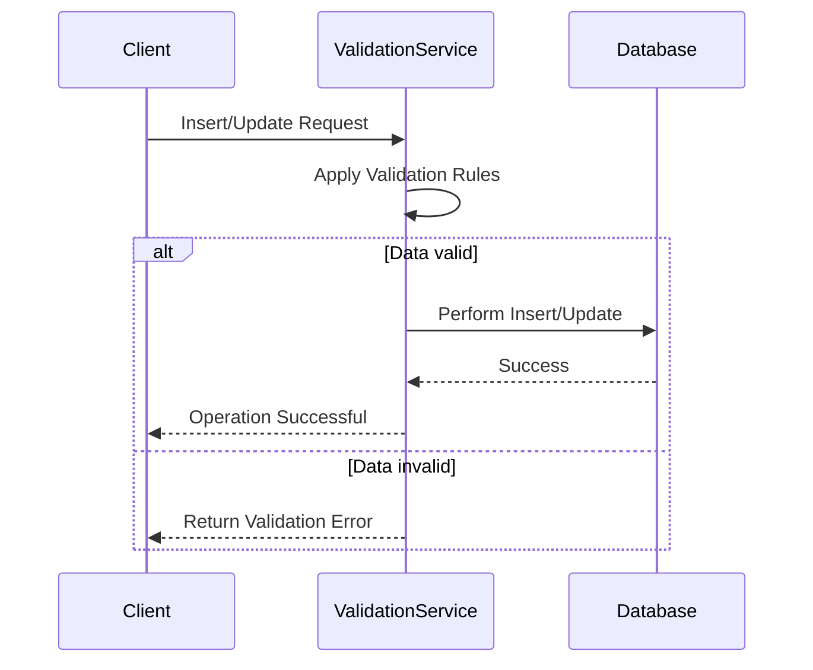

## Introduction

The Entity-Attribute-Value (EAV) model is a data model commonly used to encode and store attribute data that can be highly variable. While EAV offers great flexibility, it does come with challenges, one of which is maintaining data integrity. This pattern focuses on implementing data validation rules within an EAV model to ensure that the data adheres to specified constraints and meets quality standards.

## Problem

In traditional relational databases, schemas are rigid and structured, making it easier to enforce data integrity through constraints like `NOT NULL`, `UNIQUE`, `CHECK`, and `FOREIGN KEY`. However, an EAV model's flexible schema allows for dynamic attribute definition, posing risk to data integrity. How can one apply validation rules to verify that data stored in an EAV model is correct, complete, and reliable?

## Solution

Establish a validation rules engine or framework that supports the dynamic nature of the EAV model. This engine should have the ability to define, manage, and enforce attribute-specific validation rules that can include:

- **Type Validation**: Ensures the attribute value type matches the defined type (e.g., integer, string, boolean).
- **Range Validation**: Checks numerical attributes fall within specified limits (e.g., age > 0).
- **Pattern Matching**: Uses regular expressions to validate data formats (e.g., email, phone number).
- **Referential Integrity**: Ensures values correspond to existing records where applicable.

## Architectural Approach

Consider implementing a middleware layer or a microservice that handles all data transactions with the database. This layer should:

- Intercept all data modification requests.
- Validate data against the defined rules.
- Reject or log data that fails validation.
- Provide feedback for users or systems to correct and resend data.

### Example Code

Here's an example of a validation rule applied in a microservice-based architecture using Java:

```java
public class ValidationService {

    public boolean validateAttributeValue(String entityType, String attributeName, Object value) {
        // Fetch validation rules from configuration or repository
        ValidationRule rule = fetchRuleFor(entityType, attributeName);

        // Perform type check
        if (!checkType(rule, value)) {
            return false;
        }

        // Perform range check
        if (rule.hasRange() && !checkRange(rule, value)) {
            return false;
        }
        
        // Perform pattern validation
        if (rule.hasPattern() && !checkPattern(rule, value)) {
            return false;
        }

        return true;
    }

    private boolean checkType(ValidationRule rule, Object value) {
        // Implement type checking logic
    }

    private boolean checkRange(ValidationRule rule, Object value) {
        // Implement range checking logic
    }

    private boolean checkPattern(ValidationRule rule, Object value) {
        // Implement pattern validation logic
    }
}
```

### Mermaid UML Sequence Diagram

Visual representation of a validating data insertion:



## Related Patterns

- **Schema-Enforced EAV**: Rigid schema extensions for known attributes to enhance data integrity.
- **Adaptive Data Schemas**: Uses flexible table structures with business logic constraints.

## Additional Resources

- [Designing Flexible Database Schema](#)
- [Validating EAV Data Models](#)
- [Efficient Data Integrity in Dynamic Schemas](#)

## Conclusion

Implementing Data Validation Rules within EAV models is crucial for ensuring that stored data maintains integrity and reliability. By setting up a validation framework that accommodates the EAV data's flexible nature, organizations can prevent invalid data from entering the system, thereby enhancing the quality and trustworthiness of the stored data.
