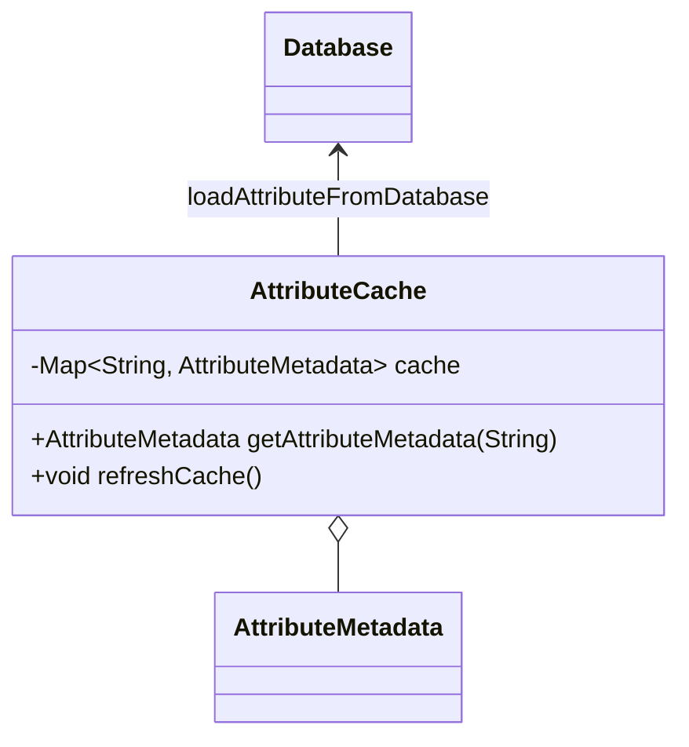

## Overview

In modern data management, Entity-Attribute-Value (EAV) models offer flexibility and scalability for representing complex data structures. However, they can introduce performance challenges, particularly in scenarios requiring frequent access to attribute definitions and metadata. The Attribute Caching pattern addresses these challenges by preloading and caching this metadata in application memory, significantly reducing database load and improving response times.

## Detailed Explanation

### Design Pattern Intent

The intent of the Attribute Caching pattern is to optimize read performance by reducing repeated database accesses for static attribute metadata. This is achieved by caching attribute definitions initially loaded during application startup and periodically refreshed as needed.

### Context and Problem

In systems employing EAV models, attributes are typically stored as separate rows rather than columns, providing great flexibility. However, each access to an entity's attributes may involve multiple database queries to retrieve associated metadata such as attribute names, data types, validations, and constraints. This additional load can degrade system performance.

### Solution

Attribute Caching mitigates this issue by storing attribute metadata in a fast-access storage medium, such as application memory or a distributed cache. By maintaining this cache:

- **Reduced Database Load**: Fewer database queries are required since attribute metadata is available in the cache.
- **Faster Access**: Direct memory access is significantly faster than database retrieval operations.
- **Scalability**: The system can handle more concurrent requests by freeing up database resources.

### Applicability

This pattern is particularly useful in the following scenarios:

- Applications with a high volume of read operations concerning static entity metadata.
- Systems where attribute definitions change infrequently.
- Use cases demanding stringent performance requirements and low latency.

## Example Implementation

```java
import java.util.Map;
import java.util.concurrent.ConcurrentHashMap;

public class AttributeCache {
    private Map<String, AttributeMetadata> cache = new ConcurrentHashMap<>();

    public AttributeMetadata getAttributeMetadata(String attributeName) {
        return cache.computeIfAbsent(attributeName, this::loadAttributeFromDatabase);
    }

    private AttributeMetadata loadAttributeFromDatabase(String attributeName) {
        // Simulated database access
        return Database.fetchAttributeMetadata(attributeName);
    }

    // Periodic refresh mechanism
    public void refreshCache() {
        // Load updated attributes from database periodically
    }
}

class AttributeMetadata {
    // Attribute metadata fields
}
```

### Diagram

Here is a diagram illustrating the data flow in the Attribute Caching pattern:



### Related Patterns

- **Read-Through Caching**: Automatically retrieves cached data from the database if not present in the cache.
- **Write-Back Caching**: Data is written to the cache first, with persistence to the database occurring later.
- **Cache-Aside Pattern**: Application code is responsible for loading data into the cache from a datastore.

## Additional Resources

- [Oracle EAV Pattern Case Study](https://www.oracle.com/technical-resources/articles/database/entity-attribute-value-model.html)
- [Caching Strategies Overview](https://www.cloudflare.com/learning/cdn/what-is-caching/)
- [Improving Performance with Caches](https://aws.amazon.com/caching/)

## Summary

The Attribute Caching design pattern is essential for systems using flexible data models like EAV, where performance optimizations in attribute retrieval are crucial. By caching attribute metadata, the pattern significantly reduces the frequency and overhead of database queries, enhancing overall application responsiveness and performance.
