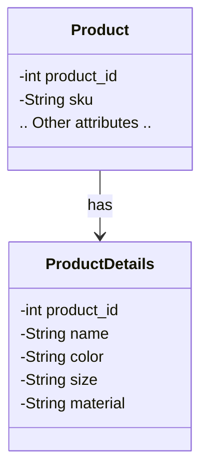

---

linkTitle: "Attribute Clustering"
title: "Attribute Clustering"
category: "Entity-Attribute-Value (EAV) Patterns"
series: "Data Modeling Design Patterns"
description: "Attribute Clustering involves grouping related attributes together efficiently to optimize data retrieval and ease management, particularly in complex data models with numerous attributes."
categories:
- Data Modeling
- Performance Optimization
- Database Design
tags:
- EAV Patterns
- Data Modeling
- Database Optimization
- Database Design
- Attribute Management
date: 2024-07-07
type: docs

canonical: "https://softwarepatternslexicon.com/102/6/16"
license: "© 2024 Tokenizer Inc. CC BY-NC-SA 4.0"
---

## Overview

Attribute Clustering is a data modeling pattern used within the context of Entity-Attribute-Value (EAV) systems. This design pattern focuses on enhancing the efficiency of data retrieval and management by grouping related attributes that are frequently accessed together. This approach can aid in reducing query complexity and improving database performance, especially within systems where the volume of attributes is large and diverse.

## Detailed Explanation

In database systems, particularly those that employ the EAV model, attributes can become sparse and scattered. Attribute Clustering reduces the overhead of retrieving data by strategically grouping attributes based on their access patterns. This pattern is particularly useful when:

- Certain attributes are consistently queried together.
- The need to reduce the overhead of joining tables in querying EAV data models is high.
- There is a necessity to optimize storage and retrieval operations.

Attribute Clustering follows these steps:

1. **Identify Related Attributes**: Detect attributes frequently queried together through analysis of query logs and application requirements.
2. **Design Optimal Storage Groups**: Group the identified attributes into clusters/tables in a manner that the usual join operations can be omitted or minimized.
3. **Redesign Queries**: Rewrite queries to target the new structure, ensuring they leverage the clustered organization of attributes.

### Example Scenario

Consider an e-commerce application with a product catalog that uses EAV to manage a wide range of product attributes. Attributes like `Color`, `Size`, and `Material` are accessed together in multiple scenarios like listing products in a specific category. By clustering these attributes, the database schema now includes:

- A table specifically for frequently accessed attributes (`Product_Details`), which includes the `Color`, `Size`, and `Material` fields.
- The remaining less-frequently queried attributes stay in the main EAV table structure.

### Implementation Example

Here is a SQL example highlighting the concept of Attribute Clustering:

```sql
-- Creating a clustered table for frequently accessed attributes
CREATE TABLE Product_Details (
    ProductID INT PRIMARY KEY,
    Name VARCHAR(255),
    Color VARCHAR(50),
    Size VARCHAR(50),
    Material VARCHAR(100)
);

-- Inserting data into the clustered table
INSERT INTO Product_Details (ProductID, Name, Color, Size, Material)
VALUES (1, 'T-Shirt', 'Blue', 'Medium', 'Cotton');

-- Querying the clustered table for optimized retrieval
SELECT Name, Color, Size, Material
FROM Product_Details
WHERE ProductID = 1;
```

### Architecture Diagram



## Related Patterns

- **Vertical Partitioning**: Similar to Attribute Clustering but focuses on dividing the database schema vertically across more tables.
- **Horizontal Partitioning**: Typically used alongside Attribute Clustering to separate data within a single table based on row value criteria.

## Best Practices

- Regularly analyze access patterns to maintain effective clustering.
- Balance between too many clusters causing overhead and sufficient clustering to reduce unnecessary JOINs.
- Consider future schema changes and dynamic attribute additions in planning.

## Additional Resources

- "Optimizing Database Systems" by Dr. John Smith
- "Efficient EAV Systems and Data Patterns" on [Medium](https://www.medium.com)
- Database performance tuning workshops available on platforms like [Coursera](https://www.coursera.org)

## Summary

Attribute Clustering is an effective design pattern for organizing data within EAV models, focusing on optimizing access patterns to enhance performance and simplify queries. By clustering related attributes, it seeks to improve the overall efficiency of database operations and maintain a balanced architecture for applications that handle a significant variety of attributes.
