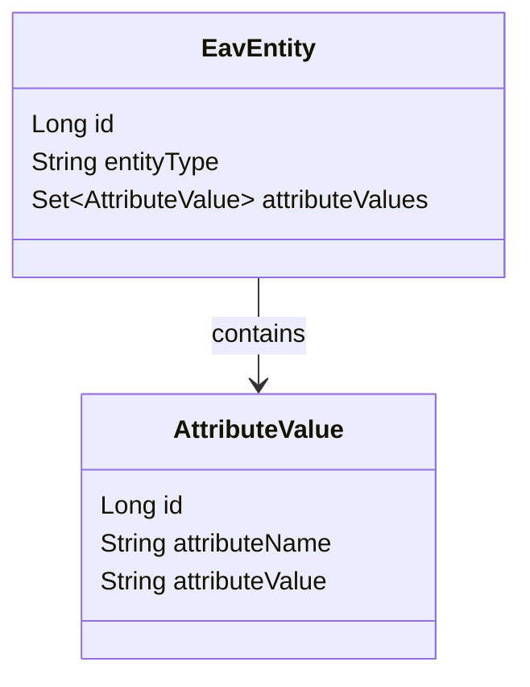

---

linkTitle: "EAV with Object-Relational Mapping (ORM)"
title: "EAV with Object-Relational Mapping (ORM)"
category: "6. Entity-Attribute-Value (EAV) Patterns"
series: "Data Modeling Design Patterns"
description: "Integrating Entity-Attribute-Value (EAV) models with Object-Relational Mapping (ORM) frameworks for enhancing flexibility and ease of development while maintaining strong database structure."
categories:
- Data Modeling
- ORM
- Database Design
tags:
- EAV
- ORM
- Hibernate
- Dynamic Attributes
- Application Integration
date: 2024-07-07
type: docs

canonical: "https://softwarepatternslexicon.com/102/6/17"
license: "© 2024 Tokenizer Inc. CC BY-NC-SA 4.0"
---

## Introduction

The Entity-Attribute-Value (EAV) pattern is a data modeling technique suited to scenarios involving numerous dynamic attributes. This flexibility is often required in applications like medical databases or configuration systems where attributes are subject to frequent changes or extensions. However, integrating EAV schemas with Object-Relational Mapping (ORM) frameworks involves certain challenges like maintaining efficient querying and consistent data representation. Leveraging ORM frameworks like Hibernate can mitigate this complexity, making development more manageable and aligning with existing database schemas through configurations or custom adaptations.

## Detailed Explanation

### Benefits of EAV with ORM

1. **Flexibility and Extensibility**: By design, EAV allows the definition of any number of attributes without altering the database schema.
2. **Dynamic Schema**: This model is particularly beneficial in environments that require frequent changes, as it supports the addition of new attributes dynamically.
3. **Reduction in Nulls**: The sparsity of traditional relational tables with many optional attributes is avoided, reducing storage overhead due to null values.
4. **Integration Ease**: ORM frameworks facilitate mapping EAV records to object representations in different programming environments, offering object-oriented access and manipulation.

### Challenges

1. **Performance Overheads**: Querying can become complex and slower; indexing strategies might be needed to mitigate this.
2. **Complex Queries**: Join and filtering logic can be challenging to implement efficiently.
3. **ORM Adaptation**: It may require customizing the ORM tooling to handle polymorphic associations and dynamic attributes properly.

### Architectural Approach

Using ORM frameworks such as Hibernate:

- **Mapping Strategy**: Utilize custom types or dynamic component mapping features to manage EAV tables. An EAV table can store JSON or XML in some cases, where Hibernate can map these structures using custom user types.
- **Polymorphic Associations**: Leverage Hibernate's support for polymorphic associations to enable this flexibility.
- **Batch Processing**: Implement batch processing to improve performance when handling a significant number of dynamic attributes.

### Example Code Using Hibernate

```java
@Entity
@Table(name = "eav_entity")
public class EavEntity {

    @Id
    @GeneratedValue(strategy = GenerationType.IDENTITY)
    private Long id;

    private String entityType;

    @OneToMany(mappedBy = "eavEntity", cascade = CascadeType.ALL, fetch = FetchType.LAZY)
    private Set<AttributeValue> attributeValues = new HashSet<>();

    // Getters and Setters
}

@Entity
@Table(name = "attribute_value")
public class AttributeValue {

    @Id
    @GeneratedValue(strategy = GenerationType.IDENTITY)
    private Long id;

    private String attributeName;
    private String attributeValue;

    @ManyToOne
    @JoinColumn(name = "entity_id")
    private EavEntity eavEntity;

    // Getters and Setters
}
```

### Mapping Configuration

In this example, Hibernate entities represent EAV tables, where `EavEntity` acts as the object to which multiple attributes (`AttributeValue`) are linked, following ORM principles.

## Best Practices

- **Use Caches Wisely**: Implement second-level cache providers in Hibernate for attribute values to enhance frequent read performance.
- **Optimize Database Design**: Deploy indexing strategies for quick lookup by entity, attribute name, and value.
- **Attribute Validation**: Ensure input constraints and validation rules are enforced at the application level.

## Diagrams

Below is a Mermaid UML diagram illustrating the basic relationship between EAV entities and attributes.



## Related Patterns

- **Polymorphic Association Pattern**: Supports multiple subtypes of an entity.
- **Document Store**: Sometimes similar functionality can be achieved using NoSQL solutions like MongoDB, which allow for an even more flexible schema.

## Additional Resources

- [Hibernate User Guide](https://docs.jboss.org/hibernate/stable/userguide/html_single/Hibernate_User_Guide.html)
- [EAV Pattern Explained](https://martinfowler.com/eaaCatalog/eavPattern.html)

## Summary

The EAV with ORM design pattern combines the dynamic data structure benefits of the EAV model with the strengths of an ORM framework. This blend provides a structure that adapts readily to frequent changes and domain-specific constraints, while ORM frameworks like Hibernate maintain an interface for structured data manipulation and access. Achieving optimal performance and functionality necessitates embracing strategic considerations like caching, indexing, and custom entity mappings, laying the foundation for powerful and flexible application architectures.


