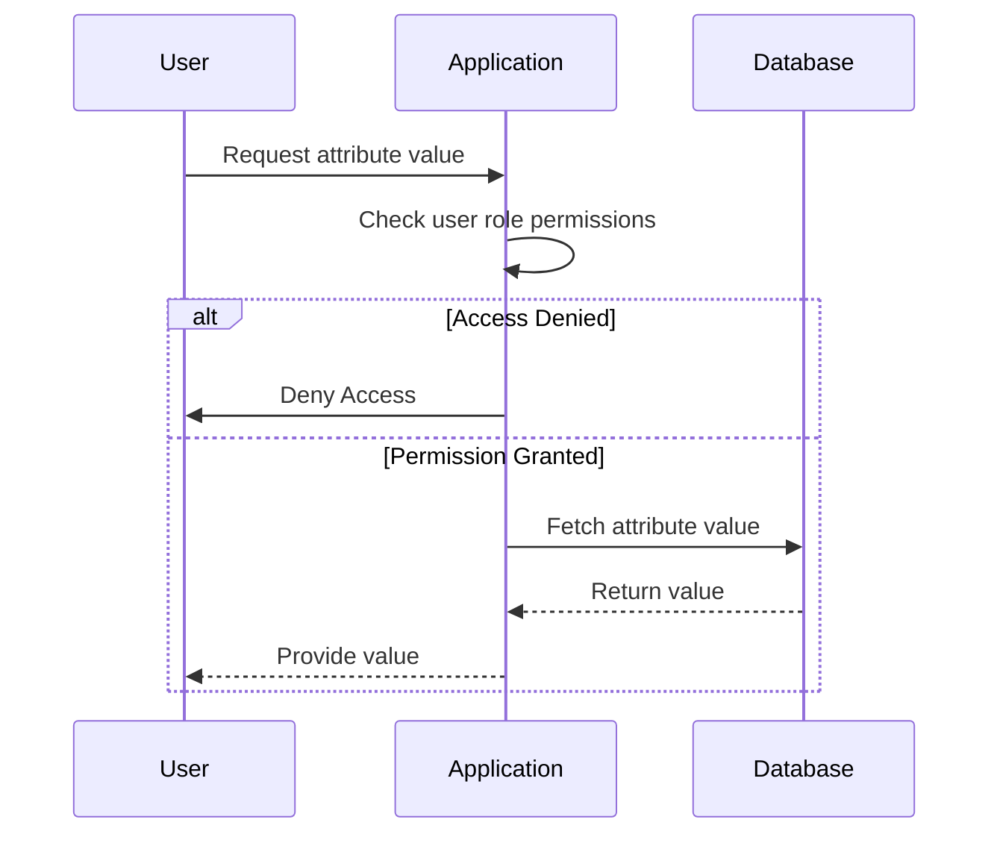

## Security and Access Control in EAV Patterns

The Entity-Attribute-Value (EAV) model is a versatile design pattern used to manage dynamic and sparse data. While EAV offers flexibility in handling diverse attribute types, it often presents challenges in terms of securing sensitive data. Fine-grained security and access control mechanisms are essential for protecting sensitive information, such as personal identifiable information (PII), and ensuring compliance with regulations (like GDPR and HIPAA).

### Description

In EAV systems, data is typically stored across three main columns: an `entity` identifier, an `attribute` name, and the `value`. Applying security and access controls on such models involves implementing attribute-level restrictions, where permissions are configured at a granular level, specifying who can access or modify each attribute.

### Architectural Approaches

1. **Role-based Access Control (RBAC):** Define roles in your system, and assign access rights to specific attributes based on these roles. This involves maintaining a mapping of roles to attributes and enforcing checks during data access.

2. **Attribute-based Access Control (ABAC):** Uses policies that consider multiple attributes like the user's role, the resource, and the environment (such as time of access). This approach often provides more flexibility than RBAC.

3. **Fine-grained Encryption:** Encrypt sensitive attributes individually, and manage decryption keys based on user privileges. Only authorized users or systems should decrypt certain attributes, ensuring data privacy.

4. **Audit Trails and Monitoring:** Implement logging mechanisms to track who accessed or modified what attribute and when. Integrate real-time alerting capabilities to detect unauthorized access.

5. **Application-layer Security:** Enforce security policies at the application layer to validate access permissions before presenting or modifying data.

### Example Code

Below is an example of how permissions might be applied at the attribute level in a pseudo-code implementation:

```kotlin
fun getAttributeValue(userId: String, entityId: String, attributeName: String): String? {
    // Fetch user role
    val userRole = getUserRole(userId)

    // Check if user role has permission to access the attribute
    if (!hasAccess(userRole, attributeName)) {
        throw AccessDeniedException("Access to attribute $attributeName is denied for role $userRole")
    }

    // Fetch and return the attribute value
    return fetchAttributeValue(entityId, attributeName)
}

fun hasAccess(role: String, attributeName: String): Boolean {
    // Mapping of roles to accessible attributes. This can be expanded with more logic or data stores.
    val rolePermissions = mapOf(
        "ADMIN" to listOf("SocialSecurityNumber", "Address", "PhoneNumber"),
        "USER" to listOf("Address", "PhoneNumber")
    )
    return rolePermissions[role]?.contains(attributeName) ?: false
}
```

### Diagrams

#### Access Control Sequence Diagram



### Related Patterns

- **Policy Enforcement Point (PEP):** Commonly used in ABAC for implementing security policies.
- **Attribute-based Encryption (ABE):** Complements ABAC by encrypting data based on attributes and managing decryption keys accordingly.

### Additional Resources

- [NIST Access Control Models](https://csrc.nist.gov/groups/SNS/ac/) – Governmental resource on various access control models.
- [OWASP Access Control Cheat Sheet](https://owasp.org/www-project-cheat-sheets/cheatsheets/Access_Control_Cheat_Sheet.html) – Practical guidance for implementing access controls.

### Summary

Incorporating security and access control mechanisms into an EAV model is essential for data protection and compliance. Employing a combination of RBAC, ABAC, encryption, and logging provides a robust framework to secure attribute-level data. By understanding the architectural approaches and best practices outlined, organizations can enhance their data security posture while leveraging the flexibility of the EAV model.
