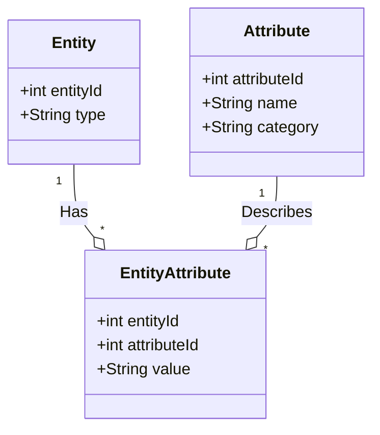

## Overview

The Attribute Categories pattern is a strategic approach used in data modeling, particularly in the Entity-Attribute-Value (EAV) model, to improve the organization and efficiency of data retrieval. In scenarios where entities have numerous and diverse attributes, classifying these attributes into categories ensures better structure, performance, and usability.

## Detailed Explanation

The EAV model is commonly used for environments where entities are highly variable or where new attributes are added frequently. While flexible, the model can lead to difficulty in managing and querying attributes due to its sparse schema. The Attribute Categories design pattern addresses this by grouping similar attributes to simplify access and maintenance.

### Components

1. **Entities**: The subject matter for which attributes are collected, such as products or users.
2. **Attributes**: The specific details associated with entities (e.g., color, size, weight for products).
3. **Categories**: Logical groupings of related attributes. For instance, in a product catalog:
   - **Dimensions**: Height, Width, Depth
   - **Materials**: Wood, Plastic, Metal
   - **Colors**: Red, Blue, Green

### Benefits

- **Improved Organization**: By categorizing attributes, databases adopt a more organized structure that mimetically reflects actual enterprise contexts.
- **Enhanced Query Performance**: Queries can be more efficient as they can target specific attribute categories rather than scanning through all attributes.
- **Ease of Maintenance**: Structural changes or additions are easier to handle as they affect specific categories rather than the entire attribute pool.

## Example

Consider a database for an e-commerce platform that sells furniture with varied attributes. Using the Attribute Categories pattern, the attributes can be categorized as follows:

```sql
CREATE TABLE entities (
  entity_id INT PRIMARY KEY,
  entity_type VARCHAR(255)
);

CREATE TABLE attributes (
  attribute_id INT PRIMARY KEY,
  attribute_name VARCHAR(255),
  category VARCHAR(255)
);

INSERT INTO attributes (attribute_id, attribute_name, category) VALUES
(1, 'Height', 'Dimensions'),
(2, 'Width', 'Dimensions'),
(3, 'Material', 'Materials'),
(4, 'Color', 'Colors');

CREATE TABLE entity_attributes (
  entity_id INT,
  attribute_id INT,
  value VARCHAR(255),
  FOREIGN KEY (entity_id) REFERENCES entities(entity_id),
  FOREIGN KEY (attribute_id) REFERENCES attributes(attribute_id)
);
```

In this example, attributes like Height and Width are part of the "Dimensions" category, making it easier to group these characteristics in application code and queries.

## Diagrams

Here is a simple Mermaid UML diagram to describe the relationship:



## Related Patterns

- **Flexible Schema**: Supports the adaptation of attributes and entities in the EAV model.
- **Polymorphic Associations**: Handling entities with multiple types and attributes in a more loosely coupled manner.
- **Metadata Repository**: Centralizing metadata management for better administration and governance.

## Additional Resources

- "Design Patterns for Data and Databases" by Erin E. Weithman
- Database design principles on Database Patterns by Martin Fowler

## Summary

The Attribute Categories pattern enhances the EAV model by introducing a methodical way to organize and manage attributes. This approach not only promotes better data management and retrieval strategy but also aligns with enterprise semantics. By categorizing attributes into logical categories, organizations can achieve higher query performance and maintainability, resulting in a more robust and flexible data architecture that supports rapid business changes or expansion.
