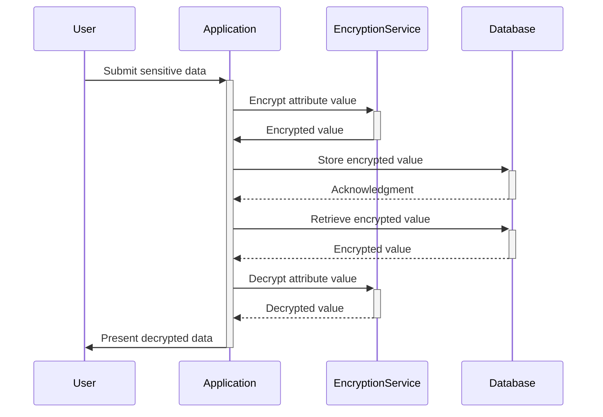

## Attribute-Level Encryption

### Introduction

In modern data-driven applications, especially those dealing with sensitive information like healthcare records or financial data, ensuring data security and privacy is paramount. Attribute-Level Encryption (ALE) is a design pattern that focuses on encrypting individual attribute values within a database, thereby enhancing confidentiality and security at a granular level. This is particularly crucial in the Entity-Attribute-Value (EAV) schema, which is commonly used for dynamic data modeling where attributes are not predefined and can vary significantly among entities.

### Architectural Approaches

- **Selective Encryption**: Determine which attributes within your EAV table require encryption based on sensitivity and compliance requirements, such as GDPR or HIPAA.
- **Encryption Algorithms**: Utilize robust encryption algorithms (e.g., AES-256) for secure encryption operations.
- **Key Management**: Implement a secure key management system to handle encryption keys, utilizing cloud solutions like AWS KMS, Azure Key Vault, or GCP KMS.
- **Access Control**: Establish strict access control policies to safeguard both encrypted data and encryption keys.
- **Logging and Monitoring**: Implement logging to track access to encrypted data and set up alerts for unauthorized access attempts.

### Best Practices

1. **Define Sensitivity Levels**: Classify data based on sensitivity to determine the encryption needs.
2. **Integration with EAV Schemas**: Use transparent encryption/decryption mechanisms that integrate seamlessly with EAV queries.
3. **Automated Key Rotation**: Regularly rotate encryption keys to minimize the risk of key exposure.
4. **Audit and Compliance**: Regularly audit encryption practices and ensure compliance with relevant data protection regulations.
5. **Performance Considerations**: Optimize encryption operations to minimize performance overhead, balancing security and usability.

### Example Code

Here's a simplified example using Java with a common encryption library:

```java
import javax.crypto.Cipher;
import javax.crypto.KeyGenerator;
import javax.crypto.SecretKey;
import javax.crypto.spec.GCMParameterSpec;

public class AttributeEncryption {
    
    private static final String AES = "AES";
    private static final String AES_GCM = "AES/GCM/NoPadding";

    public static byte[] encrypt(String data, SecretKey key, byte[] iv) throws Exception {
        Cipher cipher = Cipher.getInstance(AES_GCM);
        cipher.init(Cipher.ENCRYPT_MODE, key, new GCMParameterSpec(128, iv));
        return cipher.doFinal(data.getBytes());
    }

    public static String decrypt(byte[] encryptedData, SecretKey key, byte[] iv) throws Exception {
        Cipher cipher = Cipher.getInstance(AES_GCM);
        cipher.init(Cipher.DECRYPT_MODE, key, new GCMParameterSpec(128, iv));
        return new String(cipher.doFinal(encryptedData));
    }

    public static SecretKey generateKey() throws Exception {
        KeyGenerator keyGen = KeyGenerator.getInstance(AES);
        keyGen.init(256);
        return keyGen.generateKey();
    }
}
```

### Diagrams

Below is a sequence diagram depicting the process of encrypting an attribute at the point of data entry and decrypting it upon retrieval:



### Related Patterns and Descriptions

- **Column-Level Encryption**: Encrypts entire columns in a database rather than individual attributes, useful for more straightforward schemas.
- **Tokenization**: Replaces sensitive data with non-sensitive equivalents (tokens), minimizing exposure in case of breaches.
- **Data Masking**: Obscures data within non-production environments to protect identities while retaining basic functionality.

### Additional Resources

- [AWS Encryption SDK](https://docs.aws.amazon.com/encryption-sdk/latest/developer-guide/)
- [Azure Data Encryption](https://learn.microsoft.com/en-us/azure/security/fundamentals/encryption-overview)
- [Google Cloud Encryption and Key Policies](https://cloud.google.com/security/encryption-at-rest/)

### Summary

Attribute-Level Encryption is an effective pattern for enhancing data privacy and security in EAV databases. By selectively encrypting sensitive attributes, organizations can safeguard against unauthorized access while maintaining the flexibility of EAV models. Successful implementation requires robust encryption strategies, efficient key management, and stringent access controls, all balanced with performance and compliance considerations.
