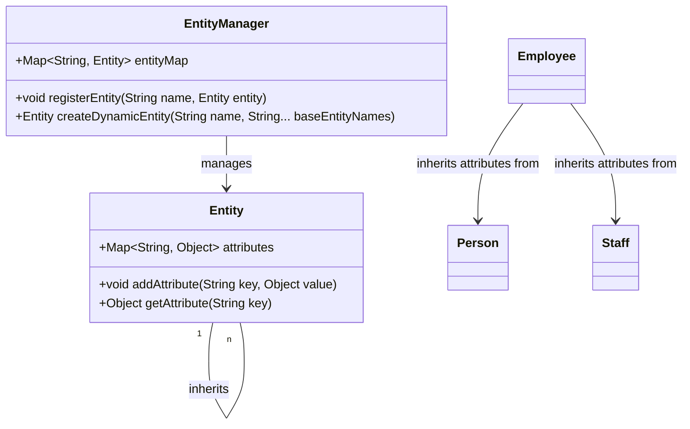

### Dynamic Attribute Inheritance

Dynamic Attribute Inheritance is a design pattern within the Entity-Attribute-Value (EAV) architecture that supports the dynamic inheritance of attributes by entities from other entities. This pattern is particularly useful in data models that require schema flexibility and need to accommodate evolving data requirements without disruptive changes.

#### Detailed Explanation

In traditional data modeling, attributes are strongly bound to their entities, which often requires predefining the schema rigidly. However, the Dynamic Attribute Inheritance pattern allows for greater flexibility by enabling an entity to adopt attributes from multiple sources at runtime.

Imagine this with the example of an "Employee" entity that can inherit attributes from both a "Person" entity and a "Staff" entity. This approach can greatly enhance the data model's versatility, especially in scenarios where entities need to adapt to frequently changing requirements or where composite and reusable attribute sets are beneficial.

#### Architectural Approach

1. **Define Base Entities**: Identify core entities like "Person" and "Staff".

2. **Configure Extended Entities**: Use an entity like "Employee" that will inherit attributes from the base entities.

3. **Dynamic Association**: Implement a system where associations between entities and their attributes can be defined at runtime using configuration files or database tables.

4. **Attribute Resolution**: When an entity like "Employee" is accessed, resolve its complete attribute set by aggregating attributes from associated base entities.

5. **Data Retrieval and Persistence**: Ensure that any retrieval or storage operations are equipped to handle dynamically composed entities.

6. **Override and Conflict Resolution**: Implement logic to resolve conflicting attribute values from different base entities, prioritizing or combining values as necessary.

#### Example Code

Below is a conceptual representation using Java that illustrates how a dynamic attribute resolution might be structured:

```java
public class Entity {
    private Map<String, Object> attributes = new HashMap<>();

    public void addAttribute(String key, Object value) {
        attributes.put(key, value);
    }

    public Object getAttribute(String key) {
        return attributes.get(key);
    }

    // Assume other necessary methods are implemented
}

public class EntityManager {
    private Map<String, Entity> entityMap = new HashMap<>();

    public void registerEntity(String name, Entity entity) {
        entityMap.put(name, entity);
    }

    public Entity createDynamicEntity(String name, String... baseEntityNames) {
        Entity dynamicEntity = new Entity();
        for (String entityName : baseEntityNames) {
            Entity baseEntity = entityMap.get(entityName);
            dynamicEntity.attributes.putAll(baseEntity.attributes);
        }
        return dynamicEntity;
    }
}
```

#### Diagrams

Below is a conceptual Mermaid UML diagram illustrating Dynamic Attribute Inheritance:



#### Related Patterns

- **Multi-Tenant Data Architecture**: Useful when entities in the same application need variability in attributes across different tenants.
- **Schema-less Design**: Employed in NoSQL databases where flexibility and scalability are important, similar to this pattern.

#### Additional Resources

- "Design Patterns: Elements of Reusable Object-Oriented Software" by Erich Gamma et al.
- "Domain-Driven Design: Tackling Complexity in the Heart of Software" by Eric Evans.
- Related research articles on flexible data schema and dynamic modeling.

#### Summary

The Dynamic Attribute Inheritance pattern is pivotal for producing scalable, flexible systems that require adaptable schema designs. By allowing dynamic association and inheritance of attributes, organizations can ensure their data models remain robust and responsive to change. This pattern is particularly fitting for environments with highly variable business rules or evolving data domains.

By adopting Dynamic Attribute Inheritance, developers can maintain clean, organized data without compromising on flexibility or performance, crucial for modern cloud-based applications and systems.
