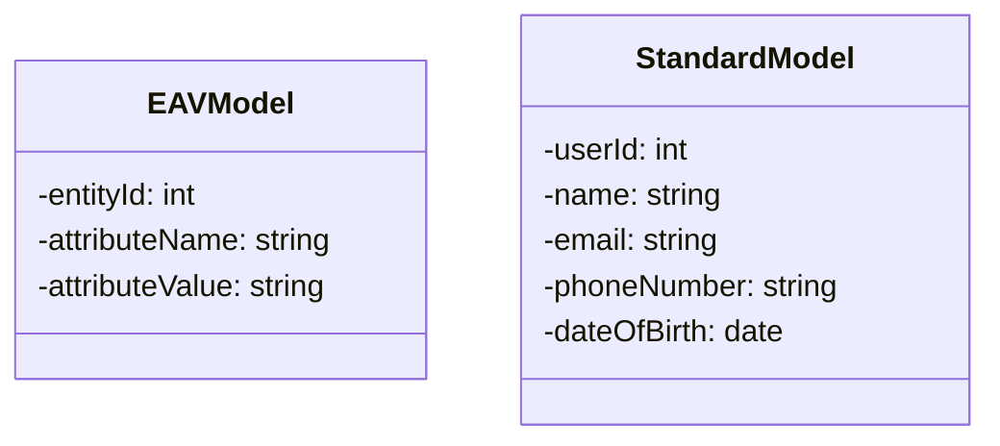

The **Entity-Attribute-Value (EAV)** design pattern is often used to handle situations where the number and types of attributes that need to be stored for entities are not strictly determined or known beforehand. This pattern can be very flexible and is useful in various scenarios like medical records or applications where the schema needs to support a high degree of variability.

However, **EAV Anti-Pattern Awareness** drives attention to the potential pitfalls and complexities of implementing the EAV model, especially when it becomes problematic due to inefficiencies in querying, maintaining data integrity, and managing data validation. This article will guide data architects and developers on recognizing the signs when EAV may not be suitable and suggest alternative approaches.

### Detailed Explanation

#### What is the EAV Pattern?

The EAV pattern stores data in a bespoke schema with three main components:
- **Entity**: The subject for which attribute data is being stored.
- **Attribute**: The property of the entity.
- **Value**: The data corresponding to the attribute.

EAV-based architectures allow you to store any number of attributes without requiring changes in the database schema.

#### Indications EAV May Be an Anti-Pattern

1. **Performance Issues**: If your application is facing slow query performance due to heavy use of EAV modeling, it might be encountering major JOIN operations due to the dispersed nature of EAV data storage.
   
2. **Complex Querying**: Complex SQL queries often arise as getting spatial data from the EAV structure can involve multiple complex JOINs and self-joins which are inefficient.

3. **Data Integrity**: EAV models tend to lack inherent data integrity checks that are more naturally maintained in a relational schema. This can lead to inconsistent data if not managed with custom constraints.

4. **Fixed and Well-Known Attributes**: If the attributes are known and unlikely to change, a conventional relational design is likely to perform better and reduce complexity.

#### Alternative Approaches

1. **Relational Schema Design**: For scenarios with fixed and well-known attributes, a classic relational approach can achieve better performance and simpler maintenance.

2. **Document-based NoSQL Databases**: NoSQL solutions like MongoDB or Couchbase are often more suitable for highly variable data models due to their flexible schema nature.

3. **JSON Columns in Relational Databases**: Utilizing JSON data types in databases that support them (e.g., PostgreSQL, MySQL) can balance flexibility with the structured nature of relational databases.

4. **Hybrid Models**: Sometimes adopting part of the EAV pattern where truly necessary combined with other models can provide the best of both worlds.

### Example Code

An inefficient EAV setup storing user attributes:

```sql
-- Creating an example EAV table for user data
CREATE TABLE user_attributes (
  user_id INT,
  attribute_name VARCHAR(255),
  attribute_value TEXT
);
```

A more efficient traditional model for known attributes:

```sql
-- More traditional user attributes model
CREATE TABLE users (
  user_id INT PRIMARY KEY,
  name VARCHAR(255),
  email VARCHAR(255),
  phone_number VARCHAR(15),
  date_of_birth DATE
);
```

### Diagrams

Below is a UML class diagram comparison between EAV and a standard relational model:



### Related Patterns

- **Polyglot Persistence**: Use different data stores for different purposes, choosing the best-suited option based on specific use case needs.
- **Data Transfer Objects (DTO)**: Used to encapsulate data and send it over a network efficiently, often used in combination with EAV as a workaround for complex entities.

### Additional Resources  
- "NoSQL Distilled" by Pramod J. Sadalage and Martin Fowler.
- Official PostgreSQL Documentation on JSON Data Types.

### Final Summary

The decision to use or avoid an EAV pattern must be based on a deep understanding of its drawbacks in complexity, performance, and data integrity. While EAV can sometimes provide the necessary flexibility, many problems can better be solved with classical data modeling approaches or modern NoSQL features. Recognizing an EAV Anti-Pattern and opting for the right approach will result in a more efficient and maintainable system architecture.
