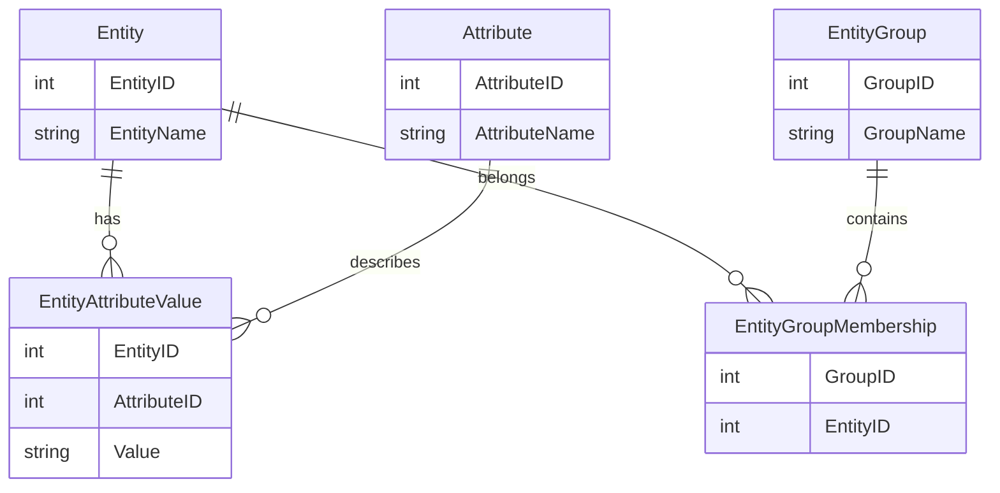

## Entity Grouping

### Introduction
In the realm of data modeling, particularly when dealing with the Entity-Attribute-Value (EAV) pattern, grouping entities effectively can lead to more intuitive data relationships and improved performance in data retrieval operations. The Entity Grouping pattern allows data architects and engineers to organize similar or related entities into logical groups within the EAV schema. This design pattern is crucial when managing complex datasets that require flexible and dynamic data structures typically seen in product catalogs, medical databases, and IoT systems.

### Problem Statement
When the number of entities and attributes grows, queries for retrieving related data can become increasingly complex and inefficient. The challenge lies in how to efficiently associate entities with attributes that share common characteristics without duplicating data. This is especially prevalent in systems where flexibility and extensibility of the data model are paramount.

### Pattern Explanation
Entity Grouping addresses this issue by allowing entities to be linked together based on shared attributes, creating a consolidated view of related data. This pattern operates on top of the EAV model by adding a layer of abstraction where:

- **Entity**: The primary data point or subject (e.g., Product, User).
- **Attribute**: Characteristic or trait of the entity (e.g., Color, Size).
- **Value**: The data value associated with an attribute (e.g., Red, Large).

By grouping entities, you provide a method for categorizing common entities, making data querying and manipulation more straightforward and enabling:

- **Improved Query Performance**: Reduce query complexity by decreasing the need for extensive joins.
- **Data Organization**: Group related data logically for better manageability and understandability.
- **Scalability**: Easily extend and scale as more attributes or entities are introduced.

### Example Use Case
Consider an e-commerce platform managing a vast inventory of products. Using the Entity Grouping pattern, products such as electronics, clothing, and furniture can be grouped into collections based on shared attributes like brand, season, or material.

### Implementation with Code Example
Here’s a generic implementation in a pseudo-SQL syntax to illustrate the Entity Grouping pattern:

```sql
CREATE TABLE Entity (
    EntityID INT PRIMARY KEY,
    EntityName VARCHAR(255)
);

CREATE TABLE Attribute (
    AttributeID INT PRIMARY KEY,
    AttributeName VARCHAR(255)
);

CREATE TABLE EntityAttributeValue (
    EntityID INT,
    AttributeID INT,
    Value VARCHAR(255),
    PRIMARY KEY (EntityID, AttributeID),
    FOREIGN KEY (EntityID) REFERENCES Entity(EntityID),
    FOREIGN KEY (AttributeID) REFERENCES Attribute(AttributeID)
);

CREATE TABLE EntityGroup (
    GroupID INT PRIMARY KEY,
    GroupName VARCHAR(255)
);

CREATE TABLE EntityGroupMembership (
    GroupID INT,
    EntityID INT,
    PRIMARY KEY (GroupID, EntityID),
    FOREIGN KEY (GroupID) REFERENCES EntityGroup(GroupID),
    FOREIGN KEY (EntityID) REFERENCES Entity(EntityID)
);
```

### Diagram


### Related Patterns
- **Attribute Value Differentiation**: Handle complex attribute variations efficiently.
- **Dynamic Schema**: Allows runtime modifications of the schema without database changes.

### Additional Resources
- [Effective Data Warehousing](https://example.com/effective-data-warehousing): Strategies for enhancing data retrieval.
- [The Art of EAV Modeling](https://example.com/art-eav-modeling): Comprehensive guide on scaling EAV models.

### Summary
The Entity Grouping pattern in EAV is a powerful approach for structuring flexible data schemas by creating natural groupings that reflect organizational or logical boundaries. This leads to better data management capabilities, supports scalability, and enhances performance in querying complex datasets. Understanding and applying this pattern is fundamental for data architects focused on designing dynamic and scalable systems.
