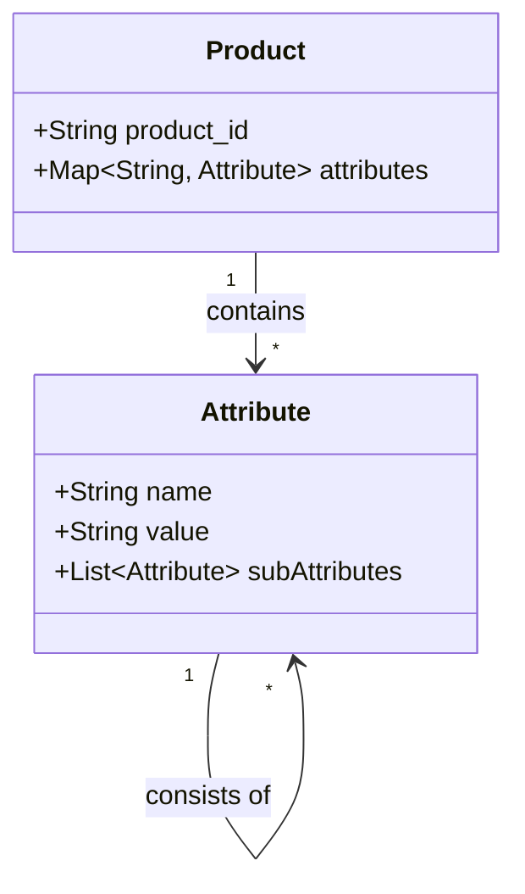

## Overview

Attribute Hierarchies is a design pattern that enables the organization of attributes in a hierarchical structure, facilitating flexible, efficient data modeling and querying in environments where different entities may have varied attributes. This pattern is particularly beneficial in scenarios involving complex datasets with variable attributes, such as in data warehouses, big data analytics, and enterprise resource planning (ERP) systems.

## Description

In data modeling, especially in scenarios where the Entity-Attribute-Value (EAV) pattern is used, attributes can be organized hierarchically. This improves manageability and enhances the ability to perform analytics by grouping related attributes in a logical, layered manner. A common example of attribute hierarchies can be found in e-commerce, where products might have attributes such as "Size," which further decomposes into "Length," "Width," and "Height."

### Benefits

- **Scalability**: Hierarchical structures support scalable data models by allowing attributes to be categorized and expanded as needed without modifying existing entity schemas.
- **Flexibility**: Enables complex queries that can traverse the hierarchy, unlocking multi-level insights.
- **Reusability**: Common attributes can be reused across multiple entity types, reducing redundancy.

### Example

Consider a dataset representing products in an online marketplace, where you need to model different size-related attributes. 

```json
[
  {
    "product_id": "1001",
    "attributes": {
      "Size": {
        "Length": "10cm",
        "Width": "5cm",
        "Height": "2cm"
      },
      "Color": "Red"
    }
  },
  {
    "product_id": "1002",
    "attributes": {
      "Size": {
        "Length": "15cm",
        "Width": "7cm",
        "Height": "3cm"
      },
      "Color": "Blue"
    }
  }
]
```

In this JSON representation, the "Size" attribute is the parent node containing "Length," "Width," and "Height" as child nodes, forming a direct attribute hierarchy.

### Mermaid UML Diagram

Below is a UML diagram illustrating a simple attribute hierarchy using Mermaid:



## Architectural Approaches

For implementing Attribute Hierarchies, choose from the following architectural approaches:

1. **Hierarchical Databases**: Leverage Hierarchical Data Models or NoSQL databases that natively support hierarchical data, such as MongoDB.
2. **RDF/OWL**: Use semantic web technologies (RDF, OWL) for defining hierarchies and relationships, providing flexibility and querying power using SPARQL.
3. **Graph Databases**: Systems like Neo4j offer inherent support for complex relationships and hierarchies, enabling efficient traversals and queries.

## Related Patterns

- **Extended EAV**: Builds on standard EAV by allowing the definition of relationships between attributes.
- **Composite Pattern**: Similar approach in design patterns where individual objects and composites are treated uniformly.
- **Hierarchical Organization**: General pattern for organizing hierarchical or structured data.

## Best Practices

- **Consistency**: Maintain consistent naming conventions and structures within hierarchies for clarity.
- **Documentation**: Thoroughly document hierarchies to assist users and developers in understanding complex structures.
- **Performance**: Optimize indexing and query strategies based on hierarchy usage patterns.

## Additional Resources

- [Entity-Attribute-Value Model - Wikipedia](https://en.wikipedia.org/wiki/Entity%E2%80%93attribute%E2%80%93value_model)
- [Modeling Relational Data as Graphs – Neo4j](https://neo4j.com/developer/graph-data-modeling/)
- [Understanding Hierarchical Database Models - IBM](https://www.ibm.com)

## Summary

Attribute Hierarchies provide a robust mechanism for structuring complex data relationships, offering enhancements in scalability, flexibility, and analysis capabilities. By adopting this design pattern, organizations can manage varied data attributes more effectively, further empowering data analytics and reporting operations within modern computing environments.
