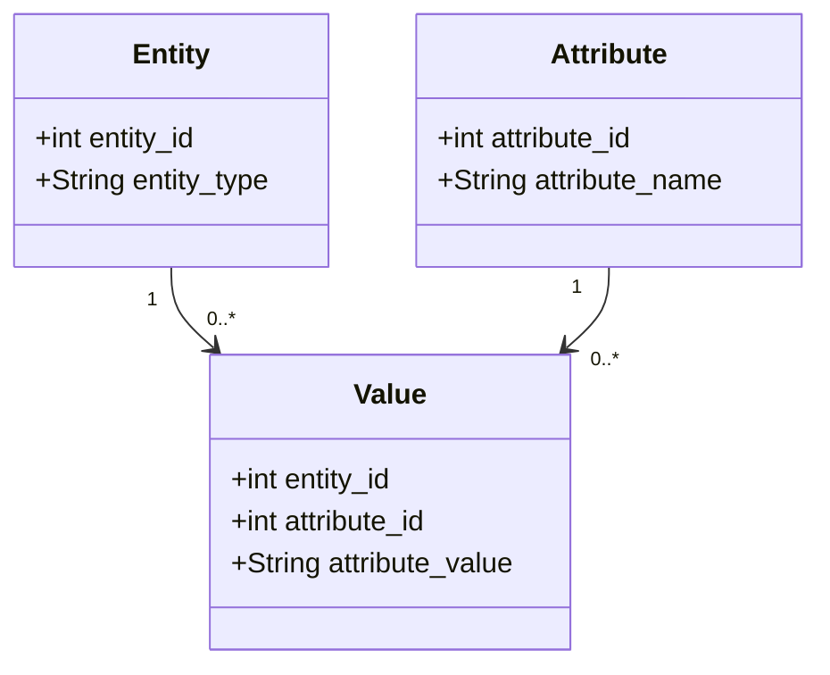

## Introduction

In modern data-driven applications, maintaining a rigid database schema can hinder agility and scalability. The Flexible Schema Design pattern allows databases to accommodate changes in data attributes without necessitating a restructure of the database or downtime.

## Detailed Explanation

The Flexible Schema Design pattern leverages the Entity-Attribute-Value (EAV) model, sometimes known as open schema, to permit the addition of new attributes dynamically. This pattern is particularly useful for applications that require frequent updates to data fields, such as content management systems, product catalogs, or user preferences.

### Key Concepts

- **Entities**: Distinct objects represented in your application (e.g., products, users).
- **Attributes**: Properties or characteristics of an entity (e.g., product color or user interest).
- **Values**: The data corresponding to an attribute for a particular entity.

### Architectural Approaches

1. **Traditional EAV Model**: Data is stored in a single table where each row represents a value of an attribute for an entity. Fields typically include entity ID, attribute name, and value.

2. **Schema-less Databases**: NoSQL databases like MongoDB or Couchbase, which inherently accommodate flexible schemata due to their document-based nature.

3. **Dynamic Columns in RDBMS**: Utilizing JSON/BLOB columns within traditional SQL databases (e.g., PostgreSQL's JSONB).

### Benefits and Drawbacks

#### Benefits:

- **Schema Flexibility**: Easily add attributes as needed without complex migrations.
- **Storage Efficiency**: Only store values for attributes that an entity actually possesses.

#### Drawbacks:

- **Complexity in Queries**: Joins and aggregations become more challenging.
- **Performance Overhead**: Increased I/O due to the extra level of abstraction.
- **Data Integrity**: Maintaining consistency and enforcing constraints is more difficult.

### Example Code

A simple implementation of the EAV model in SQL might look like this:

```sql
CREATE TABLE entity (
    entity_id INT PRIMARY KEY,
    entity_type VARCHAR(100)
);

CREATE TABLE attribute (
    attribute_id INT PRIMARY KEY,
    attribute_name VARCHAR(100)
);

CREATE TABLE value (
    entity_id INT,
    attribute_id INT,
    attribute_value TEXT,
    PRIMARY KEY (entity_id, attribute_id),
    FOREIGN KEY (entity_id) REFERENCES entity(entity_id),
    FOREIGN KEY (attribute_id) REFERENCES attribute(attribute_id)
);
```

### Diagram



## Related Patterns

- **Polymorphic Table Structures**: Use multiple tables with shared IDs but varying structures.
- **Document Store**: Adopt NoSQL for inherently flexible schemata.
- **Schema Versioning**: Maintain versions of schema as it evolves to manage complex business logic.

## Additional Resources

- [Entity-Attribute-Value Model on Wikipedia](https://en.wikipedia.org/wiki/Entity%E2%80%93attribute%E2%80%93value_model)
- [NoSQL Databases: A Survey and Decision Guidance](https://link.springer.com/article/10.1007/s10115-013-0707-7)

## Summary

The Flexible Schema Design pattern offers a path to fluidly handle dynamic data requirements without upfront schema changes. By utilizing EAV models or schema-less databases, systems can achieve significant flexibility at the cost of complexity in data handling and potential performance hits. For situations where attributes frequently change or vary across instances, adopting this pattern can streamline database evolution.
