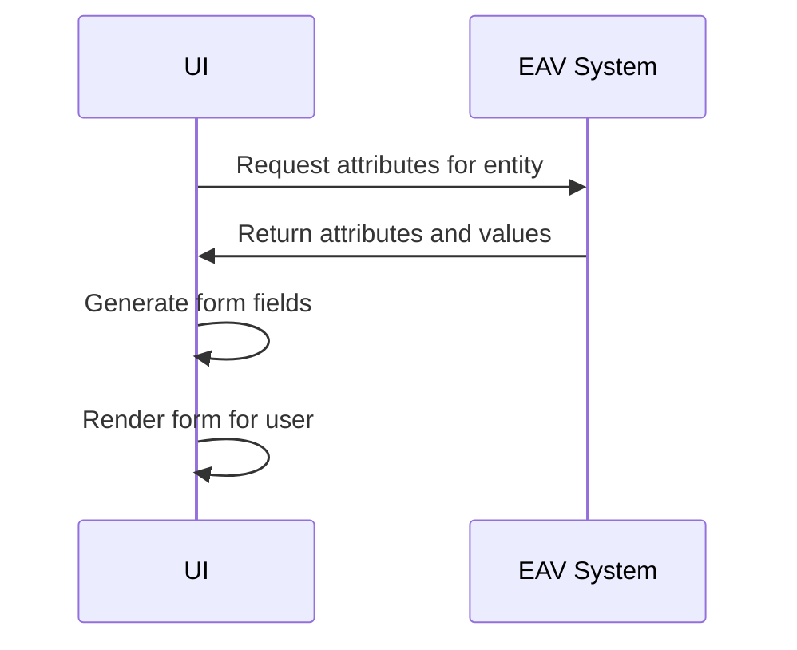

## Dynamic Forms Generation

### Overview

The Dynamic Forms Generation pattern is a method of creating user interface forms by leveraging data stored in the Entity-Attribute-Value (EAV) model. This approach allows developers to generate forms dynamically based on the varying attributes of entities, without requiring changes to the underlying code whenever new attributes are introduced. This flexibility is highly beneficial for applications that require frequent updates and customization, such as e-commerce platforms, customer relationship management systems, and other data-driven applications.

## Design Pattern Details

The EAV model is a data modeling paradigm where entities, attributes, and their values are stored as separate entries in the database. This model enables flexible data representation and is particularly useful for scenarios where entities have variable numbers and types of attributes.

### Key Components

1. **Entity**: Represents the object or instance in the model.
2. **Attribute**: Describes a property or characteristic of the entity.
3. **Value**: Holds the actual data for a specific attribute of an entity.

### Architectural Approach

1. **Data Retrieval**: Extract attributes and values from the EAV-based storage. This step involves querying the database to fetch information based on the entity's identifier.
   
2. **Form Generation**: Construct a user interface form using the retrieved data. This is done by mapping each attribute to a form field. The attributes act as metadata to define form field types, labels, validation rules, etc.
   
3. **Dynamic Updates**: Handle changes dynamically by updating the data in the EAV model, which reflects automatically in the dynamically generated forms.

### Example Code

The following pseudo-code demonstrates a simplified version of dynamic form generation:

```javascript
function generateForm(entityId) {
    const attributeData = fetchAttributesFromEAV(entityId);
    const form = document.createElement('form');

    attributeData.forEach(attribute => {
        const field = document.createElement('input');
        field.type = attribute.type;
        field.name = attribute.name;
        field.placeholder = attribute.label;

        if (attribute.required) {
            field.required = true;
        }

        form.appendChild(field);
    });

    document.body.appendChild(form);
}

generateForm('product123');
```

### Diagram



### Best Practices

- **Efficiency**: Optimize database queries to minimize the performance overhead of fetching large numbers of attributes.
- **Validation**: Ensure data validation logic is implemented both on client-side UI and server-side processes.
- **Security**: Sanitize input data to prevent injection attacks and enforce access control.
- **User Experience**: Design forms to be user-friendly with intuitive layouts and helpful tooltips.

### Related Patterns

- **Feature Toggle**: Use to enable or disable certain form elements based on feature flags.
- **Schema on Read**: Similar in concept, allows data to be interpreted in flexible ways according to the schema during read operations.

### Additional Resources

- [A Comprehensive Guide to EAV Models](https://example.com/eav-guide)
- [Dynamic Form Generation Techniques in Web Programming](https://example.com/dynamic-forms)

## Summary

Dynamic Forms Generation leverages the flexibility of the EAV model to quickly adapt user interfaces in data-centric applications. By ensuring that the form elements are generated based on database metadata, this pattern provides scalability and responsiveness to changing requirements, making it an excellent choice for dynamic applications. Through careful implementation of best practices, it ensures a seamless user experience effectively bridging the gap between data storage and presentation.
