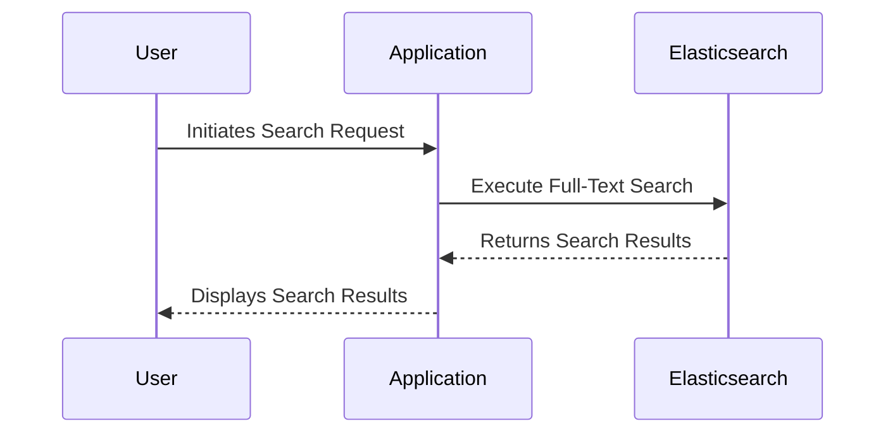

---

linkTitle: "Search Optimization"
title: "Search Optimization"
category: "Entity-Attribute-Value (EAV) Patterns"
series: "Data Modeling Design Patterns"
description: "Enhancing search capabilities over EAV data through strategic indexing and optimization techniques to improve performance and user experience in retrieving structured information efficiently."
categories:
- Entity-Attribute-Value
- Performance Optimization
- Data Modeling
tags:
- Search Optimization
- EAV Patterns
- Indexing Strategies
- Full-Text Search
- Query Performance
date: 2024-07-07
type: docs

canonical: "https://softwarepatternslexicon.com/102/6/31"
license: "© 2024 Tokenizer Inc. CC BY-NC-SA 4.0"
---


## Overview

The "Search Optimization" design pattern addresses the challenge of efficiently querying data stored in an Entity-Attribute-Value (EAV) model. The EAV model is popular in scenarios where entities have a large number of attributes, and those attributes can be sparsely assigned. It mimics a flexible schema, allowing dynamic addition of new attributes, which introduces complexities in executing efficient queries, especially when searches span across attributes heavily.

### Key Concepts

- **Dynamic Schema**: The EAV pattern enables a flexible and dynamic schema at the cost of increased complexity in querying.
- **Performance Bottlenecks**: Without optimization, searching across attribute values can lead to significant performance degradation.
- **Full-Text Search**: Implementing full-text indexing on attributes enhances search capabilities by allowing rapid text retrieval and complex query executions.

## Architectural Approaches

### Indexing Strategies

1. **Attribute-Based Indexing**: Create specific indexes on frequently queried attributes to reduce the query response time significantly.

2. **Full-Text Indexing**: Use technologies like Elasticsearch, Apache Solr, or built-in RDBMS full-text search capabilities to provide fuzzy searches, relevance scoring, and natural language processing features.

3. **Inverted Indexes**: Implement inverted indexes to map attribute values to entities, facilitating quick lookup across large datasets.

### Caching and Materialized Views

- **Result Caching**: Implement an in-memory caching layer using frameworks like Redis or Memcached to store frequent queries' results to alleviate repeated computation loads.

- **Materialized Views**: Create materialized views in the database reflecting pre-aggregated or pre-filtered data snapshots enhancing the performance of recurring complex queries.

### Vertical Partitioning

- **Data Sharding**: Distribute attribute data across different storage engines or partitions based on adoption patterns to improve concurrent access and scalability.

## Example Code

Below is an example illustrating the concept of incorporating full-text search using Elasticsearch for attributes in an EAV database:

```java
import org.elasticsearch.action.search.SearchRequest;
import org.elasticsearch.index.query.QueryBuilders;
import org.elasticsearch.client.RequestOptions;
import org.elasticsearch.action.search.SearchResponse;
import org.elasticsearch.client.RestHighLevelClient;
import org.elasticsearch.search.builder.SearchSourceBuilder;

public class EavSearch {
    private RestHighLevelClient client;

    public EavSearch(RestHighLevelClient esClient) {
        this.client = esClient;
    }

    public SearchResponse executeFullTextSearch(String query) throws IOException {
        SearchRequest searchRequest = new SearchRequest("eav-attributes");
        SearchSourceBuilder searchSourceBuilder = new SearchSourceBuilder();
        searchSourceBuilder.query(QueryBuilders.matchQuery("attribute_value", query));
        searchRequest.source(searchSourceBuilder);

        return client.search(searchRequest, RequestOptions.DEFAULT);
    }
}
```

## Diagrams

### UML Sequence Diagram



## Related Patterns

- **Indexed EAV Pattern**: Focuses on the creation of various indexes to speed up the access to attribute values.
- **Search Pattern**: Broad term that covers various techniques for implementing effective data search mechanisms in flexible schema-data architectures.

## Additional Resources

- [Elasticsearch Reference Guide](https://www.elastic.co/guide/en/elasticsearch/reference/current/index.html)
- [Apache Solr Documentation](https://solr.apache.org/guide/)
- [Indexing in Relational Databases](https://www.postgresql.org/docs/current/indexes.html)

## Summary

The Search Optimization pattern offers actionable strategies to enhance the performance of queries within an Entity-Attribute-Value data model. By leveraging full-text indexing, caching, and vertical partitioning, organizations can significantly boost their system's ability to handle complex and frequent searches efficiently. This pattern is instrumental in scenarios where flexible schemas and search accuracy are paramount for enterprise applications.
