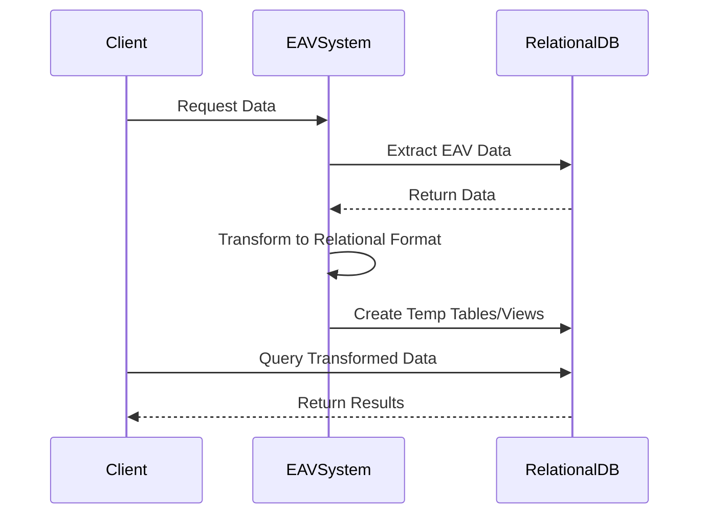

## Introduction

Entity-Attribute-Value (EAV) modeling is often used to handle situations where the number of attributes that can be associated with a data entity is very large and sparsely populated. While EAV provides flexibility, it poses challenges for performing complex queries, reporting, and analytics. The EAV to Relational Mapping design pattern addresses these challenges by transforming EAV-based data models into traditional relational table structures that are more efficient for these operations.

## Detailed Explanation

### Design Pattern Overview

The EAV to Relational Mapping pattern provides a method for efficiently interpreting and manipulating data stored in an EAV format. By converting EAV data into a tabular format using temporary tables or views, we can take advantage of traditional SQL engine optimizations, which aids in complex querying, reporting, and performing data analytics.

### Architectural Approach

1. **Schema Extraction**: Identify and document the EAV model schema, mapping each entity and its attributes to matched relational table structures.

2. **Transformation Process**:
    - **Data Extraction**: Write SQL queries or use ETL processes to extract data from EAV tables.
    - **Data Transformation**: Convert extracted data columns to a tabular-compliant structure.
    - **Data Loading**: Load transformed data into temporary tables or structured views for processing.

3. **Query Optimization**: Use indexing and materialized views to optimally handle frequent queries and computations.

### Example Code

Consider an EAV table structure with the following simple organization:

- `entity`: A representation of data entities (e.g., `entity_id`, `entity_name`).
- `attribute`: Attributes applicable to entities (e.g., `attribute_id`, `attribute_name`).
- `value`: Holds the actual data values (e.g., `entity_id`, `attribute_id`, `value`).

A basic SQL transformation might look like this:

```sql
CREATE TEMPORARY TABLE ProductAttributes AS
SELECT
    e.entity_id,
    MAX(CASE WHEN a.attribute_name = 'color' THEN v.value ELSE NULL END) AS color,
    MAX(CASE WHEN a.attribute_name = 'size' THEN v.value ELSE NULL END) AS size,
    MAX(CASE WHEN a.attribute_name = 'price' THEN v.value ELSE NULL END) AS price
FROM
    entity e
JOIN
    value v ON e.entity_id = v.entity_id
JOIN
    attribute a ON v.attribute_id = a.attribute_id
GROUP BY
    e.entity_id;
```

### Diagrams

Here's a visual illustration using a Mermaid UML Sequence Diagram, which outlines the transformation process:



## Related Patterns

- **Vertical Partitioning**: Splits table attributes into multiple tables to improve query performance.
- **Database Sharding**: Distributes data across multiple databases for scalability and parallel processing.

## Additional Resources

- "SQL Performance Explained" by Markus Winand
- "Design Patterns: Elements of Reusable Object-Oriented Software" by Erich Gamma et al. (for understanding design patterns application)

## Summary

The EAV to Relational Mapping pattern is a powerful approach for solving the challenges associated with querying and analyzing data stored in an EAV model. By employing this pattern, organizations can efficiently achieve performance optimizations while maintaining the necessary flexibility of EAV models for evolving data needs.

Transforming EAV data into a relational form for intensive processing allows leveraging advances in SQL optimization and indexing, ensuring rapid and accurate data insights while maintaining a highly dynamic data schema.
