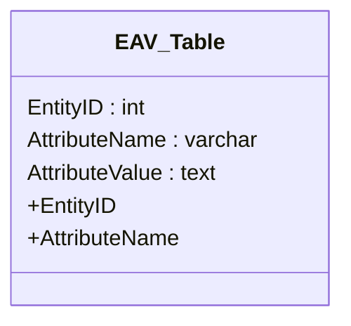

## Introduction

Entity-Attribute-Value (EAV) model is widely used to accommodate dynamic and flexible data structures in a variety of applications, such as medical databases, content management systems, and product catalogs. However, EAV tables can suffer from poor query performance due to their generic structure. One effective strategy to overcome this limitation is to employ indexing, particularly on the "EntityID" and "AttributeName" columns. This article provides a detailed exploration of the "Indexing EAV Tables" pattern, highlighting architectural approaches, practical implementations, and best practices.

## Design Pattern Details

The primary concern with EAV models is the inherent performance issue arising from the table's extensive size and sparsity. Queries filtering or aggregating on specific attributes often become inefficient. Indexing these tables involves strategically creating indexes on key columns:

1. **EntityID Index**: Essential for quickly filtering or joining based on an entity. This index expedites retrieval of all attribute-value pairs related to a specific entity.
   
2. **AttributeName Index**: Facilitates fast searching of rows that contain specific attributes, crucial for applications that need to search by attribute type or name.

## Architectural Approaches

1. **Composite Indexing**: Create a composite index on a combination of "EntityID" and "AttributeName". This approach serves the dual purpose of enhancing speed for queries that specify both parameters.
   
2. **Partial Indexing**: Use partial indexing to only index those entries relevant to frequent queries which leads to smaller indexes and potentially improved performance.
   
3. **Covering Index**: Design the index to cover most column queries, which can eliminate the need to access the base table.

## Best Practices

- Analyze query patterns to implement effective indexing strategies. Queries that frequently filter or sort on "EntityID" or "AttributeName" benefit the most from these indexes.
- Regularly maintain and optimize indexes to prevent performance degradation over time.
- Balance between read and write operations; indices may increase read speeds but can slow down write operations.
- Consider database-specific features and optimization tips tailored to EAV patterns.

## Example Code

The following SQL snippet demonstrates the implementation of an index on an EAV table:

```sql
CREATE INDEX idx_eav_entity_attribute
ON EAV_Table (EntityID, AttributeName);

CREATE INDEX idx_eav_attribute_value
ON EAV_Table (AttributeName);
```

This setup creates a composite index and a separate index on "AttributeName", aiming to optimize common query paths.

## Diagrams

Here's a UML representation of the indexing approach using a Mermaid UML Class diagram:



## Related Patterns

- **Attribute-Intensive Queries**: Focuses on optimizing queries in attribute-dense datasets, often using similar indexing techniques.
- **Schema-Less Data Modeling**: Explores dynamic data modeling approaches which often necessitate EAV designs.
- **Polymorphic Associations**: Design pattern used to define a variable set of relationships between tables in a database.

## Additional Resources

- *Database Design for Mere Mortals by Michael J. Hernandez* - Provides in-depth insights into database design principles.
- *SQL Performance Explained by Markus Winand* - Offers understanding and practical guides for SQL optimization techniques.

## Summary

Indexing EAV tables is a critical design pattern that, when applied correctly, can drastically improve the performance of database queries. By focusing on strategic indexing such as that on "EntityID" and "AttributeName" and following best practices, developers can utilize the flexibility of EAV models without sacrificing performance. The principles herein highlight the balance of adaptive data modeling with efficient execution planning, fostering robust and scalable database systems.
