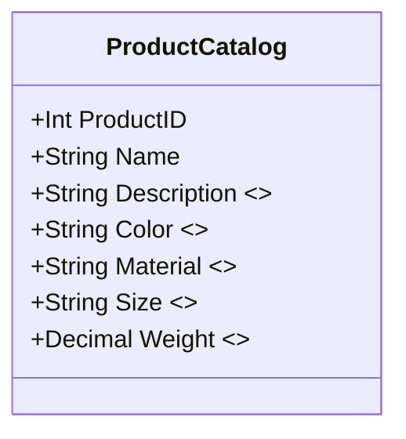

---

linkTitle: "Sparse Column Support"
title: "Sparse Column Support"
category: "6. Entity-Attribute-Value (EAV) Patterns"
series: "Data Modeling Design Patterns"
description: "Using sparse columns in databases to efficiently handle NULL values in an Entity-Attribute-Value (EAV) model, facilitating the storage of optional attributes without excessive storage cost."
categories:
- Data Modeling
- Database Design
- Performance Optimization
tags:
- EAV
- Sparse Columns
- SQL Server
- Data Storage
- Database Efficiency
date: 2024-07-07
type: docs

canonical: "https://softwarepatternslexicon.com/102/6/9"
license: "© 2024 Tokenizer Inc. CC BY-NC-SA 4.0"
---

## Overview

The Sparse Column Support design pattern is integral to modern data modeling strategies, particularly when dealing with Entity-Attribute-Value (EAV) models where multiple NULLs are expected due to optional attributes. This pattern leverages database features aimed at optimizing storage for such scenarios, with sparse columns being a primary solution in environments like SQL Server.

## Detailed Explanation

Sparse columns are a database feature that optimizes the storage of columns that typically have NULL values by significantly reducing the space required. In an EAV design where entities have multiple optional attributes, sparse columns can provide distinct advantages:

1. **Space Efficiency**: With the effective use of sparse columns, only columns with non-NULL values require storage space, reducing the database's overall size.
2. **Performance Improvement**: Sparse columns improve the performance of queries and data manipulation by minimizing unnecessary reads and writes of NULL values.
3. **Cost Savings**: By decreasing the storage footprint, using sparse columns can lead to reduced costs, especially in cloud environments where storage costs can accumulate rapidly.

### Key Features

- **Automatic NULL Compression**: Sparse columns automatically compress NULL data, providing inherent storage optimization without the need for manual interventions.
- **Integration with EAV**: Allows EAV-styled tables to efficiently handle a vast array of optional attributes while avoiding the pitfalls of traditional wide table layouts.

## Example Code

Consider a table design in SQL Server that accommodates optional attributes using sparse columns:

```sql
CREATE TABLE ProductCatalog (
    ProductID INT PRIMARY KEY,
    Name NVARCHAR(100),
    Description NVARCHAR(255) SPARSE,
    Color NVARCHAR(30) SPARSE,
    Material NVARCHAR(50) SPARSE,
    Size NVARCHAR(20) SPARSE,
    Weight DECIMAL(10, 2) SPARSE
);
```

In this example, minimal storage is used for NULL entries in `Description`, `Color`, `Material`, `Size`, and `Weight` columns, while essential product attributes like `ProductID` and `Name` remain traditionally stored.

## Diagrams

To aid in understanding, here is a UML class diagram illustrating a simple EAV model using sparse columns:



## Related Patterns

- **Column-Family Store**: For scenarios where sparse data is prevalent, column-family databases (e.g., Cassandra) offer a native solution with more direct advantages compared to relational databases.
- **Document Store**: When entities have non-uniform attributes, document stores (e.g., MongoDB) provide flexibility by storing data in a semi-structured format.

## Best Practices

1. **Align Sparse Columns with Usage Patterns**: Analyze access patterns to determine which attributes truly benefit from being sparingly populated.
2. **Monitor Performance**: Continuous monitoring and profiling are crucial to ensure that the introduction of sparse columns is having the desired effect on performance.
3. **Storage Cost Versus Complexity**: Evaluate the trade-offs in terms of storage savings against potential complexity added to the database schema.

## Additional Resources

- [Microsoft Docs on SQL Server Sparse Columns](https://docs.microsoft.com/en-us/sql/relational-databases/tables/use-sparse-columns)
- [Database Programming Using SQL](https://content.mheducation.com/responsive/index.html) - Explores advanced SQL techniques, including sparse column usage.

## Summary

The Sparse Column Support design pattern is effective in optimizing storage and performance in EAV-styled databases where optional attributes result in many NULL values. By leveraging sparse columns, database schemas can remain flexible, efficient, and cost-effective, particularly crucial in data-intensive applications and environments with variable data structures.


