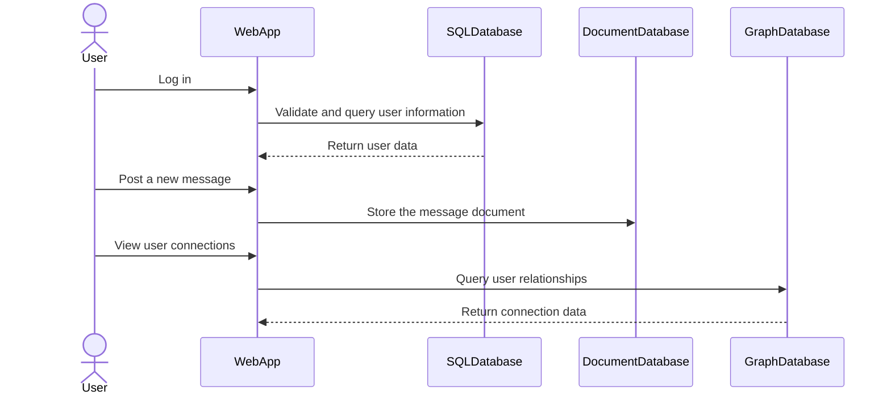

In modern software architecture, it's critical to leverage different database technologies that best match the characteristics of the data they store, the operations to be performed on that data, and the scalability requirements imposed by its usage pattern. The Best Fit Storage pattern promotes selecting the optimal data storage solution for each component of an application based on its specific needs.

## Overview

The Best Fit Storage pattern involves analyzing the unique requirements of various parts of an application and then selecting the storage technology that is best suited for those needs. These requirements could be driven by factors such as:

- Data structure (e.g., structured, semi-structured, unstructured)
- Transactional or eventual consistency
- Query complexity
- Scalability
- Latency
- Data volume
- Data lifecycle

By employing this pattern, developers can exploit the strengths and mitigate the weaknesses of different database types, such as relational databases (RDBMS), document stores, key-value stores, column-family stores, and graph databases.

## Architectural Approach

Adopting the Best Fit Storage pattern typically involves:

1. **Requirements Analysis**: Understand the requirements of each application component in terms of data storage, retrieval, and management.
2. **Technology Evaluation**: Evaluate the strengths and limitations of available database technologies, like SQL databases for transactions, NoSQL databases for flexibility, or NewSQL for scalability and consistency.
3. **Design**: Architect the system to use multiple database technologies (polyglot persistence), ensuring components are decoupled and service-oriented to allow independent scaling and maintenance.
4. **Implementation**: Implement specific data storage solutions aligned with use-case needs, possibly involving integration layers or data pipelines (ETLs or stream processing) to synchronize across multiple systems.
5. **Monitoring and Evolution**: Continuously monitor the system to ensure SLA requirements are met and evolve the architecture as needs change.

## Example

Consider a comprehensive social networking platform that supports various functionalities:

- **Relational Database (SQL)**: SQL databases like MySQL or PostgreSQL can efficiently handle transactional data for user account information, ensuring ACID properties.
  
- **Document Database (NoSQL)**: MongoDB or Couchbase might be used to store user-generated content, such as posts or messages, where a flexible schema is beneficial.
  
- **Graph Database**: Neo4j could serve as the storage for social graphs to facilitate efficient querying of connections and relationships between users.

## Diagram

Here's a simplified architecture using a Mermaid UML Sequence diagram to demonstrate how the Best Fit Storage pattern can be integrated into an existing system:

## Related Patterns

- **CQRS (Command Query Responsibility Segregation)**: Tackles separate read and write concerns, which can complement storage strategies when read and write demands differ significantly.
  
- **Event Sourcing**: Stores changes as events, allowing recreation of state and aiding in flexible storage.
  
- **Repository Pattern**: Abstracts access to data storage, providing a uniform API to different data sources.

## Additional Resources

- *"The Polyglot Programmer"* by Neal Ford
- Articles on distributed NoSQL database architectures.
- Videos on designing polyglot persistent systems.

## Summary

The Best Fit Storage pattern embodies the principle of selecting the right tool for the right job within the landscape of data management. By leveraging the strengths of each database technology where it best applies, this pattern facilitates building systems that are more robust, scalable, and easier to maintain compared to a one-size-fits-all approach. As applications grow in complexity and data needs evolve, embracing polyglot persistence and tailoring solutions to specific use cases can be a pivotal strategy for long-term success.
