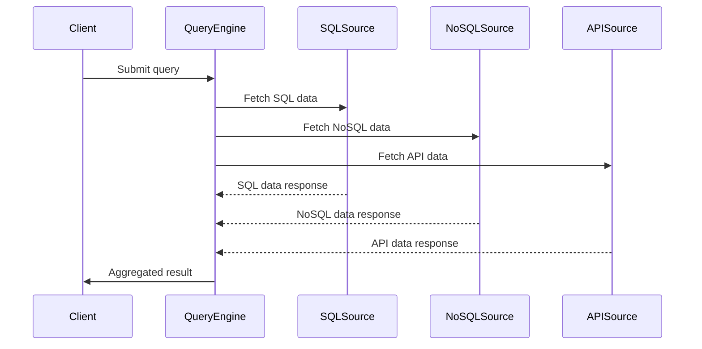

## Data Federation

### Description
Data Federation is a design pattern that provides a unified view of data collected from various heterogeneous sources. This pattern doesn't require physical relocation or transformation of the source data but instead offers a virtual database layer. Data Federation is crucial for enterprises dealing with multiple data types, such as relational databases, NoSQL databases, and API-driven data sources.

### Architectural Approach
In a Data Federation architecture, a central query engine acts as an intermediary between the client applications and the underlying data sources. The query engine is responsible for parsing the query received from the client, distributing it to the respective data sources, aggregating the results, and returning a consolidated response.

The following steps outline the typical workflow:

1. **Query Parsing**: The query engine receives the query and determines which data sources are involved.
2. **Query Federation**: It breaks down the query and sends specific parts to the relevant data sources.
3. **Data Retrieval**: The engine retrieves data from each source and initiates any required transformations or normalizations.
4. **Result Aggregation**: Data from various sources is collated into a single dataset.
5. **Response Return**: The integrated result set is returned to the client application.

### Example Code
Using a hypothetical query engine in Java:

```java
class DataFederationEngine {
    // Hypothetical data source interfaces
    private SqlDataSource sqlDataSource;
    private NoSqlDataSource noSqlDataSource;
    private ApiDataSource apiDataSource;

    public ResultSet executeQuery(String query) {
        QueryPlan plan = parseQuery(query);
        List<ResultSet> partialResults = new ArrayList<>();

        if (plan.includesSql()) {
            partialResults.add(sqlDataSource.query(plan.getSqlQuery()));
        }
        if (plan.includesNoSql()) {
            partialResults.add(noSqlDataSource.query(plan.getNoSqlQuery()));
        }
        if (plan.includesApi()) {
            partialResults.add(apiDataSource.query(plan.getApiQuery()));
        }

        return aggregateResults(partialResults);
    }

    // Methods for query parsing, result aggregation...
}
```

### Diagram
#### Mermaid Sequence Diagram



### Best Practices
- **Optimize Queries**: Ensure that queries are optimized specifically for each data source to minimize latency.
- **Manage Data Consistency**: Implement strategies for maintaining eventual consistency, especially when dealing with real-time data.
- **Security Layers**: Protect sensitive data by enforcing strict security and governance policies.
- **Scalability**: Design the query engine to handle increased loads and multiple data source integrations efficiently.

### Related Patterns
- **Data Lake**: While Data Federation provides a virtual view, a data lake focuses on storing data from different sources in a centralized repository for analysis.
- **ETL Process**: Extract, Transform, Load (ETL) processes move and transform data physically, which is in contrast to the virtual integration approach of Data Federation.

### Additional Resources
- [Polyglot Persistence and Data Integration Concepts](https://www.example.com/polyglot-persistence)
- [Federated Database Systems in Practice](https://www.example.com/federated-dbs)
- [Real-time Data Federation Techniques](https://www.example.com/realtime-data-federation)

### Summary
The Data Federation pattern bridges the gap between disparate data systems, offering a real-time, unified view without physically moving data. By employing an intelligent query engine, Data Federation ensures that enterprises can leverage the dynamic and robust analysis capabilities across all their data sources. It is a key pattern for achieving seamless data integration in complex, polyglot persistence environments.
