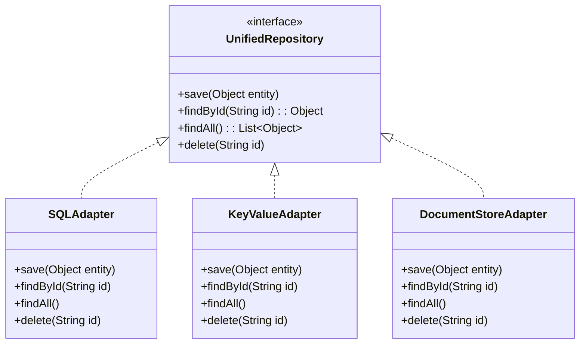

---

linkTitle: "Polyglot Persistence API Design"
title: "Polyglot Persistence API Design"
category: "Polyglot Persistence Patterns"
series: "Data Modeling Design Patterns"
description: "Designing APIs that effectively handle interactions with multiple data stores, possibly using different paradigms."
categories:
- Integration Strategies
- Data Modeling
- Polyglot Persistence
tags:
- API Design
- Polyglot Persistence
- Integration
- Data Stores
- Cloud Computing
date: 2024-07-07
type: docs

canonical: "https://softwarepatternslexicon.com/102/7/13"
license: "© 2024 Tokenizer Inc. CC BY-NC-SA 4.0"
---

## Introduction

In today's diverse data landscape, many organizations are employing a polyglot persistence strategy to leverage the unique strengths of different data storage technologies. However, this introduces the challenge of designing and managing APIs that can seamlessly interact with these varied data sources. The Polyglot Persistence API Design pattern addresses these challenges by providing a structured approach to creating flexible and robust interfaces capable of interacting with multiple databases and data paradigms.

## Problem

As organizations adopt various storage solutions like SQL databases, NoSQL stores, and distributed data systems, they face the complexity of building applications that can interact with these heterogeneous data sources. The API layer becomes crucial in abstracting and handling this diversity, reducing complexity and maintaining agility in application development.

### Challenges

- **Data Consistency**: Ensuring consistent data across different stores.
- **Transaction Management**: Handling transactions over multiple data sources that have different consistency and transaction models.
- **Performance**: Optimizing performance by understanding the unique performance characteristics of each data store.
- **Scalability and Reliability**: Maintaining a scalable and reliable API that can cater to different workloads.

## Solution

The Polyglot Persistence API Design pattern suggests creating a unified API layer that abstracts the underlying data store interactions. This includes defining a set of interfaces and interaction patterns which can be used by application developers to perform CRUD operations seamlessly across multiple databases.

### Key Concepts

- **Abstraction Layer**: Implement a layer that abstracts the specifics of interacting with different backend stores.
- **Interface Design**: Design clear and consistent interfaces for CRUD operations that work across different paradigms.
- **Adapter Pattern**: Utilize the Adapter Pattern to translate generic interface calls into specific operations required by each data store.
- **Service-Oriented Approach**: Leverage services to perform operations on behalf of the API, ensuring decoupling between application logic and data access logic.

## Example

Let's consider a scenario where an application needs to interact with a SQL database for transactional data, a key-value store for caching user sessions, and a document store for logging.

### Unified Repository Interface

```java
public interface UnifiedRepository {
    void save(Object entity);
    Object findById(String id);
    List<Object> findAll();
    void delete(String id);
}
```

### Implementing Adapters

```java
public class SQLAdapter implements UnifiedRepository {
    // SQL-specific implementation
}

public class KeyValueAdapter implements UnifiedRepository {
    // Key-value store-specific implementation
}

public class DocumentStoreAdapter implements UnifiedRepository {
    // Document store-specific implementation
}
```

### Usage

```java
public class PersistenceService {
    private UnifiedRepository sqlRepo;
    private UnifiedRepository kvRepo;
    private UnifiedRepository docRepo;

    public PersistenceService() {
        this.sqlRepo = new SQLAdapter();
        this.kvRepo = new KeyValueAdapter();
        this.docRepo = new DocumentStoreAdapter();
    }

    // Operations using UnifiedRepository interfaces...
}
```

## Diagram



## Related Patterns

- **Repository Pattern**: Provides a way to encapsulate data access logic.
- **Adapter Pattern**: Used to adapt one interface to another.
- **Service Layer Pattern**: Decouples business logic and data access.
- **Command Query Responsibility Segregation (CQRS)**: Separates read and write models for performance and scalability.

## Additional Resources

- "Design Patterns: Elements of Reusable Object-Oriented Software" by Gamma et al. (For understanding patterns like Adapter and Repository)
- "Domain-Driven Design" by Eric Evans
- Microservices architecture and polyglot persistence approaches

## Summary

The Polyglot Persistence API Design pattern is essential for building robust, flexible, and scalable APIs capable of interacting with a variety of data stores. By using abstraction, the Adapter Pattern, and service orientation, organizations can create efficient and maintainable application architectures that leverage multiple database paradigms while reducing complexity for developers. This pattern not only improves adaptability in a rapidly changing technology landscape but also enhances system resilience and scalability.
