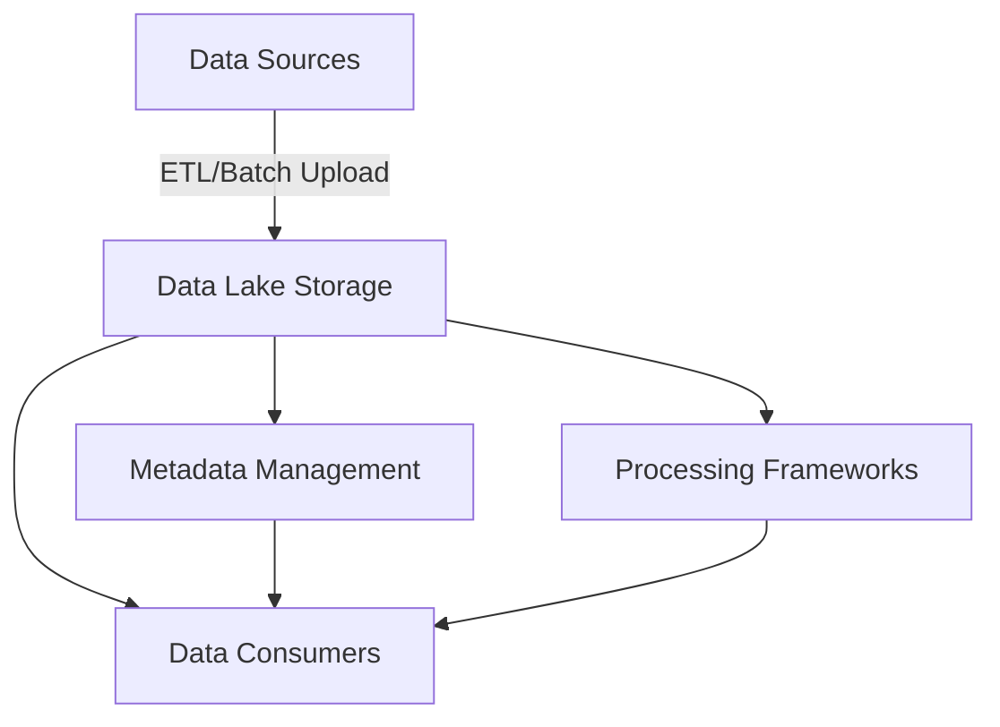

## Overview

A Data Lake is a centralized repository that allows you to store all your structured and unstructured data at any scale. You can store your data as-is, without first structuring the data, and run different types of analytics—from dashboards and visualizations to big data processing, real-time analytics, and machine learning—to guide better decisions.

Data Lakes are designed to manage vast amounts of raw data in its native format, facilitating big data analytics. They support multiple data types and sources, providing the flexibility needed for modern data analysis tools. They can integrate structured data, like databases, with unstructured data such as web content.

## Architectural Components

- **Storage Layer**: This is often built on distributed file systems like Apache Hadoop's HDFS or cloud-based object storage solutions like Amazon S3.
  
- **Processing Frameworks**: Apache Spark and Apache Flink are commonly used for batch and real-time processing.
  
- **Metadata Management**: Ensures data usability by describing the data catalog. Apache Hive, AWS Glue Data Catalog, or similar solutions can be used.
  
- **Access Control**: Security provisions are critical, especially since data lakes store sensitive data. AWS IAM, Apache Ranger, or Azure Active Directory can be part of implementation.

- **Data Ingestion**: Data is brought into the lake via ETL (Extract, Transform, Load) processes, streaming data ingestion tools like Apache Kafka, or batch uploads.

## Design Patterns

1. **Data Ingestion and Storage**: Use tools like Apache NiFi or AWS Glue to automate data collection and storage.

2. **Data Cataloging**: Implement a data catalog to improve discoverability across data lakes, using tools like AWS Glue Catalog or Apache Hive Metastore.

3. **Schema on Read**: Unlike traditional data warehouses that require schema-on-write, data lakes implement schema-on-read, providing flexibility in defining data structure at query time.

4. **Governance and Compliance**: Tools to ensure compliance with data privacy regulations, and maintaining data lineage and audit logs.

## Example Code

Below is a simple Scala code to demonstrate reading data from a file system like HDFS using Apache Spark:

```scala
import org.apache.spark.sql.SparkSession

object DataLakeExample {
  def main(args: Array[String]): Unit = {
    val spark = SparkSession.builder
      .appName("Data Lake Example")
      .getOrCreate()

    // Reading data from HDFS
    val rawData = spark.read.text("hdfs://namenode:9000/user/hadoop/data.txt")

    // Perform transformations or analytics
    rawData.show()
  }
}
```

## Diagrams

### Data Lake Architecture Diagram



## Related Patterns

- **Data Warehousing**: Unlike data lakes, warehouses store processed and structured data for fast query performance.
  
- **Stream Processing**: Integration patterns that deal with real-time data as it flows into the data lake.

## Additional Resources

- [AWS Data Lakes and Analytics](https://aws.amazon.com/big-data/datalakes-and-analytics/)
- [Azure Data Lake Storage Gen2](https://azure.microsoft.com/en-us/services/storage/data-lake-storage/)
- [Google Cloud Data Lakes](https://cloud.google.com/solutions/data-lake)

## Summary

Data Lakes are an essential component of modern data architecture, allowing organizations to handle diverse data types and volumes while enabling complex analytics on comprehensive datasets. With the right tools and practices, Data Lakes offer significant business advantages in terms of data flexibility, cost savings, and analytically actionable insights. Investing in robust security, governance, and metadata strategies is essential for maintaining an effective data lake environment.
