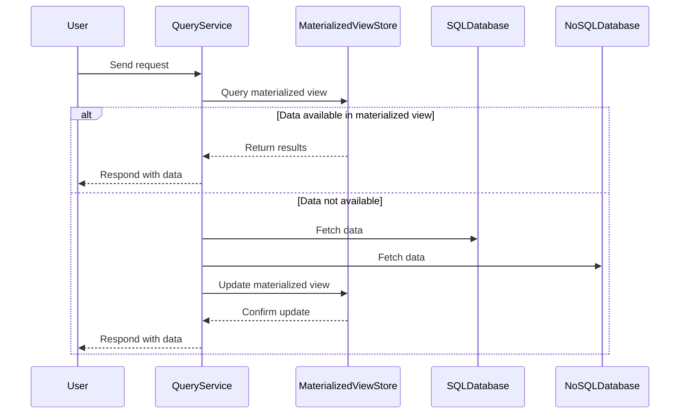

---

linkTitle: "Materialized Views Across Data Stores"
title: "Materialized Views Across Data Stores"
category: "Polyglot Persistence Patterns"
series: "Data Modeling Design Patterns"
description: "Creating precomputed views that combine data from multiple databases to improve query performance."
categories:
- Performance Optimization
- Data Integration
- Polyglot Persistence
tags:
- Materialized Views
- Data Stores
- Query Performance
- SQL
- NoSQL
date: 2024-07-07
type: docs
canonical: "https://softwarepatternslexicon.com/102/7/16"
license: "© 2024 Tokenizer Inc. CC BY-NC-SA 4.0"
---


## Introduction

Materialized Views Across Data Stores is a pattern that addresses the complexity of querying data spread across multiple heterogeneous databases for performance optimization in polyglot persistence environments. By precomputing and storing the results as materialized views, applications can query these views instead of hitting multiple databases, thereby reducing latency and computational overhead.

## Architectural Approach

### Components

1. **Data Sources**: These include various SQL databases, NoSQL stores, and other data repositories.
2. **ETL/ELT Processes**: Extract, transform, load/extract, load, transform processes are designed to pull data from different data stores, transform it into the desired format, and load it as a materialized view.
3. **Materialized View Storage**: A database or data warehouse that holds the precomputed data.
4. **Schedulers and Triggers**: Tools that maintain up-to-date materialized views by scheduling refreshes or triggering updates based on data changes.

### Process Flow

The ETL/ELT processes are central in aggregating and transforming data from diverse sources. Here's an example sequence diagram displaying this pattern:



## Best Practices

- **Consistency Management**: Ensure consistency across different data sources. Use eventual consistency or read-after-write guarantees.
- **Refresh Strategy**: Implement an optimal refresh strategy—periodic refresh, on demand, or event-driven updates—based on application requirements.
- **Storage and Performance Trade-offs**: Consider the storage cost versus query performance improvements when designing materialized views.
- **Security and Compliance**: Secure data flows and ensure compliance with data privacy standards during ETL/ELT processes.

## Example Code

Below is a simplified example using a Java application with Kafka for stream processing:

```java
import org.apache.kafka.streams.KafkaStreams;
import org.apache.kafka.streams.StreamsBuilder;
import org.apache.kafka.streams.kstream.KTable;

public class MaterializedViewExample {
    public static void main(String[] args) {
        StreamsBuilder builder = new StreamsBuilder();
        
        KTable<String, Customer> customers = builder.table("customers");
        KTable<String, Order> orders = builder.table("orders");
        
        KTable<String, CustomerOrderView> materializedView = customers.join(
                orders,
                (customer, order) -> new CustomerOrderView(customer, order)
        );

        materializedView.toStream().to("materialized-view-topic");
        
        KafkaStreams streams = new KafkaStreams(builder.build(), getStreamsConfig());
        streams.start();
    }
    
    private static StreamsConfig getStreamsConfig() {
        var props = new Properties();
        props.put(StreamsConfig.APPLICATION_ID_CONFIG, "materialized-view-app");
        return new StreamsConfig(props);
    }
}

class Customer {}
class Order {}
class CustomerOrderView {
    CustomerOrderView(Customer customer, Order order) {
        // Combine customer and order data
    }
}
```

## Related Patterns

- **CQRS (Command Query Responsibility Segregation)**: This pattern can be combined with materialized views for separating read and write operations, especially useful in high-concurrency scenarios.
- **Data Lake Pattern**: Collects data in its raw form and can be a source for materialized views.
- **Event Sourcing**: In environments where event logs are kept, materialized views can provide current state snapshots derived from event logs.

## Additional Resources

- **Books**: *Designing Data-Intensive Applications* by Martin Kleppmann for data modeling patterns.
- **Websites**: Cloud provider documentation (AWS, GCP, Azure) for services managing materialized views.
- **Blogs & Podcasts**: Look up case studies and implementations from the field for real-world example implementations.

## Summary

The Materialized Views Across Data Stores pattern provides an efficient means to query complex and distributed data environments, improving performance while managing data consistency and integration across various platforms. Proper implementation of this pattern involves choosing the right tools and strategies to fit your application’s needs.
