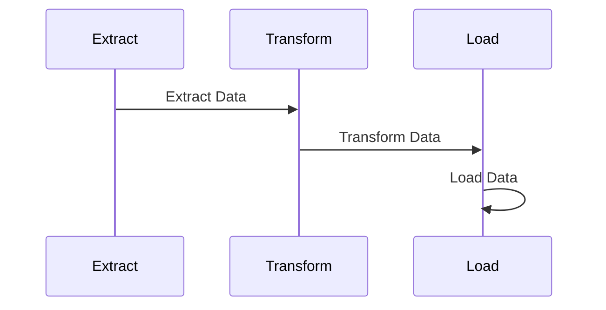

## Introduction

The **Data Orchestration** design pattern is crucial in modern data architectures. It involves coordinating data flows and transformations across diverse data stores, leveraging orchestration tools to manage complex workflows effectively. This pattern ensures seamless integration and processing of data in polyglot persistence environments, where different data systems must cohesively operate to support various applications and use cases.

## Architectural Approach

Data orchestration involves setting up workflows that ensure data flows through different stages of processing seamlessly. These stages usually include data extraction, transformation, loading (ETL), and often additional processing or analytics tasks. The orchestration facilitates both time-bound scheduling and event-driven triggers to manage data pipelines.

### Key Features:

1. **Workflow Management**: Define, schedule, and monitor complex data workflows.
2. **Task Coordination**: Ensure tasks executed in the right order, managing dependencies and conditional paths.
3. **Resource Optimization**: Efficiently utilize computation and storage resources, often in a cloud environment.
4. **Fault Tolerance and Error Handling**: Provide mechanisms to handle failures gracefully, with retry and alerting capabilities.
5. **Logging and Audit Trails**: Maintain comprehensive logs and audit trails for debugging and regulatory compliance.

## Example Code Using Apache Airflow

Here is a simplified example of a data orchestration task using Apache Airflow:

```python
from airflow import DAG
from airflow.operators.dummy_operator import DummyOperator
from airflow.operators.python_operator import PythonOperator
from datetime import datetime

def extract_data(**kwargs):
    # Implement data extraction logic here
    print("Extracting data...")

def transform_data(**kwargs):
    # Implement data transformation logic here
    print("Transforming data...")

def load_data(**kwargs):
    # Implement data loading logic here
    print("Loading data...")

default_args = {
    'owner': 'airflow',
    'start_date': datetime(2024, 1, 1),
}

dag = DAG('data_pipeline', default_args=default_args, schedule_interval='@daily')

extract = PythonOperator(task_id='extract', python_callable=extract_data, dag=dag)
transform = PythonOperator(task_id='transform', python_callable=transform_data, dag=dag)
load = PythonOperator(task_id='load', python_callable=load_data, dag=dag)

extract >> transform >> load
```

## Mermaid Diagram of Task Sequence



## Related Patterns

- **Data Lake Pattern**: Design architecture to store all types of data at any scale, without needing to structure it first.
- **Event-Driven Data Processing**: Use events to trigger dynamically driven data processing pipelines.
- **Polyglot Microservices Pattern**: Architect microservices to use different storage technologies tailored to their needs.
- **ETL Pipeline Pattern**: Design a data processing system to extract, transform, and load data from different data sources.

## Best Practices

- **Use Version Control for DAGs**: Maintain workflows in a version control system to track changes and ensure consistency.
- **Implement Monitoring and Alerts**: Setup monitoring to detect failures and trigger alerts for quick response.
- **Leverage Containerization**: Use containers for portability, enabling workflows to be easily deployed across different environments.
- **Optimize Scheduling**: Use scheduling strategies to optimize resource usage, such as idling resources when not in use.

## Additional Resources

- [Apache Airflow Documentation](https://airflow.apache.org/docs/)
- [Data Pipelines Patterns](https://martinfowler.com/articles/patterns-of-distributed-systems/pipeline.html)
- [Polyglot Persistence on AWS](https://aws.amazon.com/nosql/patterns/)
- [Google Cloud Dataflow](https://cloud.google.com/dataflow/docs/)

## Summary

Data orchestration plays an integral role in modern cloud environments, enabling seamless integration and management of data workflows in a polyglot persistence landscape. By using tools like Apache Airflow, organizations can efficiently handle ETL processes, ensuring data is timely processed and delivered to support analytics and decision-making tasks. This pattern, alongside related architectures and technologies, empowers data-centric enterprises to harness their data's full potential efficiently.
