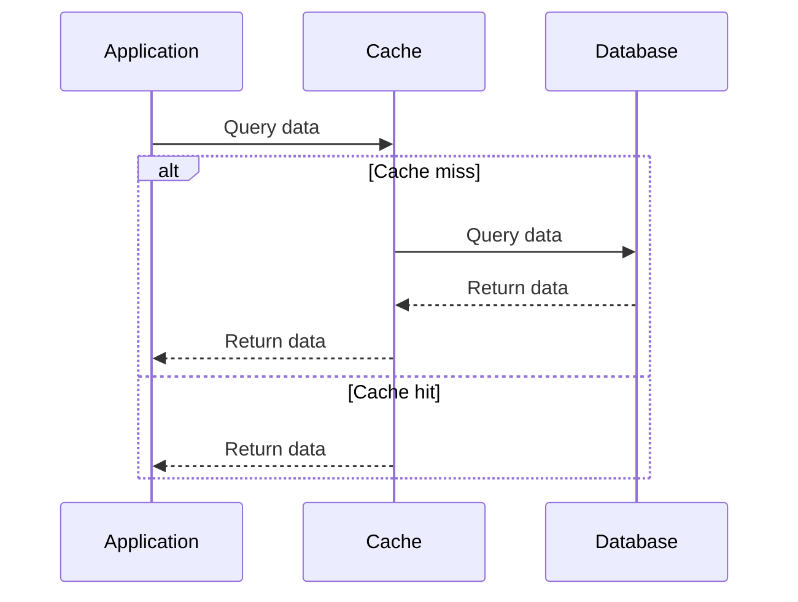

## Description

Caching patterns involve implementing cache layers within a system architecture to temporarily store frequently accessed or computationally expensive data. This approach is used to reduce the load on primary data stores, improve the application performance, and enhance user experience by providing faster data retrieval.

The primary goal of implementing caching patterns is to minimize access to data sources that are slower or more resource-intensive, such as relational databases or external APIs. 

## Architectural Approaches

### Cache-aside Pattern

In the cache-aside pattern, the application code is responsible for loading data into the cache. When a request for data is made, the application first checks the cache. If the data is not present (cache miss), the application retrieves it from the primary data source, populates the cache, and returns the data.

### Read-through Pattern

The read-through pattern delegates the loading of data into the cache to the caching system itself. In this setup, the application always interacts with the cache, and the cache transparently fetches the data from the backend store when needed (cache miss).

### Write-through Pattern

In the write-through pattern, every time data is written, the cache is updated synchronously with the primary data store. This ensures that the cache always has the latest valid data but may introduce additional latency due to the synchronization process.

### Write-behind Pattern

Write-behind caching decouples the update process, allowing changes to be made in the cache and asynchronously written back to the data store. This reduces write latency for the application but introduces complexity in ensuring data consistency.

## Best Practices

- **Cache Invalidation**: Implement consistent cache invalidation strategies to ensure the cache holds fresh data. This can range from time-based expiration to more complex logic that listens to changes in the backend data store.
  
- **Data Consistency**: Decide on the consistency requirements and choose a caching strategy accordingly—strong consistency versus eventual consistency.

- **Cache Size Management**: Ensure proper management of cache size to avoid memory bloat. Techniques such as Least Recently Used (LRU) eviction strategy can be helpful.
  
- **Monitoring and Logging**: Implement monitoring and logging for caching layers to understand cache hits, misses, and overall performance.

## Example Code

Here is an example implementation using Redis with a cache-aside strategy in Python:

```python
import redis
import some_database_module

redis_client = redis.StrictRedis(host='localhost', port=6379, db=0)

def get_data(key):
    # Attempt to retrieve data from cache
    cached_data = redis_client.get(key)
    if cached_data is not None:
        return cached_data
    
    # If cache miss, retrieve from database
    data = some_database_module.get_data_from_db(key)
    
    # Populate cache for future requests
    redis_client.set(key, data)
    
    return data
```

## Diagrams

A Mermaid diagram to illustrate the cache-aside pattern:



## Related Patterns

- **CDN Caching**: Focuses on caching static assets like images, CSS, and JavaScript files at distributed edge servers to improve content delivery times.
  
- **Memory Cache**: Involves using RAM as a high-performance caching layer, typically deployed at the application level, such as using in-memory databases like Redis or Memcached.

## Additional Resources

- [Understanding Caching - Redis Official Documentation](https://redis.io/documentation)
- [Cache Means Cache - Martin Fowler's Blog](https://martinfowler.com/bliki/Cache.html)
- [Caching Strategies and Patterns - AWS Whitepaper](https://docs.aws.amazon.com/whitepapers/latest/caching-strategies/)

## Summary

Caching patterns are crucial for enhancing application performance by reducing load on primary data stores and speeding up data retrieval. By understanding different caching strategies such as cache-aside, read-through, write-through, and write-behind, and implementing best practices such as cache invalidation, stakeholders can effectively balance performance and consistency within their applications' architecture.
