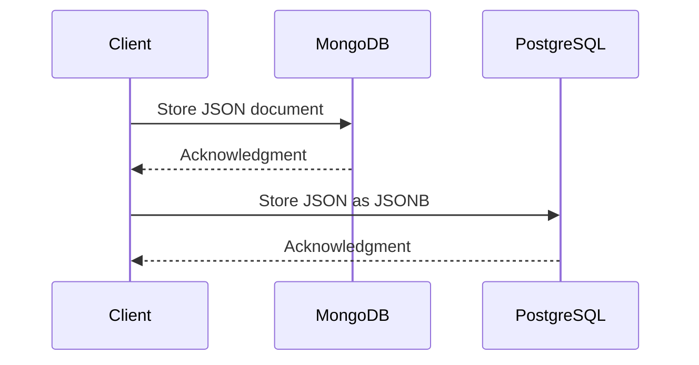

### Description

The Shared Data Structures pattern involves utilizing common data formats or structures to ensure seamless integration and consistency across different databases. This approach leverages standardized data representations to simplify and streamline data management in polyglot persistence environments, where multiple databases with different models coexist.

The pattern is particularly useful in scenarios that require high interoperability between systems using diverse data storage solutions. It ensures uniformity of data interpretation and reduces transformation overhead when data moves between storage engines.

### Architectural Approaches and Design Considerations

1. **Common Data Formats**: Utilizing universally accepted data formats like JSON, XML, or CSV as a bridge across different databases. This allows for easy interpretation and processing no matter the underlying data storage technology.

2. **Schema Evolution**: Plan for changes in your data structure over time. Ensure your shared format can accommodate schema changes like the addition or removal of fields with minimal disruption.

3. **Consistency Across Systems**: Define rules or formats that all systems must adhere to. This might involve creating a formal specification or using a data governance strategy to ensure compliance.

4. **Data Conversion Layers**: Implement data conversion layers or services that can transform data between the common format and the native formats required by each database.

5. **Performance Considerations**: Understand the impact of storing standardized data. Although database support for formats like JSON has improved, there may be performance implications, especially for queries involving large datasets.

### Example Code

Here is an example of using JSON as a shared data structure between MongoDB and PostgreSQL:

**MongoDB Insertion**

```json
db.products.insertOne({
  "id": "123456",
  "name": "Widget",
  "price": 25.50,
  "stock": 100,
  "categories": ["Tools", "Gadgets"]
})
```

**PostgreSQL Table Creation and Insertion**

```sql
CREATE TABLE products (
  id SERIAL PRIMARY KEY,
  data JSONB
);

INSERT INTO products (data) VALUES (
  '{"id":"123456", "name":"Widget", "price":25.50, "stock":100, "categories":["Tools","Gadgets"]}'
);
```

### Diagrams

A simple sequence diagram written in Mermaid to depict a system using shared data structures for data flow between MongoDB and PostgreSQL.



### Related Patterns

- **Data Transfer Objects (DTOs)**: Facilitates the carrying of data between processes, simplifying data conversion across systems.
- **Schema on Read**: Allows the application of schema to data when read from storage, rather than when it is written.
- **Materialized View**: Enables storage of query results, and can be utilized as a form of shared structure across different database systems.

### Additional Resources

1. [Polyglot Persistence in Action](https://link_to_polyglot_persistence_in_action)
2. [Data Governance Best Practices](https://link_to_data_governance)
3. [Designing Data-Intensive Applications](https://link_to_data_intensive_apps_book)

### Final Summary

The Shared Data Structures pattern is integral in environments where multiple databases need to communicate seamlessly and effectively. By adopting a common data format, organizations can achieve greater consistency and interoperability, reduce data transformation overhead, and simplify integration efforts across systems. This pattern helps manage data more efficiently in polyglot persistence contexts, catering to different application needs without sacrificing flexibility or incurring significant performance losses.
