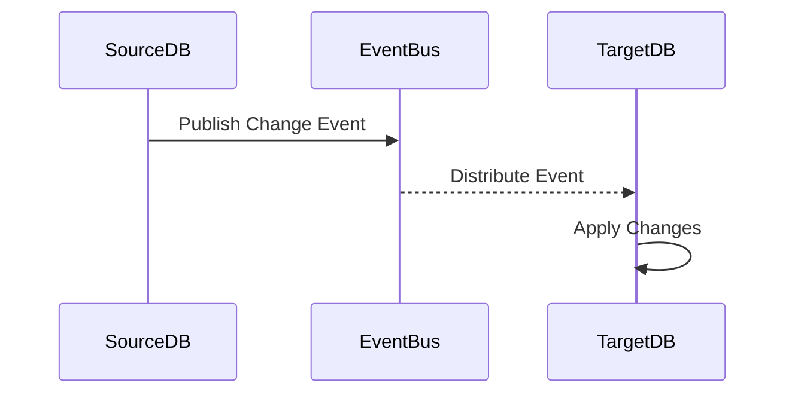

## Data Synchronization Pattern

The Data Synchronization pattern is crucial for maintaining consistency across various data stores in a system, especially in distributed architectures where different services rely on different types of databases. This pattern aims to synchronize data across heterogeneous data repositories to ensure that they reflect the same state and business logic integrity.

### Detailed Explanation

Data Synchronization involves coordinating data changes in a way that ensures all involved data stores remain up-to-date with the latest state. Different systems within an enterprise might use diverse types of databases, due to varying data storage requirements, such as relational, NoSQL, or graph databases. The goal of data synchronization is to ensure seamless data coherence among these databases.

**Key Components:**

- **Change Data Capture (CDC)**: Uses logs or database triggers to detect changes in the source data store.
- **Event Buses**: Broadcasts change events to subscribers interested in syncing their data.
- **Data Consumers**: Systems or services subscribing to events to update their data stores accordingly.
- **Conflict Resolution Strategies**: Defines how conflicts are resolved when simultaneous updates occur.

### Architectural Approaches

- **Event-Driven Architecture**: Changes in one database generate events that inform other systems or databases about new updates.
  
  ```java
  // Example in Java
  @Service
  public class DataSyncService {
      @Autowired
      private ApplicationEventPublisher eventPublisher;
      
      public void updateDatabase(Entity entity) {
          // Save or update logic
          eventPublisher.publishEvent(new DataChangeEvent(entity));
      }
  }
  ```

- **Database Federation**: Data access is abstracted in such a way that operations can span multiple databases as if they were a single database.

### Best Practices

- **Use of middleware** like Apache Kafka for message brokering to handle event traffic efficiently and resiliently.
- **Idempotent Operations**: Ensure operations can be repeated without different outcomes to handle duplicate events gracefully.
- **Versioning**: Maintain version history for entities to manage data conflicts.
- **Monitoring and Alerts**: To quickly identify when synchronization issues arise.

### Example Code

```kotlin
import org.springframework.context.ApplicationEventPublisher

@Service
class DataSyncService(private val eventPublisher: ApplicationEventPublisher) {

    fun saveEntity(entity: Entity) {
        // Perform Save Operations
        eventPublisher.publishEvent(DataChangeEvent(entity))
    }
}

data class DataChangeEvent(val entity: Entity)
```

### Diagrams

#### Sequence Diagram


### Related Patterns

- **Saga Pattern**: Helps manage data consistency across microservices without using distributed transactions.
- **CQRS (Command Query Responsibility Segregation)**: Separates read and update operations for a data store, promoting more scalable designs.

### Additional Resources

- [Apache Kafka Documentation](https://kafka.apache.org/documentation/)
- [Cloud Patterns](https://cloudpatterns.io/patterns/data-synchronization)
- [Event-Driven Architecture Principles](https://martinfowler.com/articles/edataxonomy.html)

### Summary

The Data Synchronization pattern is essential for polyglot persistence in cloud architectures. By leveraging events to capture changes, systems can maintain a consistent view of data across disparate data stores. When implementing this pattern, consider appropriate integration infrastructure, conflict management, and data governance policies to ensure successful synchronization.
