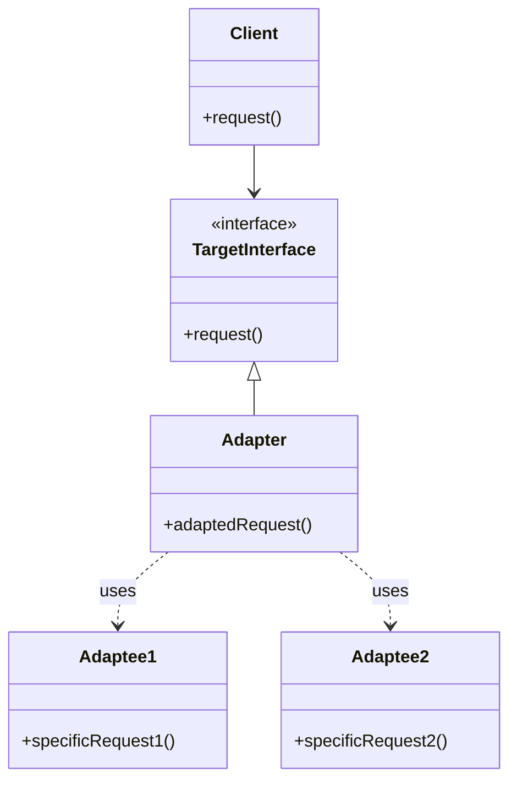

## Overview

The Adapter Pattern in the context of polyglot persistence is a design pattern that facilitates the interaction between an application and various types of data stores. This pattern introduces a layer of adaptation between the application logic and the specific implementations of data access, thus promoting loose coupling. The primary objective is to enable the application to access diverse data stores seamlessly, such as SQL and NoSQL databases, without altering its core logic.

## Detailed Description

In polyglot persistence, different data stores might be used to leverage their unique capabilities based on use-case requirements. The Adapter Pattern provides a uniform interface, translating a common application's requests into store-specific commands. This ensures consistency in handling data operations, regardless of the type of data store employed.

### Key Concepts:

- **Adapter Layer**: A class or module that functions as an intermediary between the application and data stores. It translates general requests from the application into specific queries or commands understood by the data stores.
  
- **Encapsulation of Data Access Logic**: By using this pattern, the logic for accessing and manipulating data is separated from the application's core logic, promoting maintainability and scalability.

- **Data Access Objects (DAOs)**: DAOs act as an abstraction layer, often implementing this pattern to manage connections, transactions, and queries for different databases.

## Architectural Approach

The Adapter Pattern is implemented by defining an interface for accessing data stores. Specific adapters for each type of data store (e.g., SQL, NoSQL) implement this interface to translate application data operations into appropriate store queries.

### Structural Diagram



## Example Code

Here is a simplified implementation of the Adapter Pattern in Java, demonstrating how DAOs can encapsulate data access logic:

```java
interface DatabaseAdapter {
    void connect();
    void query(String sql);
    void close();
}

class SqlDatabaseAdapter implements DatabaseAdapter {
    public void connect() {
        System.out.println("Connecting to SQL Database...");
    }
    
    public void query(String sql) {
        System.out.println("Executing SQL Query: " + sql);
    }
    
    public void close() {
        System.out.println("Closing SQL Database connection.");
    }
}

class NoSqlDatabaseAdapter implements DatabaseAdapter {
    public void connect() {
        System.out.println("Connecting to NoSQL Database...");
    }
    
    public void query(String query) {
        System.out.println("Executing NoSQL Query: " + query);
    }
    
    public void close() {
        System.out.println("Closing NoSQL Database connection.");
    }
}

public class DataStoreClient {
    private DatabaseAdapter adapter;
    
    public DataStoreClient(DatabaseAdapter adapter) {
        this.adapter = adapter;
    }
    
    public void executeOperations() {
        adapter.connect();
        adapter.query("SELECT * FROM data");
        adapter.close();
    }
    
    public static void main(String[] args) {
        DataStoreClient sqlClient = new DataStoreClient(new SqlDatabaseAdapter());
        sqlClient.executeOperations();

        DataStoreClient noSqlClient = new DataStoreClient(new NoSqlDatabaseAdapter());
        noSqlClient.executeOperations();
    }
}
```

## Best Practices

1. **Decoupling**: Ensure that your application logic remains decoupled from database specifics to allow for easy transitioning between different database technologies.

2. **Reusability**: Design adapter classes to be reusable across different components of the application.

3. **Abstraction**: Keep a clear abstraction layer to handle any complexity in the database interactions, making your application logic cleaner and more maintainable.

## Related Patterns

- **Repository Pattern**: Complementary to the Adapter Pattern, it provides a more domain-centric interface for data operations.
  
- **Facade Pattern**: Can be used in conjunction with the Adapter Pattern to provide a unified interface over complex sub-systems.

## Additional Resources

- [Design Patterns: Elements of Reusable Object-Oriented Software](https://en.wikipedia.org/wiki/Design_Patterns)
- [Patterns of Enterprise Application Architecture](https://martinfowler.com/books/eaa.html) by Martin Fowler

## Summary

The Adapter Pattern is an integral part of polyglot persistence strategies, providing a seamless way to interact with multiple data stores by abstracting the access logic into distinct layers. By employing this pattern, applications gain the flexibility to shift between different data store types with minimal impact on the application's architecture, fostering better integration and adaptability.
