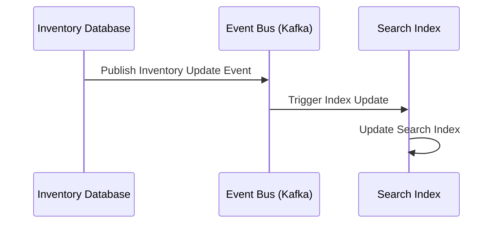

## Event-Driven Data Propagation

### Introduction
Event-Driven Data Propagation is an architectural pattern designed to synchronize data across disparate data stores by reacting to events. This pattern is pivotal in polyglot persistence environments, where applications use a diverse set of databases optimized for specific tasks or queries.

### Architectural Approach

In a system employing Event-Driven Data Propagation, changes in one data store produce events which are picked up and processed by listeners or consumers interested in those events. The listeners can then update other data stores, ensuring data consistency or availability across various parts of an application.

- **Event Publishers** post events whenever significant data changes occur.
- **Event Bus** acts as a middleware that routes these events to the appropriate consumers.
- **Event Consumers** subscribe to relevant events and propagate changes to other data stores.

### Best Practices

1. **Decoupling Publishers and Consumers**: Ensure that event producers and consumers are loosely coupled to facilitate independent scaling and maintenance.
2. **Idempotency**: Design consumers to handle duplicate events gracefully, ensuring that actions are idempotent.
3. **Event Schemas**: Define and standardize event schemas across the system to maintain consistency.
4. **Error Handling and Retries**: Implement robust error handling and retry mechanisms to manage failures during event processing.

### Example Code

Below is a sample using Apache Kafka as the event bus:

```java
// Event Publisher
public void publishInventoryUpdate(InventoryUpdateEvent event) {
    producer.send(new ProducerRecord<>("inventory_updates", event.getItemId(), event));
}

// Event Consumer
@KafkaListener(topics = "inventory_updates")
public void handleInventoryUpdate(InventoryUpdateEvent event) {
    searchIndexService.updateIndex(event);
}
```

### Diagrams

#### Sequence Diagram



### Related Patterns

- **Event Sourcing**: Persist events along with traditional data models, offering a complete audit trail.
- **CQRS (Command Query Responsibility Segregation)**: Separate the read and write workloads, optimizing for scalable event propagation and real-time query capabilities.
- **Saga Pattern**: Manage complex business transactions and ensure data consistency across distributed services using event sequences.

### Additional Resources

- [Martin Fowler's Overview of Event-Driven Architecture](https://martinfowler.com/articles/201701-event-driven.html)
- [Apache Kafka: Quick Guide](https://kafka.apache.org/quickstart)
- [Building Scalable Microservices with Event-Driven Architectures](https://dzone.com/articles/building-scalable-microservices-with-event-driven-architectures)

### Summary

Event-Driven Data Propagation enables seamless data synchronization across multiple data stores by using event-driven architecture principles. This pattern ensures that disparate data persistence technologies can coexist, allowing applications to benefit from the specific advantages offered by different data stores while maintaining data consistency and integrity through structured events.
